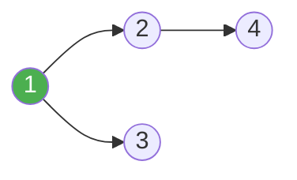
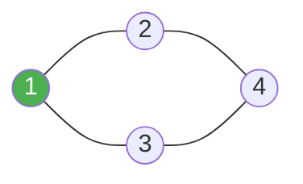
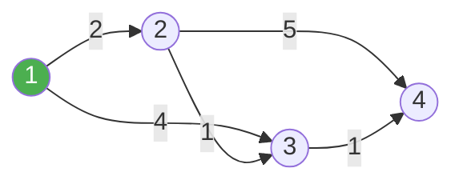
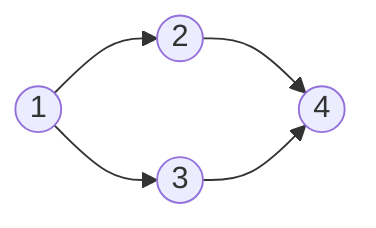
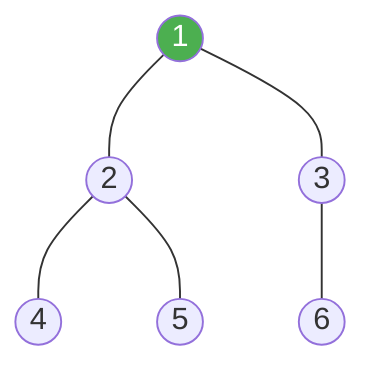
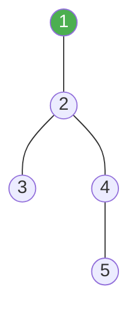
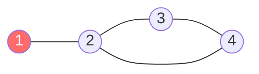
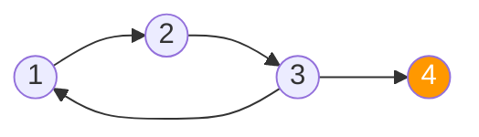

---
puppeteer:
  format: "A4"
  printBackground: true
---
<style>
/*  CHẾ ĐỘ PRINT-FRIENDLY (Tối ưu cho in ấn)  */

body {
    font-family: 'Segoe UI', Tahoma, Geneva, Verdana, sans-serif !important;
    line-height: 1.6 !important;
    color: #1a1a1a !important; 
}

/* Fix Syntax Highlighting cho Code Blocks */
pre {
    background-color: #f8f9fa !important;
    border: 1px solid #e1e4e8 !important;
    border-radius: 8px !important;
    padding: 8px !important;
    margin: 0.3rem 0 !important;
    overflow: auto !important;
    font-family: 'Consolas', 'Courier New', monospace !important;
    font-size: 14px !important;
    line-height: 1.5 !important;
    color: #24292e !important;
    box-shadow: inset 0 1px 3px rgba(0,0,0,0.05) !important;
}

p, ul, ol {
    margin-top: 0.4rem !important;
    margin-bottom: 0.4rem !important;
}

code {
    background-color: transparent !important;
    color: inherit !important;
    font-family: inherit !important;
}

/* Màu sắc mã nguồn C++ (GitHub Light Style) */
.hljs-comment, .hljs-quote { color: #6a737d !important; font-style: italic !important; }
.hljs-keyword, .hljs-selector-tag { color: #d73a49 !important; font-weight: bold !important; }
.hljs-string, .hljs-doctag, .hljs-type { color: #032f62 !important; }
.hljs-number, .hljs-literal, .hljs-variable, .hljs-template-variable { color: #005cc5 !important; }
.hljs-title, .hljs-section, .hljs-selector-id { color: #6f42c1 !important; font-weight: bold !important; }
.hljs-params { color: #24292e !important; }
.hljs-built_in, .hljs-class .hljs-title { color: #e36209 !important; }
.hljs-attr { color: #005cc5 !important; }

/* Tối ưu header */
h1, h2, h3 {
    color: #0366d6 !important;
    border-bottom: 1px solid #eaecef !important;
    padding-bottom: 0.3em !important;
    margin-top: 0.8em !important;
    margin-bottom: 0.4em !important;
}
/* Tối ưu header h4 */
h4 {
    font-size: 1rem !important; 
    color: #24292e !important; 
    margin-top: 0.6em !important;
    margin-bottom: 0.3em !important;
    font-weight: bold !important;
}

/* Đảm bảo link không bị mất màu khi in */
a { color: #0366d6 !important; text-decoration: none !important; }

/*  GIAO DIỆN MỤC LỤC CHUYÊN NGHIỆP  */
.toc-container {
    padding: 0 10px;
}
.toc-entry {
    display: flex;
    align-items: baseline;
    /* margin-bottom: 2px; */
    font-size: 14.5px;
}
.toc-entry a {
    color: #1a1a1a !important;
    text-decoration: none !important;
    white-space: nowrap;
    font-weight: 500;
}
.toc-entry a:hover {
    color: #0366d6 !important;
}
.toc-dots {
    flex-grow: 1;
    border-bottom: 1px dotted #aaa;
    margin: 0 10px 5px 10px;
}
.toc-page {
    flex-shrink: 0;
    font-weight: bold;
    color: #333;
    min-width: 25px;
    text-align: right;
}
.toc-sub {
    margin-left: 24px;
    font-size: 14px;
}
.toc-sub a {
    font-weight: normal;
    color: #444 !important;
}
</style>

<link rel="stylesheet" href="https://cdn.jsdelivr.net/npm/katex@0.16.8/dist/katex.min.css">
<script defer src="https://cdn.jsdelivr.net/npm/katex@0.16.8/dist/katex.min.js"></script>
<script defer src="https://cdn.jsdelivr.net/npm/katex@0.16.8/dist/contrib/auto-render.min.js"
    onload="renderMathInElement(document.body, {
        delimiters: [
            {left: '$$', right: '$$', display: true},
            {left: '$', right: '$', display: false}
        ]
    });">
</script>

# 📚 NỘI DUNG ÔN TẬP LẬP TRÌNH THI ĐẤU CẤP THÀNH PHỐ

> *"Lập trình thi đấu không chỉ là việc tìm ra lời giải cho một bài toán, mà là hành trình rèn luyện tính kiên trì, khả năng tư duy đột phá và nghệ thuật tối ưu hóa thế giới thông qua những dòng code."*

### 🌟 LỜI NÓI ĐẦU

Chào bạn, người đồng hành trên con đường chinh phục những thuật toán!

Tài liệu này không đơn thuần là một tập hợp các công thức hay mã nguồn khô khan. Đây là kết tinh của những giờ phút miệt mài bên bàn phím, là hệ thống hóa những kiến thức quan trọng nhất để bạn có thể tự tin bước vào đấu trường lập trình thi đấu. Từ những kiểu dữ liệu cơ bản cho đến những cấu trúc dữ liệu nâng cao như *Li Chao Tree* hay *HLD*, mỗi phần đều được trình bày với mục tiêu: **Dễ hiểu - Thực chiến - Tối ưu.**

Lập trình thi đấu là một cuộc marathon của trí tuệ. Sẽ có những lúc bạn gặp phải lỗi "TLE" (giới hạn thời gian) hay "WA" (sai kết quả), nhưng đừng nản lòng. Mỗi lần thất bại là một bài học để code của bạn trở nên sắc bén hơn, tư duy của bạn trở nên nhạy bén hơn.

Hy vọng tập tài liệu này sẽ là "kim chỉ nam" hữu ích, giúp bạn hệ thống lại kiến thức, rèn luyện kỹ năng và khơi dậy niềm đam mê cháy bỏng với những dòng thuật toán. Hãy nhớ rằng: Đằng sau mỗi trạng thái **Accepted (AC)** xanh mướt là cả một quá trình nỗ lực không ngừng nghỉ.

**Chúc bạn giữ vững ngọn lửa đam mê, bình tĩnh tự tin và gặt hái những kết quả rực rỡ nhất trong kỳ thi sắp tới!** 🚀


> **Ngôn ngữ:** C++ | **Cấp độ:** Thi đấu cấp Thành Phố

<div style="page-break-after: always;"></div>

## 📋 MỤC LỤC

<div class="toc-container">
<div class="toc-entry"><a href="#1-kiểu-dữ-liệu-cơ-bản">1. Kiểu Dữ Liệu Cơ Bản</a><span class="toc-dots"></span><span class="toc-page">4</span></div>
<div class="toc-entry"><a href="#2-cấu-trúc-dữ-liệu-stl">2. Cấu Trúc Dữ Liệu STL</a><span class="toc-dots"></span><span class="toc-page">5</span></div>
<div class="toc-entry"><a href="#3-cấu-trúc-dữ-liệu-nâng-cao">3. Cấu Trúc Dữ Liệu Nâng Cao</a><span class="toc-dots"></span><span class="toc-page">10</span></div>
<div class="toc-entry"><a href="#4-số-học--toán-rời-rạc">4. Số Học & Toán Rời Rạc</a><span class="toc-dots"></span><span class="toc-page">15</span></div>
<div class="toc-entry"><a href="#5-thuật-toán-tìm-kiếm">5. Thuật Toán Tìm Kiếm</a><span class="toc-dots"></span><span class="toc-page">29</span></div>
<div class="toc-entry"><a href="#6-thuật-toán-sắp-xếp">6. Thuật Toán Sắp Xếp</a><span class="toc-dots"></span><span class="toc-page">31</span></div>
<div class="toc-entry"><a href="#7-mảng-cộng-dồn--mảng-hiệu">7. Mảng Cộng Dồn & Mảng Hiệu</a><span class="toc-dots"></span><span class="toc-page">33</span></div>
<div class="toc-entry"><a href="#8-đệ-quy--quay-lui">8. Đệ Quy & Quay Lui</a><span class="toc-dots"></span><span class="toc-page">34</span></div>
<div class="toc-entry"><a href="#9-thuật-toán-chia-để-trị-divide--conquer">9. Thuật Toán Chia Để Trị</a><span class="toc-dots"></span><span class="toc-page">36</span></div>
<div class="toc-entry"><a href="#10-thuật-toán-đồ-thị-bfs--dfs">10. Thuật Toán Đồ Thị (BFS / DFS)</a><span class="toc-dots"></span><span class="toc-page">37</span></div>
<div class="toc-entry"><a href="#11-quy-hoạch-động-dp">11. Quy Hoạch Động (DP)</a><span class="toc-dots"></span><span class="toc-page">44</span></div>
<div class="toc-entry"><a href="#12-xử-lý-chuỗi">12. Xử Lý Chuỗi</a><span class="toc-dots"></span><span class="toc-page">49</span></div>
<div class="toc-entry"><a href="#13-xử-lý-bit">13. Xử Lý Bit</a><span class="toc-dots"></span><span class="toc-page">51</span></div>
<div class="toc-entry"><a href="#14-hình-học-tính-toán">14. Hình Học Tính Toán</a><span class="toc-dots"></span><span class="toc-page">53</span></div>
<div class="toc-entry"><a href="#15-kỹ-thuật-chặt-nhị-phân">15. Kỹ Thuật Chặt Nhị Phân</a><span class="toc-dots"></span><span class="toc-page">55</span></div>
<div class="toc-entry"><a href="#16-hàm-tiện-ích--mẫu-mã-nguồn">16. Hàm Tiện Ích & Mẫu Mã Nguồn</a><span class="toc-dots"></span><span class="toc-page">56</span></div>
<div class="toc-entry"><a href="#17-thuật-toán-cần-học-luyện-thêm">17. Thuật Toán Cần Học Luyện Thêm</a><span class="toc-dots"></span><span class="toc-page">58</span></div>
<div class="toc-entry toc-sub"><a href="#171-kỹ-thuật-hai-con-trỏ">17.1 Kỹ Thuật Hai Con Trỏ</a><span class="toc-dots"></span><span class="toc-page">58</span></div>
<div class="toc-entry toc-sub"><a href="#172-cửa-sổ-trượt-sliding-window">17.2 Cửa Sổ Trượt (Sliding Window)</a><span class="toc-dots"></span><span class="toc-page">59</span></div>
<div class="toc-entry toc-sub"><a href="#173-tham-lam-greedy">17.3 Tham Lam (Greedy)</a><span class="toc-dots"></span><span class="toc-page">61</span></div>
<div class="toc-entry toc-sub"><a href="#174-sparse-table--rmq">17.4 Sparse Table & RMQ</a><span class="toc-dots"></span><span class="toc-page">62</span></div>
<div class="toc-entry toc-sub"><a href="#175-segment-tree-lazy-propagation">17.5 Segment Tree Lazy Propagation</a><span class="toc-dots"></span><span class="toc-page">63</span></div>
<div class="toc-entry toc-sub"><a href="#176-string-hashing">17.6 String Hashing</a><span class="toc-dots"></span><span class="toc-page">64</span></div>
<div class="toc-entry toc-sub"><a href="#177-z-algorithm">17.7 Z-Algorithm</a><span class="toc-dots"></span><span class="toc-page">65</span></div>
<div class="toc-entry toc-sub"><a href="#178-số-học-modular-nâng-cao">17.8 Số Học Modular Nâng Cao</a><span class="toc-dots"></span><span class="toc-page">66</span></div>
<div class="toc-entry toc-sub"><a href="#179-0-1-bfs">17.9 0-1 BFS</a><span class="toc-dots"></span><span class="toc-page">67</span></div>
<div class="toc-entry toc-sub"><a href="#1710-nén-số-coordinate-compression">17.10 Nén Số (Coordinate Compression)</a><span class="toc-dots"></span><span class="toc-page">67</span></div>
<div class="toc-entry"><a href="#18-lca--tổ-tiên-chung-gần-nhất-binary-lifting">18. LCA — Tổ Tiên Chung Gần Nhất</a><span class="toc-dots"></span><span class="toc-page">68</span></div>
<div class="toc-entry"><a href="#19-tree-dp--qhđ-trên-cây">19. Tree DP — QHĐ Trên Cây</a><span class="toc-dots"></span><span class="toc-page">70</span></div>
<div class="toc-entry"><a href="#20-cầu--khớp--tarjan-bridges--articulation-points">20. Cầu & Khớp — Tarjan</a><span class="toc-dots"></span><span class="toc-page">72</span></div>
<div class="toc-entry"><a href="#21-scc--liên-thông-mạnh-kosaraju">21. SCC — Liên Thông Mạnh</a><span class="toc-dots"></span><span class="toc-page">73</span></div>
<div class="toc-entry"><a href="#22-nhân-ma-trận-nhanh-matrix-exponentiation">22. Nhân Ma Trận Nhanh</a><span class="toc-dots"></span><span class="toc-page">74</span></div>
<div class="toc-entry"><a href="#23-prim--cây-khung-nhỏ-nhất">23. Prim — Cây Khung Nhỏ Nhất</a><span class="toc-dots"></span><span class="toc-page">75</span></div>
<div class="toc-entry"><a href="#24-spfa--shortest-path-faster-algorithm">24. SPFA — Shortest Path Faster</a><span class="toc-dots"></span><span class="toc-page">76</span></div>
<div class="toc-entry"><a href="#25-số-học-nâng-cao--ext-gcd-euler-crt">25. Số Học Nâng Cao — Ext GCD</a><span class="toc-dots"></span><span class="toc-page">77</span></div>
<div class="toc-entry"><a href="#26-manacher--palindrome-dài-nhất-on">26. Manacher — Palindrome O(n)</a><span class="toc-dots"></span><span class="toc-page">79</span></div>
<div class="toc-entry"><a href="#27-ternary-search--tìm-cực-trị">27. Ternary Search — Tìm Cực Trị</a><span class="toc-dots"></span><span class="toc-page">80</span></div>
<div class="toc-entry"><a href="#28-heavy-light-decomposition-hld--phân-rã-cây">28. Phân Rã Cây (HLD)</a><span class="toc-dots"></span><span class="toc-page">81</span></div>
<div class="toc-entry"><a href="#29-mos-algorithm--truy-vấn-đoạn-offline">29. Mo's Algorithm — Truy Vấn Đoạn</a><span class="toc-dots"></span><span class="toc-page">82</span></div>
<div class="toc-entry"><a href="#30-li-chao-tree--tối-ưu-dp">30. Li Chao Tree — Tối Ưu DP</a><span class="toc-dots"></span><span class="toc-page">83</span></div>
<div class="toc-entry"><a href="#31-lời-khuyên-tổng-quát-khi-thi">31. Lời Khuyên Tổng Quát Khi Thi</a><span class="toc-dots"></span><span class="toc-page">85</span></div>
</div>

<div style="page-break-after: always;"></div>


## 1. KIỂU DỮ LIỆU CƠ BẢN

### 1.1 Bảng Kiểu Dữ Liệu

| Kiểu       | Kích thước | Phạm vi                                                               | Dùng khi                              |
|------------|------------|-----------------------------------------------------------------------|---------------------------------------|
| `int`      | 4 bytes    | $-2{,}147{,}483{,}648 \rightarrow 2{,}147{,}483{,}647$ ($\approx 2 \times 10^9$) | Số nguyên thông thường                |
| `long long`| 8 bytes    | $\approx -9.2 \times 10^{18} \rightarrow 9.2 \times 10^{18}$         | Số nguyên lớn, kết quả nhân/giai thừa|
| `double`   | 8 bytes    | $\approx$ 15–16 chữ số thập phân                                     | Số thực, hình học                     |
| `long double`|16 bytes  | $\approx$ 18–19 chữ số thập phân                                     | Số thực cần độ chính xác cao          |
| `char`     | 1 byte     | $-128 \rightarrow 127$ (ký tự ASCII)                                 | ký tự đơn, xử lý ký tự               |
| `string`   | động       | Xâu ký tự bất kỳ                                                     | Xử lý chuỗi                           |
| `bool`     | 1 byte     | `true` / `false`                                                     | Cờ đánh dấu, trạng thái              |

### 1.2 Lưu Ý Quan Trọng

**⚠️ TRÀN SỐ:** `int × int` có thể tràn — luôn ép kiểu trước.

**⚠️ Chia số thực:** Phải cast (ép kiểu) trước, `a / b` là chia nguyên.

**⚠️ So sánh số thực:** KHÔNG dùng `==` trực tiếp.

**✅ Hằng số hữu ích:**

```cpp
long long ans = (long long)a * b;
double result = (double)a / b;
if (fabs(a - b) < 1e-9) { /* bằng nhau */ }

const int INF = 1e9;
const long long LINF = 1e18;
const double PI = acos(-1.0);
```

> 💡 **Lời khuyên:** Khi đề bài có số lên đến $10^9$ hoặc yêu cầu nhân hai số có thể đến $10^9$, hãy dùng `long long` ngay.

<div style="page-break-after: always;"></div>

## 2. CẤU TRÚC DỮ LIỆU STL

**Lời khuyên:** Dùng `#include<bits/stdc++.h>` để nạp toàn bộ thư viện chuẩn của C++ chỉ với một dòng code. Điều này giúp tiết kiệm thời gian và tránh các lỗi thiếu thư viện không đáng có trong lúc thi đấu. (Lưu ý: Header này thuộc chuẩn GCC, hoạt động tốt trên hầu hết các nền tảng chấm bài).


### 2.0 Mảng Tĩnh (Static Array)

**Mô tả:** Vùng nhớ liên tiếp cố định, khai báo lúc biên dịch. Truy cập trực tiếp qua chỉ số, không có overhead (chi phí tài nguyên dư thừa). Đây là CTDL nền tảng và nhanh nhất trong C++.

**Đặc điểm:**
- Kích thước **cố định**, phải biết trước khi khai báo
- Lưu trên **stack** (khai báo local(cục bộ)) hoặc **data segment** (khai báo global)
- Truy cập `a[i]` là $O(1)$, **không có kiểm tra giới hạn**
- Nên khai báo **global(Toàn Cục)** để tránh stack overflow khi kích thước lớn

```cpp
const int MAXN = 1e5 + 5;

// Mảng 1 chiều
int a[MAXN];          // Global — an toàn, tự khởi tạo = 0
int b[MAXN] = {0};    // Tường minh khởi tạo 0

// Mảng 2 chiều
int grid[1005][1005];

// Khởi tạo nhanh bằng memset (chỉ dùng với 0 hoặc -1)
memset(a, 0, sizeof(a));   // Gán tất cả = 0
memset(a, -1, sizeof(a));  // Gán tất cả = -1 (vì -1 = 0xFF...FF)

// Khởi tạo với giá trị bất kỳ dùng fill
fill(a, a + n, INF);       // Gán tất cả = INF

// Nhập/xuất mảng (1-indexed thường dùng trong thi)
for (int i = 1; i <= n; i++) cin >> a[i];
for (int i = 1; i <= n; i++) cout << a[i] << " ";
```

**Dùng khi:** Kích thước biết trước, cần tốc độ tối đa, làm nền cho các thuật toán (DP, prefix sum, sàng...).

> ⚠️ **Lưu ý:** Khai báo mảng lớn ($> 10^6$) bên trong `main()` → **stack overflow**. Hãy khai báo **global**.

<div style="page-break-after: always;"></div>

### 2.1 vector<any> — Mảng Động

**Mô tả:** Mảng có kích thước thay đổi được, được quản lý tự động. Bên trong dùng mảng liên tiếp trên heap (vùng nhớ heap), tự động cấp phát lại (×2) khi đầy. Truy cập ngẫu nhiên O(1) giống mảng tĩnh nhưng linh hoạt hơn.

**Đặc điểm:**
- Kích thước **động**, thêm/xóa cuối $O(1)$ amortized (trung bình tích lũy)
- Hỗ trợ đầy đủ iterator (biến lặp), tương thích với các hàm STL
- Có thể dùng như mảng 2 chiều: `vector<vector<int>>`

```cpp
v.push_back(x);           // Thêm cuối — O(1) amortized
v.pop_back();             // Xóa cuối — O(1)
v[i];                     // Truy cập — O(1)
v.size();                 // Kích thước hiện tại
v.empty();                // Kiểm tra rỗng
v.clear();                // Xóa hết phần tử
v.resize(n, 0);           // Đổi kích thước, giá trị mặc định = 0
v.assign(n, val);         // Gán n phần tử giá trị val
sort(v.begin(), v.end()); // Sắp xếp tăng
```

**Dùng khi:** Cần mảng có kích thước thay đổi, danh sách kề đồ thị, không biết trước số phần tử.


### 2.2 stack<any> — Ngăn Xếp (LIFO)

**Mô tả:** Cấu trúc **LIFO (Last In First Out - Vào sau ra trước)** — thêm và lấy ra từ **một đầu (đỉnh)**. Như chồng đĩa: đĩa để sau cùng sẽ lấy ra đầu tiên. Bên trong mặc định dùng `deque` làm container (bộ lưu trữ).

**Đặc điểm:**
- **Hạn chế truy cập:** Không thể truy cập phần tử ở giữa hay ở đáy nếu không bỏ các phần tử ở trên.
- **Không hỗ trợ iterator:** Không thể dùng vòng lặp `for` hay các hàm `begin()`, `end()` để duyệt.
- **Hiệu suất cao:** Các thao tác cơ bản (`push`, `pop`, `top`) đều đạt O(1).
- **Container Adapter:** Là lớp vỏ bọc bên ngoài các container khác (mặc định dùng `deque`).

```cpp
stack<int> st;
st.push(x);    // Thêm vào đỉnh — O(1)
st.pop();      // Xóa đỉnh (không trả về giá trị) — O(1)
st.top();      // Xem đỉnh — O(1)
st.size();     // Kích thước
st.empty();    // Kiểm tra rỗng
```

**Dùng khi:** Kiểm tra ngoặc hợp lệ, DFS không đệ quy, bài toán "phần tử gần nhất lớn hơn" (Monotone Stack).

<div style="page-break-after: always;"></div>

### 2.3 queue<any> — Hàng Đợi (FIFO)

**Mô tả:** Cấu trúc **FIFO (First In First Out - Vào trước ra trước)** — thêm vào **cuối**, lấy ra từ **đầu**. Hình dung như hàng xếp chờ mua vé: người đến trước được phục vụ trước. Bên trong dùng `deque`.

**Đặc điểm:**
- **Tính trừu tượng:** Là một Container Adapter, có khả năng thay đổi container lưu trữ bên dưới (như `list`).
- **Hạn chế giao diện:** Không hỗ trợ iterator, không thể truy cập các phần tử nằm giữa.

```cpp
queue<int> q;
q.push(x);    // Thêm vào cuối — O(1)
q.pop();      // Xóa phần tử đầu (không trả về giá trị) — O(1)
q.front();    // Xem phần tử đầu — O(1)
q.back();     // Xem phần tử cuối — O(1)
q.size();
q.empty();
```

**Dùng khi:** BFS (bắt buộc), mô phỏng hàng đợi, xử lý theo thứ tự đến.


### 2.4 deque<any> — Hàng Đợi Hai Đầu

**Mô tả:** **Deque (Double-Ended Queue - Hàng đợi hai đầu)** — cho phép thêm và xóa ở **cả hai đầu** với O(1). Không lưu liên tiếp hoàn toàn như `vector` mà dùng các block nhỏ, nên truy cập ngẫu nhiên vẫn O(1) nhưng hơi chậm hơn `vector` một chút.

**Đặc điểm:**
- **An toàn Iterator:** Thao tác chèn/xóa ở hai đầu **không** làm mất hiệu lực (invalidate) iterator trỏ đến các phần tử hiện có.
- **Hiệu quả bộ nhớ:** Tránh việc phải tái cấp phát và copy toàn bộ dữ liệu khi mở rộng kích thước như `vector`.

```cpp
deque<int> dq;
dq.push_front(x);  // Thêm đầu — O(1)
dq.push_back(x);   // Thêm cuối — O(1)
dq.pop_front();    // Xóa đầu — O(1)
dq.pop_back();     // Xóa cuối — O(1)
dq.front();        // Xem đầu — O(1)
dq.back();         // Xem cuối — O(1)
dq[i];             // Truy cập ngẫu nhiên — O(1)
```

**Dùng khi:** Sliding window maximum/minimum (Monotone Deque), bài toán cần thêm/xóa cả hai đầu, BFS với nhiều nguồn (0-1 BFS).

<div style="page-break-after: always;"></div>

### 2.5 priority_queue<any> — Hàng Đợi Ưu Tiên (Heap)

**Mô tả:** Luôn đưa phần tử có **độ ưu tiên cao nhất** lên đầu. Bên trong dùng **Binary Heap** (cây nhị phân ưu tiên / đống - cây nhị phân hoàn chỉnh lưu trên mảng). Mặc định là **max-heap** (phần tử lớn nhất ở đỉnh).

**Đặc điểm:**
- **Tính không ổn định:** Các phần tử cùng độ ưu tiên không đảm bảo thứ tự xuất hiện (không stable sorting).
- **Ràng buộc Container:** Chỉ hoạt động hiệu quả với container truy cập ngẫu nhiên như `vector`, `deque`.

```cpp
// Max-heap (mặc định) — phần tử lớn nhất luôn ở top
priority_queue<int> pq;
pq.push(x);    // Thêm — O(log n)
pq.top();      // Phần tử lớn nhất — O(1)
pq.pop();      // Xóa phần tử đỉnh — O(log n)
pq.size();
pq.empty();
// Min-heap — phần tử nhỏ nhất ở top
priority_queue<int, vector<int>, greater<int>> pq_min;
// Heap với pair: ưu tiên theo first, nếu bằng thì so second
priority_queue<pair<int,int>> pq_pair;
```
**Dùng khi:** Thuật toán Dijkstra (min-heap), Prim, bài toán lấy top-k phần tử, lập lịch tham lam.

### 2.6 set<any> & multiset<any> — Tập Hợp Có Thứ Tự

**Mô tả:** Tập hợp phần tử **không trùng nhau** (với `set`) hoặc **có thể trùng** (với `multiset`), luôn được **sắp xếp tăng dần**. Bên trong dùng **Cây Đỏ-Đen** - cây nhị phân tìm kiếm tự cân bằng, nên mọi thao tác đều O(log n).

**Đặc điểm:**
- **Tính bền vững:** Iterator và tham chiếu đến phần tử vẫn giữ nguyên giá trị ngay cả sau khi chèn hoặc xóa các phần tử khác.
- **Hiệu suất tiên đoán:** Đảm bảo thời gian phản hồi O(log n) mọi trường hợp, không bị ảnh hưởng bởi tính chất của dữ liệu đầu vào.

```cpp
set<int> s;
s.insert(x);             // Thêm — O(log n), bỏ qua nếu đã có
s.erase(x);              // Xóa tất cả phần tử x — O(log n)
s.count(x);              // 0 hoặc 1 (set), hoặc số lần xuất hiện (multiset)
s.find(x);               // Iterator đến x, s.end() nếu không có — O(log n)
s.lower_bound(x);        // Iterator đến phần tử đầu tiên >= x — O(log n)
s.upper_bound(x);        // Iterator đến phần tử đầu tiên > x — O(log n)
*s.begin(); *s.rbegin(); // Phần tử nhỏ/lớn nhất — O(1)

multiset<int> ms;        // Cho phép phần tử trùng
ms.erase(ms.find(x));    // ⚠️ Xóa ĐÚNG MỘT phần tử x (không phải ms.erase(x))
```

**Dùng khi:** Kiểm tra phần tử tồn tại nhanh, lấy min/max động, duy trì tập hợp có thứ tự, đếm phần tử trong khoảng.


### 2.7 map<any> & multimap<any> — Từ Điển Có Thứ Tự

**Mô tả:** Lưu các cặp **(key → value)**, các key luôn được **sắp xếp tăng dần**. Bên trong cũng dùng **Red-Black Tree (Cây Đỏ-Đen)**. Truy cập `mp[key]` sẽ **tự tạo** phần tử mới nếu key chưa tồn tại (giá trị mặc định = 0).

**Đặc điểm:**
- **Iterator hai chiều:** Cho phép duyệt tiến và lùi linh hoạt qua các cặp key-value của cây.
- **Cảnh báo `operator[]`:** Thao tác đọc có thể làm thay đổi kích thước container (tạo phần tử mặc định) nếu key chưa hiện diện.

```cpp
map<string, int> mp;
mp["key"] = value;          // Gán — O(log n), tạo mới nếu chưa có
mp["key"]++;                // Đếm tần suất
mp.count("key");            // Trả về 1 nếu tồn tại, 0 nếu không
mp.find("key");             // Iterator, mp.end() nếu không có
mp.erase("key");            // Xóa — O(log n)
mp.size();
for (map<string,int>::iterator it = mp.begin(); it != mp.end(); ++it) {
    string k = it->first; int v = it->second; /* Duyệt theo key tăng dần */
}
// ⚠️ Dùng find() thay vì [] để KIỂM TRA mà không tạo phần tử mới
if (mp.find("key") != mp.end()) { /* tồn tại */ }
```
**Dùng khi:** Đếm tần suất chuỗi/số, ánh xạ key → value, nén số (coordinate compression), nhóm phần tử theo key.


### 2.8 `unordered_set<any>` & `unordered_map<any>` — Hash Table

**Mô tả:** Phiên bản **không có thứ tự** của `set`/`map`, bên trong dùng **Hash Table (Bảng băm)**. Đổi lại việc mất thứ tự, các thao tác đạt O(1) trung bình thay vì O(log n). Không hỗ trợ `lower_bound`/`upper_bound`.

**Đặc điểm:**
- **Chi phí quản lý:** Tốn nhiều bộ nhớ hơn bản có thứ tự để duy trì bảng băm và xử lý xung đột (chaining).
- **Hệ số tải (Load Factor):** Cần được `rehash` tự động hoặc thủ công khi bảng băm đầy để duy trì tốc độ truy cập.

```cpp
unordered_map<int, int> ump;
unordered_set<int> us;

ump[key] = val;      // O(1) trung bình -- Gán giá trị, tạo mới nếu chưa có
ump.count(key);      // O(1) trung bình -- Trả về 1 nếu tồn tại, 0 nếu không
us.insert(x);        // O(1) trung bình -- Thêm phần tử, bỏ qua nếu đã có
// ⚠️ Với key là string hoặc pair, cần định nghĩa hash riêng
```

**Dùng khi:** Cần tốc độ O(1) và không cần thứ tự (đếm tần suất nhanh, kiểm tra đã thăm...). 

> ⚠️ **Cảnh báo:** Worst case O(n) do hash collision (xung đột mã băm). Trong thi đấu, nếu bị hack (bị đối thủ hoặc bộ test chuẩn bị sẵn các trường hợp xấu nhất) có thể TLE — cân nhắc dùng `map` nếu lo ngại.

<div style="page-break-after: always;"></div>

### 2.9 Hàm STL Quan Trọng

```cpp
sort(v.begin(), v.end());                    // Sắp xếp tăng O(n log n)
sort(v.begin(), v.end(), greater<int>());    // Sắp xếp giảm
reverse(v.begin(), v.end());                 // Đảo ngược O(n)
next_permutation(v.begin(), v.end());        // Hoán vị kế tiếp
*max_element(v.begin(), v.end());            // Phần tử lớn nhất
*min_element(v.begin(), v.end());            // Phần tử nhỏ nhất
accumulate(v.begin(), v.end(), 0LL);         // Tổng mảng
lower_bound(v.begin(), v.end(), x);          // Pointer đến phần tử >= x (mảng đã sort)
upper_bound(v.begin(), v.end(), x);          // Pointer đến phần tử > x (mảng đã sort)
```


## 3. CẤU TRÚC DỮ LIỆU NÂNG CAO

### 3.1 Segment Tree — Cây Phân Đoạn

**Mô tả:** Cây nhị phân lưu thông tin của các đoạn con (tổng, max, min...). Cho phép truy vấn và cập nhật theo đoạn cực nhanh.

**Ẩn dụ trực quan (Quản lý trường học):**
Hãy tưởng tượng bạn là Hiệu trưởng quản lý điểm số của **N** học sinh:
1. **Nút gốc (Học sinh 1 -> N):** Lưu tổng điểm toàn trường.
2. **Nút con:** Được chia đôi. Nút trái quản lý nửa đầu học sinh, nút phải quản lý nửa sau.
3. **Lá (Học sinh i):** Lưu điểm của đúng 1 học sinh đó.
=> Khi muốn biết tổng điểm từ học sinh 10 đến 50, bạn không cần hỏi từng người, mà chỉ cần hỏi các "Trưởng khối" quản lý các đoạn nằm trong khoảng đó.

**Tại sao dùng Segment Tree?**
- Nếu dùng mảng thường: Cập nhật $O(1)$, nhưng tính tổng đoạn mất $O(n)$.
- Nếu dùng mảng cộng dồn: Tính tổng $O(1)$, nhưng cập nhật một số mất $O(n)$.
- **Segment Tree:** Cân bằng cả hai — Cập nhật $O(\log n)$ và Truy vấn $O(\log n)$.

**Độ phức tạp:** Xây dựng $O(n)$, Truy vấn/Cập nhật $O(\log n)$.

```cpp
const int MAXN = 1e5 + 5;
long long tree[4 * MAXN]; // Tại sao x4? Để đảm bảo đủ nút cho cây nhị phân đầy đủ
int a[MAXN];

// node: chỉ số nút trên cây, [l, r]: đoạn mà nút đó quản lý
void build(int node, int l, int r) {
    if (l == r) { // Trường hợp cơ sở: Đoạn chỉ có 1 phần tử (Lá)
        tree[node] = a[l];
        return;
    }
    int mid = (l + r) / 2;
    build(2*node, l, mid);      // Xây cây con bên trái (quản lý nửa đầu)
    build(2*node+1, mid+1, r);  // Xây cây con bên phải (quản lý nửa sau)
    tree[node] = tree[2*node] + tree[2*node+1]; // Nút cha = tổng 2 nút con
}

void update(int node, int l, int r, int pos, int val) {
    if (l == r) {
        tree[node] = val; // Cập nhật tại lá
        return;
    }
    int mid = (l + r) / 2;
    if (pos <= mid) update(2*node, l, mid, pos, val);
    else update(2*node+1, mid+1, r, pos, val);
    tree[node] = tree[2*node] + tree[2*node+1]; // Cập nhật lại các nút cha liên quan
}

long long query(int node, int l, int r, int ql, int qr) {
    if (qr < l or r < ql) return 0; // Ngoài đoạn đang xét -> trả về phần tử trung tính (0 cho tổng)
    if (ql <= l and r <= qr) return tree[node]; // Đoạn [l, r] nằm hoàn toàn trong [ql, qr]
    int mid = (l + r) / 2;
    return query(2*node, l, mid, ql, qr) + query(2*node+1, mid+1, r, ql, qr);
}
```

**Giải thích logic:**
- **`2*node` và `2*node+1`:** Cách biểu diễn cây nhị phân trên mảng (nút con của **i** là **2i** và **2i+1**).
- **`mid = (l + r) / 2`:** Luôn chia bài toán làm đôi (Chia để trị).
- **`4 * MAXN`:** Số lượng nút tối đa của một cây nhị phân hoàn chỉnh quản lý **N** lá là khoảng **4N**.

**Dùng khi:** Cần tính tổng, max, min, GCD... trên đoạn và giá trị các phần tử thay đổi liên tục.

> 💡 **Pro-tip:** Nếu bài toán chỉ yêu cầu tính **Tổng đoạn** và **Cập nhật điểm**, hãy cân nhắc dùng **Fenwick Tree (BIT)** vì nó code ngắn hơn và nhanh hơn. Segment Tree mạnh nhất khi cần xử lý các phép toán phức tạp hơn (Max, Min) hoặc cập nhật theo đoạn (dùng Lazy Propagation).


### 3.2 Trie — Cây Tiền Tố

**Mô tả:** Cây dùng để lưu tập hợp các chuỗi, hỗ trợ tìm kiếm tiền tố cực nhanh.

**Ẩn dụ trực quan (Từ điển tìm kiếm):**
Hãy tưởng tượng một cuốn từ điển khổng lồ:
1. **Gốc (Root):** Là trang trắng đầu tiên.
2. **Cạnh (Edges):** Mỗi cạnh dẫn đến một nút con được gắn một ký tự.
3. **Đường đi:** Bạn bắt đầu từ gốc, đi theo các cạnh 'c' -> 'a' -> 't'.
    - Nếu tại nút 't', cờ `isEnd` bật lên -> Bạn đã tìm thấy từ "cat".
    - Nếu bạn đang ở nút 'a' và thấy có cả cạnh đi tiếp đến 't' ("cat") và 'p' ("cap") -> "ca" là tiền tố chung.

<div style="page-break-after: always;"></div>
---

**Đặc điểm:**
- Tìm kiếm một chuỗi độ dài $L$ chỉ mất $O(L)$, không phụ thuộc vào số lượng từ trong từ điển.
- Tiết kiệm bộ nhớ khi có nhiều từ chung tiền tố (ví dụ: "apple", "apply", "applied").

```cpp
struct TrieNode {
    int children[26]; // 26 chữ cái tiếng Anh
    bool isEnd;       // Đánh dấu đây có phải là điểm kết thúc của một từ không
    TrieNode() { 
        fill(children, children + 26, -1); 
        isEnd = false; 
    }
};

vector<TrieNode> trie(1); // Bắt đầu với 1 nút gốc (chỉ số 0)

void insert(const string& s) {
    int cur = 0;
    for (char c : s) {
        int idx = c - 'a';
        if (trie[cur].children[idx] == -1) { // Nếu chưa có đường đi cho ký tự c
            trie[cur].children[idx] = trie.size();
            trie.emplace_back(); // Tạo nút mới
        }
        cur = trie[cur].children[idx]; // Đi xuống nút tiếp theo
    }
    trie[cur].isEnd = true; // Kết thúc chuỗi
}

bool search(const string& s) {
    int cur = 0;
    for (char c : s) {
        int idx = c - 'a';
        if (trie[cur].children[idx] == -1) return false; // Gãy nhánh -> Không có từ này
        cur = trie[cur].children[idx];
    }
    return trie[cur].isEnd; // Phải là điểm kết thúc mới coi là tìm thấy từ
}
```

**Dùng khi:** Kiểm tra từ điển, gợi ý từ (auto-complete), tìm chuỗi có tiền tố chung, hoặc bài toán XOR lớn nhất (Trie nhị phân).

> 💡 **Pro-tip:** Trong các bài toán về số hiệu (XOR), ta dùng Trie với `children[2]` (bit 0 và bit 1). Đây là kỹ thuật cực mạnh để giải các bài tìm cặp số có XOR lớn nhất/nhỏ nhất.

<div style="page-break-after: always;"></div>

### 3.3 Fenwick Tree (BIT) — Cây Chỉ Số Nhị Phân

**Mô tả:** Cấu trúc dữ liệu cực kỳ gọn nhẹ, dùng để cập nhật giá trị tại một điểm và tính tổng tiền tố (prefix sum) trong **O(log n)**.

**Ẩn dụ trực quan (Kho hàng thông minh):**
Thay vì mỗi thùng hàng chỉ ghi số lượng của chính nó, BIT thiết kế theo quy tắc:
- Mọi thùng ở vị trí lẻ (1, 3, 5...) chỉ giữ đúng số lượng của mình.
- Các thùng ở vị trí chẵn (2, 4, 8...) sẽ giữ tổng của chính nó và một số thùng đứng trước đó (theo quy luật lũy thừa của 2).
=> Để biết tổng từ 1 đến 7, bạn chỉ cần mở 3 thùng (thùng 7, thùng 6, thùng 4) thay vì 7 thùng.

**Lõi của BIT — Hàm `lowbit(i)`:**
`i & (-i)` trả về giá trị của bit 1 thấp nhất của số **i**. 
- Ví dụ: **6** (nhị phân `110`) -> `lowbit(6) = 2` (nhị phân `010`).
- BIT dùng giá trị này để xác định "bước nhảy" khi cập nhật hoặc truy vấn.

**Độ phức tạp:** Truy vấn/Cập nhật $O(\log n)$. Không gian $O(n)$.

```cpp
const int MAXN = 1e5 + 5;
long long bit[MAXN];
int n;

// Cộng thêm val vào vị trí pos
void update(int pos, long long val) {
    for (; pos <= n; pos += pos & (-pos)) // Nhảy lên các nút cha quản lý pos
        bit[pos] += val;
}

// Tính tổng từ 1 đến pos
long long query(int pos) {
    long long sum = 0;
    for (; pos > 0; pos -= pos & (-pos)) // Nhảy xuống các nút con tích lũy
        sum += bit[pos];
    return sum;
}

// Tính tổng đoạn [l, r] dựa trên prefix sum
long long queryRange(int l, int r) {
    return query(r) - query(l - 1);
}

void build(int arr[], int sz) {
    n = sz;
    fill(bit, bit + n + 1, 0);
    for (int i = 1; i <= n; i++) update(i, arr[i]);
}
```

**Dry-run (n=5, a=[1,2,3,4,5]):**
- bit[] sau build: bit[1]=1, bit[2]=3, bit[3]=3, bit[4]=10, bit[5]=5
- query(4) = bit[4] = 10 ✓
- queryRange(2, 4) = query(4) - query(1) = 10 - 1 = 9 ✓
- update(3, +2): bit[3]+=2→5, bit[4]+=2→12

**Dùng khi:** Cập nhật điểm + truy vấn tổng đoạn, đếm số nghịch thế, bài toán order-statistic. Nhanh hơn Segment Tree ~2x trong thực tế.

> ⚠️ **So sánh BIT vs Segment Tree**: BIT code ngắn hơn, nhanh hơn nhưng ít linh hoạt hơn (chỉ dùng cho các bài toán "prefix-sum dạng group"). Segment Tree xử lý được nhiều loại truy vấn hơn (max/min/GCD...).


### 3.4 Union-Find (DSU) — Cấu Trúc Tập Hợp Rời Rạc

**Mô tả:** Quản lý các nhóm (component) rời rạc. Hỗ trợ gộp hai nhóm và tìm nhóm của một phần tử cực nhanh.

**Ẩn dụ trực quan (Bữa tiệc bạn bè):**
Hãy tưởng tượng một bữa tiệc có **N** người lạ:
1. **Ban đầu:** Mỗi người là một nhóm riêng (là "trưởng nhóm" của chính mình).
2. **Kết bạn (Union):** Người A và người B làm quen. Hai nhóm của họ gộp làm một. Họ chọn ra một người làm "trưởng nhóm".
3. **Kiểm tra (Find):** Bạn muốn biết người X và người Y có quen nhau (cùng nhóm) không? Hãy hỏi xem "Trưởng nhóm" của họ có phải là cùng một người không.

**Kỹ thuật tối ưu:**
- **Path Compression (Nén đường đi):** Khi tìm trưởng nhóm, ta cập nhật cho tất cả mọi người trên đường đi trỏ thẳng vào ông trùm cuối cùng. Lần sau hỏi sẽ trả lời được ngay.
- **Union by Rank (Gộp theo hạng):** Luôn gộp nhóm nhỏ vào nhóm lớn để cây DSU không bị quá cao (giúp tìm kiếm nhanh hơn).

**Độ phức tạp:** Gần như $O(1)$ cho mọi thao tác.

```cpp
const int MAXN = 1e5 + 5;
int parent[MAXN], rnk[MAXN];

void init(int n) {
    for (int i = 1; i <= n; i++) {
        parent[i] = i; // Ban đầu ai cũng là trưởng nhóm của chính mình
        rnk[i] = 0;    // Độ cao của cây nhóm = 0
    }
}

// Tìm đại diện (trưởng nhóm) của x
int find(int x) {
    if (parent[x] != x) 
        parent[x] = find(parent[x]); // Nén đường đi: trỏ thẳng lên trùm cuối
    return parent[x];
}

// Gộp nhóm chứa x và nhóm chứa y
bool unite(int x, int y) {
    int px = find(x), py = find(y);
    if (px == py) return false; // Đã cùng một nhóm rồi
    // Kỹ thuật Union by Rank: Gộp cây thấp vào cây cao hơn
    if (rnk[px] < rnk[py]) swap(px, py);
    parent[py] = px; 
    if (rnk[px] == rnk[py]) rnk[px]++;
    
    return true; // Gộp thành công
}
// Kiểm tra cùng nhóm
bool sameGroup(int x, int y) { return find(x) == find(y); }
```

**Dry-run (n=5, unite(1,2), unite(3,4), unite(2,3)):**
- Sau unite(1,2): parent[2]=1
- Sau unite(3,4): parent[4]=3
- Sau unite(2,3): find(2)=1, find(3)=3 → parent[3]=1
- sameGroup(1,4): find(1)=1, find(4)=find(3)=1 → **true** ✓

**Dùng khi:** Kiểm tra liên thông, xây dựng cây khung nhỏ nhất (Kruskal), phát hiện chu trình, bài toán gộp nhóm động.


## 4. SỐ HỌC & TOÁN RỜI RẠC

### 4.1 Tìm Ước & Đếm Ước

**`getDivisors(n)`** — Lấy tất cả ước của n, $O(\sqrt{n})$. Dùng `sqrt()` thay vì `i*i` để tránh tràn.

```cpp
vector<int> getDivisors(int n) {
    vector<int> divisors;
    for (int i = 1; i <= sqrt(n); ++i) 
        if (n % i == 0) {
            divisors.push_back(i);
            if (i != n / i) // Tránh lặp nếu n là số chính phương
                divisors.push_back(n / i); 
        }
    sort(divisors.begin(), divisors.end());
    return divisors;
}
```

**`countDivisors(n)`** — Đếm nhanh số lượng ước, $O(\sqrt{n})$.

```cpp
long long countDivisors(long long n) {
    long long cnt = 0;
    for (long long i = 1; i * i <= n; ++i)
        if (n % i == 0) {
            cnt++;            // ước i
            if (i * i != n) cnt++;  // ước n/i
        }
    return cnt;
}
```

**Dry-run getDivisors(12):** i=1: {1,12} | i=2: {2,6} | i=3: {3,4} → sort → {1,2,3,4,6,12} ✓
**Dry-run countDivisors(12):** i=1,2,3 đều chia hết, i²≠12 → cnt = 6 ✓


### 4.2 GCD & LCM

**GCD:** Dùng `__gcd(a, b)` (C++98+) hoặc `std::gcd(a, b)` (`#include <numeric>`, C++17+), $O(\log \min(a,b))$.

**`lcm(a, b)`** — Chia trước để tránh tràn số.

```cpp
int lcm(int a, int b)
    return (a / __gcd(a, b)) * b;

long long lcmLL(long long a, long long b)
    return (a / __gcd(a, b)) * b;
```

**Dry-run __gcd(48, 18):** 48 % 18 = 12 → 18 % 12 = 6 → 12 % 6 = 0 → = 6 ✓

**Dry-run lcm(4, 6):** __gcd(4,6)=2, (4/2)*6 = 12 ✓

> 💡 **Lưu ý:** Không tự viết lại `gcd()` — `__gcd` đã được tối ưu ở cấp compiler, nhanh hơn và không bị stack overflow.


### 4.3 Kiểm Tra Số Nguyên Tố

#### Cách 1: O(√n / 3) — Tối ưu cho số thông thường

**Ý tưởng:** Mọi SNT $> 3$ đều có dạng $6k \pm 1$. Chỉ kiểm tra các bước $i = 6k-1$ và $6k+1$, bỏ qua bội của 2 và 3 $\Rightarrow$ tiết kiệm ~$1/3$ vòng lặp so với $O(\sqrt{n})$, giúp thuật toán chạy nhanh hơn (optimized).

```cpp
bool isPrime(long long n) {
    if (n < 2) return false;
    if (n == 2 or n == 3) return true;            // SNT đặc biệt
    if (n % 2 == 0 or n % 3 == 0) return false;   // Loại ngay bội 2 và 3
    long long sqrtN = sqrt((double)n);
    for (long long i = 5; i <= sqrtN; i += 6) {   // i = 6k-1, i+2 = 6k+1
        if (n % i == 0 or n % (i + 2) == 0) return false;
    }
    return true;
}
```

**Dry-run (n=25):** 25 % 2 ≠ 0, 25 % 3 ≠ 0, sqrtN=5, i=5: 25 % 5 = 0 → false ✓
**Dry-run (n=17):** 17 % 2 ≠ 0, 17 % 3 ≠ 0, sqrtN≈4.1, i=5 > 4.1 → true ✓

> ⚠️ Hạn chế: $n \leq 10^{12}$ hoặc cần kiểm tra ít số. Nếu kiểm tra $10^6$ số có $n \leq 10^9$ thì cách này quá chậm → dùng Miller-Rabin.


#### Cách 2: Phép Thử Fermat — O(k · log n)

**Nguyên lý (Định lý Fermat nhỏ):** Nếu p là số nguyên tố và $\gcd(a,p)=1$ thì $a^{p-1} \equiv 1 \pmod{p}$.

**Ý tưởng:** Chọn ngẫu nhiên $k$ giá trị $a$, nếu một trường hợp vi phạm $\Rightarrow$ chắc chắn là hợp số. Nếu tất cả thỏa $\Rightarrow$ rất có khả năng là SNT.

> ⚠️ **Lưu ý môi trường:** Hàm `mulMod` dùng phép nhân thủ công (nhân đôi 128-bit giả lập) để tránh tràn số khi `a × b` vượt `long long`. **Không dùng `__int128`** vì không khả dụng trên một số trình biên dịch (MSVC, một số OJ).

**`mulMod(a, b, m)`** — Nhân module an toàn, tránh tràn `long long` khi `a,b` gần $10^{18}$. Không dùng `__int128` (để tương thích mọi trình biên dịch).

```cpp
long long mulMod(long long a, long long b, long long m) {
    long long res = 0;
    a %= m;
    while (b > 0) {
        if (b & 1) res = (res + a) % m;
        a = (a + a) % m;
        b >>= 1;
    }
    return res;
}
```

**`powMod(base, exp, mod)`** — Lũy thừa module nhanh, $O(\log \text{exp})$.

```cpp
long long powMod(long long base, long long exp, long long mod) {
    long long result = 1;
    base %= mod;
    while (exp > 0) {
        if (exp & 1) result = mulMod(result, base, mod);
        base = mulMod(base, base, mod);
        exp >>= 1;
    }
    return result;
}
```

**`fermatTest(n, k)`** — Phép thử Fermat với `k` lần thử ngẫu nhiên, $O(k \cdot \log n)$.

```cpp
bool fermatTest(long long n, int k = 10) {
    if (n < 2) return false;
    if (n == 2 or n == 3) return true;
    if (n % 2 == 0) return false;
    mt19937_64 rng(chrono::steady_clock::now().time_since_epoch().count());
    for (int i = 0; i < k; i++) {
        long long a = uniform_int_distribution<long long>(2, n - 2)(rng);
        if (powMod(a, n - 1, n) != 1) return false;
    }
    return true;
}
```

> ⚠️ **Hạn chế:** Tồn tại **số Carmichael** (561, 1105, 1729...) là hợp số nhưng vượt qua phép thử Fermat với **mọi** a. Do đó không dùng Fermat đơn lẻ trong thi đấu nếu cần 100% chính xác.


#### Cách 3: Miller-Rabin — O(k · log²n), Khắc phục số Carmichael

**Nguyên lý:** Phân tích $n-1 = 2^R \times m$ ($m$ lẻ). Kiểm tra chuỗi bình phương của $a^m \bmod n$. Điều kiện chặt chẽ hơn Fermat, khắc phục số Carmichael.

**`millerTest(a, n, k, m)`** — Kiểm tra một nhân chứng `a` cho số `n`.

```cpp
bool millerTest(long long a, long long n, long long k, long long m) {
    long long x = powMod(a, m, n);
    if (x == 1 or x == n - 1) return true;
    for (int i = 0; i < k - 1; i++) {
        x = mulMod(x, x, n);
        if (x == n - 1) return true;
    }
    return false;
}
```

**`isPrimeMR(n)`** — Miller-Rabin Deterministic (Tất định - chắc chắn 100%), chính xác 100% với $n \leq 2^{63}-1$.

```cpp
bool isPrimeMR(long long n) {
    static vector<int> checkSet = {2, 3, 5, 7, 11, 13, 17, 19, 23, 29, 31, 37};
    for (int a : checkSet)
        if (n == a) return true;
    if (n < 41 or n % 2 == 0) return false;

    long long k = 0, m = n - 1;
    while (m % 2 == 0) { m /= 2; k++; }

    for (int a : checkSet)
        if (!millerTest(a, n, k, m)) return false;
    return true;
}
```

**Bảng chọn thuật toán (theo VNOI):**

| Phạm vi **n** | Thuật toán tối ưu | Tập cơ số (`checkSet`) |
| :--- | :--- | :--- |
| **$n \leq 10^{12}$** | Cách 1 $O(\sqrt{n})$ (isPrime) | Không cần |
| **$n \leq 3 \times 10^9$** | Miller-Rabin (isPrimeMR) | `{2, 3, 5, 7}` |
| **$n \leq 10^{18}$** | Miller-Rabin (isPrimeMR) | `{2,3,5,7,11,13,17,19,23,29,31,37}` |

**Dry-run isPrimeMR(15):**
- 15 không trong checkSet, không < 41
- $14 = 2^1 \times 7 \Rightarrow k=1, m=7$
- a=2: $x = 2^7 \bmod 15 = 128 \bmod 15 = 8 \neq 1$ và $\neq 14 \Rightarrow$ trả về **false** ⇒ **hợp số** ✓

**Dùng khi:** Kiểm tra SNT với n lớn ($10^{18}$), kiểm tra rất nhiều số ($10^6$ test), hoặc cần chính xác 100%.

> 💡 `mulMod` dùng phép nhân nhị phân thủ công — **an toàn trên mọi trình biên dịch**, không cần `__int128`. Đánh đổi: chậm hơn ~2–3 lần so với dùng `__int128`, nhưng vẫn O(log n) mỗi lần gọi.


### 4.4 Sàng Nguyên Tố

#### Cách 1: Sàng Eratosthenes — O(n log log n)

**Mô tả:** Đánh dấu tất cả bội số của từng SNT là hợp số. Bắt đầu đánh từ p² (vì nhỏ hơn đã được đánh bởi SNT nhỏ hơn).

**`sieve(n)`** — Trả về `vector<bool>`: `isPrime[i] = true` nếu `i` là SNT. Dùng: `vector<bool> isp = sieve(1e6);`

```cpp
vector<bool> sieve(int n) {
    vector<bool> isPrime(n + 1, true);
    isPrime[0] = isPrime[1] = false;
    for (int p = 2; p * p <= n; p++)
        if (isPrime[p])
            for (int i = p * p; i <= n; i += p)
                isPrime[i] = false;
    return isPrime;
}
```

**Độ phức tạp:** $O(n \log \log n)$. **Dùng khi:** $N \leq 10^7$, cần kiểm tra nhiều số.

**Dry-run (n=10):**
- i=2: 2 là SNT. Đánh dấu các bội của 2 bắt đầu từ 2²: {4, 6, 8, 10} là hợp số.
- i=3: 3 là SNT. Đánh dấu các bội của 3 bắt đầu từ 3²: {9} là hợp số.
- Kết quả: Các số chưa bị đánh dấu {2, 3, 5, 7} là SNT. ✓

#### Cách 2: Sàng Tuyến Tính (Linear Sieve) — O(n)

**Mô tả:** Mỗi hợp số chỉ bị đánh dấu **đúng một lần** bởi thừa số nguyên tố nhỏ nhất của nó. Lưu danh sách SNT và mảng `lp[]` (lowest prime factor) để dùng trong phân tích thừa số.

**`linearSieve(n)`** — Trả về danh sách SNT, đồng thời điền `lp[i]` = thừa số nguyên tố nhỏ nhất của `i`.

```cpp
vector<int> linearSieve(int n) {
    vector<int> lp(n + 1, 0);
    vector<int> primes;
    for (int i = 2; i <= n; ++i) {
        if (lp[i] == 0) {
            lp[i] = i;
            primes.push_back(i);
        }
        for (int p : primes) {
            if (p > lp[i] or (long long)i * p > n) break;
            lp[i * p] = p;
        }
    }
    return primes;
}
```

**Dry-run (n=10):**
- i=2: lp[2]=0 → lp[2]=2, primes={2}. Vòng lặp p: i*p = 4 → lp[4]=2.
- i=3: lp[3]=0 → lp[3]=3, primes={2, 3}. Vòng lặp p: i*2=6 → lp[6]=2; i*3=9 → lp[9]=3.
- i=4: lp[4]=2, primes={2, 3}. Vòng lặp p: i*2=8 → lp[8]=2. (Dừng vì p=lp[i]=2).
- i=5: lp[5]=0 → lp[5]=5, primes={2, 3, 5}. Vòng lặp p: i*2=10 → lp[10]=2.
- Kết quả: primes = {2, 3, 5, 7} (sâu hơn: mỗi số chỉ được điền `lp` đúng một lần). ✓

**Dùng khi:** Cần O(n) tuyệt đối, hoặc cần mảng `lp[]` để phân tích thừa số nhanh sau đó.

#### Sàng SPF (Smallest Prime Factor) — Phân Tích Nhiều Số Cực Nhanh

**Giải thích:**
Hãy tưởng tượng mỗi con số là một chiếc hộp. Chúng ta muốn dán một cái **nhãn** lên mỗi hộp ghi tên **số nguyên tố nhỏ nhất** có thể chia được nó.
1. Chúng ta đi qua từng hộp từ số 2 trở đi.
2. Nếu hộp đó chưa có nhãn, nghĩa là nó là một **Số nguyên tố**. Nó sẽ tự dán nhãn tên mình lên chính nó.
3. Sau đó, Số nguyên tố này sẽ chạy đi tìm tất cả các "anh em" của mình (bội số: x2, x3, x4...) và dán nhãn tên mình lên những hộp nào **chưa có nhãn**. (Ví dụ: 2 dán nhãn '2' cho 4, 6, 8... Anh 3 dán nhãn '3' cho 9, 15... vì 6, 12 đã có nhãn '2' của anh 2 rồi).

**Dùng khi:** Có **nhiều truy vấn** factorization/đếm ước/tổng ước với N cỡ $10^6$–$10^7$.

```cpp
struct SPF_Sieve {
    int N;
    vector<int> spf; // smallest prime factor

    SPF_Sieve(int n) : N(n), spf(n + 1, 0) {
        for (int i = 2; i <= N; i++) {
            if (spf[i] == 0) {
                spf[i] = i;
                if (1LL * i * i <= N)
                    for (long long j = 1LL * i * i; j <= N; j += i)
                        if (spf[(int)j] == 0) spf[(int)j] = i;
            }
        }
        spf[1] = 1;
    }

    vector<pair<int,int>> factorize(int x) {
        vector<pair<int,int>> f;
        while (x > 1) {
            int p = spf[x], cnt = 0;
            while (x % p == 0) { x /= p; cnt++; }
            f.push_back({p, cnt});
        }
        return f;
    }
};
// Dùng: SPF_Sieve spf(1e6); vector<pair<int,int>> f = spf.factorize(360);
```

**Dry-run (N=10):**
- **Bước 1 (Dán nhãn):**
    - i=2: spf[2]=2. Nó dán nhãn '2' cho các hộp {4, 6, 8, 10}.
    - i=3: spf[3]=3. Nó dán nhãn '3' cho các hộp {9}. (Hộp 6 đã có nhãn '2' nên bỏ qua).

<div style="page-break-after: always;"></div>

- **Bước 2 (Mở hộp 12):** 
    - Nhìn hộp 12 → thấy nhãn **2**. Lấy 12 / 2 = 6.
    - Nhìn hộp 6 → thấy nhãn **2**. Lấy 6 / 2 = 3.
    - Nhìn hộp 3 → thấy nhãn **3**. Lấy 3 / 3 = 1. **Dừng!**
- **Kết quả:** 12 = 2 × 2 × 3. Trả về: `{(2,2), (3,1)}` ✓

#### Sàng Mở Rộng (đoạn $[L, R]$, $R \leq 10^{12}$)

**Nguyên lý:** Khi $R$ rất lớn (đến $10^{12}$) nhưng độ dài đoạn $[L, R]$ nhỏ ($\leq 10^6$), ta không thể sàng toàn bộ từ 1 đến $R$. Thay vào đó:
1. Sàng các số nguyên tố $p \leq \sqrt{R}$.
2. Với mỗi $p$, đánh dấu các bội của nó trong đoạn $[L, R]$. Vị trí `j` trong mảng tương ứng với số `L + j`.

```cpp
void segmentSieve(long long L, long long R) {
    int sqrtR = (int)sqrt((double)R) + 1;
    vector<bool> smallIsPrime(sqrtR + 1, true);
    smallIsPrime[0] = smallIsPrime[1] = false;
    for (int p = 2; p * p <= sqrtR; p++) // normal sieve to sqrtR
        if (smallIsPrime[p])
            for (int j = p * p; j <= sqrtR; j += p)
                smallIsPrime[j] = false;

    vector<bool> isNotPrime(R - L + 1, false);// Segement sieve L, R
    if (L < 2) isNotPrime[0] = true;           // xử lý 0 hoặc 1
    if (L <= 1 and R >= 1) isNotPrime[1 - L] = true;
    for (int p = 2; p <= sqrtR; p++) {
        if (!smallIsPrime[p]) continue;
        long long start = max((long long)p * p, (L + p - 1) / p * p);
        for (long long j = start; j <= R; j += p)
            isNotPrime[j - L] = true;
    }
    // isNotPrime[i] = false → (L+i) là SNT
}
```

**Dry-run (L=10, R=20):**
- **Chuẩn bị:** √R ≈ 4. Các số nguyên tố ≤ 4 là {2, 3}.
- **Thực hiện:**
    - Với p=2: Bội đầu tiên ≥ 10 là 10. Đánh dấu các số {10, 12, 14, 16, 18, 20} là hợp số.
    - Với p=3: Bội đầu tiên ≥ 10 là 12. Đánh dấu các số {12, 15, 18} là hợp số.
- **Kết quả:** Các số chưa bị đánh dấu trong đoạn [10, 20] là: {11, 13, 17, 19} ✓

<div style="page-break-after: always;"></div>

### 4.5 Phân Tích Thừa Số Nguyên Tố

**`factorize(n)`** — Phân tích thừa số nguyên tố: Trả về `map<int,int>` (thừa số → số mũ), $O(\sqrt{n})$.

```cpp
map<int, int> factorize(int n) {
    map<int, int> res;
    for (int i = 2; (long long)i * i <= n; i++) {
        while (n % i == 0) {
            res[i]++;
            n /= i;
        }
    }
    if (n > 1) res[n]++;
    return res;
}
```

**Dry-run ($n=360$):** $360 = 2^3 \times 3^2 \times 5$ ✓

**`countDivisors_fromFactor(f)`** — Số lượng ước từ phân tích: $d(n) = \prod(a_i + 1)$.

```cpp
long long countDivisors_fromFactor(const vector<pair<int,int>>& f) {
    long long ans = 1;
    for (int i = 0; i < (int)f.size(); i++) ans *= (f[i].second + 1LL);
    return ans;
}
```

**`sumDivisors_fromFactor(f)`** — Tổng ước từ phân tích: $\sigma(n) = \prod\left(1 + p + p^2 + \cdots + p^a\right)$.

```cpp
long long sumDivisors_fromFactor(const vector<pair<int,int>>& f) {
    long long ans = 1;
    for (int i = 0; i < (int)f.size(); i++) {
        long long p = f[i].first; int a = f[i].second;
        long long term = 1, cur = 1;
        for (int j = 0; j < a; j++) { cur *= p; term += cur; }
        ans *= term;
    }
    return ans;
}
// Ví dụ: n=12=2²×3, countDivisors={{2,2},{3,1}} → (2+1)*(1+1)=6 ✓
// sumDivisors: (1+2+4)*(1+3) = 7*4 = 28 ✓
```

<div style="page-break-after: always;"></div>

### 4.6 Kiểm Tra Số Chính Phương

**`isSquare(n)`** — Kiểm tra `r-1, r, r+1` để tránh sai số floating point.

```cpp
bool isSquare(long long n) {
    if (n < 0) return false;
    long long r = sqrt((double)n);
    for (long long i = max(0LL, r - 1); i <= r + 1; i++)
        if (i * i == n) return true;
    return false;
}
```


### 4.7 Kiểm Tra Số Hoàn Thiện

**Số hoàn thiện:** Tổng các ước thực sự bằng chính nó (VD: $6 = 1+2+3$). **`isPerfect(n)`** — $O(\sqrt{n})$.

```cpp
bool isPerfect(int n) {
    if (n <= 1) return false;
    int sum = 1;
    for (int i = 2; (long long)i * i <= n; i++) {
        if (n % i == 0) {
            sum += i;
            if (i != n / i) sum += n / i;
        }
    }
    return sum == n;
}
```


### 4.8 Các Hàm Tiện Ích Số Học

**`isPowerOfTwo(n)`** — Kiểm tra lũy thừa của 2, $O(1)$. Trick bit: n=8=`1000`, n-1=`0111`, `8&7=0`.

```cpp
bool isPowerOfTwo(int n) {
    return n and !(n & (n - 1));
}
```

**`getFirstDigit(num)`** — Lấy chữ số đầu tiên, $O(\log_{10} n)$.

```cpp
int getFirstDigit(int num) {
    if (num == 0) return 0;
    num = abs(num);
    int digits = log10(num);
    return num / pow(10, digits);
}
```
<div style="page-break-after: always;"></div>

**Tổng các số từ l đến r — $O(1)$**
```cpp
long long sumRange(long long l, long long r) {
    return (l + r) * (r - l + 1) / 2;
}
```

**Tổng các số chia hết cho k trong $[l, r]$ — $O(1)$**
```cpp
long long sumDivisible(long long l, long long r, long long k) {
    long long first = (l + k - 1) / k * k;  // Bội nhỏ nhất của k >= l
    if (first > r) return 0;
    long long last = r / k * k;              // Bội lớn nhất của k <= r
    long long cnt = (last - first) / k + 1; // Số lượng bội
    return (first + last) * cnt / 2;
}
```

**Dry-run isPowerOfTwo(8):** 8=1000, 7=0111, 8&7=0000 → true ✓
**Dry-run sumDivisible(1, 10, 3):** first=3, last=9, cnt=3 → (3+9)*3/2 = 18 ✓


### 4.9 Giai Thừa, Tổ Hợp, Chỉnh Hợp
**`factorial(n)`** — Giai thừa, O(n). Chú ý tràn số khi n > 20 (vượt `long long`).
- **Ý nghĩa cốt lõi (Sắp xếp toàn bộ):** Bạn có n người, xếp họ vào n cái ghế. Có bao nhiêu cách ngồi khác nhau? (Mọi đồ vật đều được dùng, chỉ thay đổi thứ tự).

```cpp
long long factorial(int n) {
    long long res = 1;
    for (int i = 2; i <= n; i++) res *= i;
    return res;
}
```
**Dry-run factorial(5):**
- **B1:** i=2, res = 1 * 2 = 2
- **B2:** i=3, res = 2 * 3 = 6
- **B3:** i=4, res = 6 * 4 = 24
- **B4:** i=5, res = 24 * 5 = 120 ✓

**Giải thích Code:** Nhân dồn các số từ 2 đến n vào biến `res`. Do n! tăng cực nhanh, `long long` chỉ chứa được đến 20!.


**`precompute()`** — Tiền xử lý tổ hợp `C[i][j] = C(i,j)` bằng tam giác Pascal, tránh tràn số. Dùng khi n ≤ 34.
- **Ý nghĩa cốt lõi (Chọn KHÔNG phân vai):** Bạn chọn k người trong n người để đi **ăn kem**. Ai được gọi tên trước hay sau không quan trọng, miễn là k người đó có mặt trong nhóm là được.

```cpp
long long C[35][35];
void precompute() {
    C[0][0] = 1;
    for (int i = 1; i <= 34; i++) {
        C[i][0] = 1;
        for (int j = 1; j <= i; j++)
            C[i][j] = C[i-1][j-1] + C[i-1][j];
    }
}
```
**Dry-run precompute (n=3):**
- C[0][0]=1
- i=1: C[1][0]=1, C[1][1]=C[0][0]+C[0][1]=1+0=1
- i=2: C[2][0]=1, C[2][1]=C[1][0]+C[1][1]=1+1=2, C[2][2]=1
- i=3: C[3][0]=1, C[3][1]=1+2=3, C[3][2]=2+1=3, C[3][3]=1
- Kết quả: Dòng 3 của tam giác Pascal là {1, 3, 3, 1} ✓

**Giải thích Code:** 
- Công thức truy hồi của Pascal: $C(n, k) = C(n-1, k-1) + C(n-1, k)$.
- Sử dụng kỹ thuật Quy hoạch động dựa trên tính chất của tam giác Pascal: Một ô bằng tổng của hai ô ngay phía trên nó. Cách này giúp tính trước mọi giá trị **C(n, k)** mà không cần tính giai thừa (tránh tràn số sớm).

**`permCount(n, k)`** — Chỉnh hợp A(n,k) = n!/(n-k)!, O(k).
- **Ý nghĩa cốt lõi (Chọn CÓ phân vai):** Bạn chọn k người trong n người để trao giải **Nhất, Nhì, Ba**. Nếu đổi chỗ 2 người đoạt giải, kết quả là khác nhau vì "vai trò/danh hiệu" của họ đã thay đổi. Thứ tự rất quan trọng.

```cpp
long long permCount(int n, int k) {
    long long res = 1;
    for (int i = n; i > n - k; i--) res *= i;
    return res;
}
```
**Dry-run permCount(5, 2):**
- n=5, k=2. Chạy i từ 5 xuống (5-2+1)=4.
- res = 5 * 4 = 20 ✓

**Tại sao công thức `n * (n-1) * ... * (n-k+1)` lại bằng `n! / (n-k)!`?**
- Hãy nhìn vào phép chia: 
  `n! = n * (n-1) * ... * (n-k+1) * (n-k) * (n-k-1) * ... * 1`
  `(n-k)! = (n-k) * (n-k-1) * ... * 1`
- Khi lấy n! chia cho (n-k)!, phần đuôi giống nhau `(n-k) * ... * 1` sẽ bị **triệt tiêu**. Chỉ còn lại đúng k số hạng đầu tiên: `n * (n-1) * ... * (n-k+1)`.

**Giải thích Code:** 
Vòng lặp chạy đúng k lần, nhân lùi từ n xuống. Cách này giúp tránh tính (n-k)! và n! riêng biệt (vì chúng rất dễ gây tràn số `long long`).

<div style="page-break-after: always;"></div>

### 4.10 Chuyển Đổi Hệ Cơ Số

**Giải thích đơn giản:**
- **Hệ 10 → Hệ base (Chia để dư):** Lấy số đó chia liên tục cho `base`, các số dư thu được (viết ngược lại) chính là kết quả.
- **Hệ base → Hệ 10 (Nhân lũy thừa):** Mỗi chữ số nhân với `base` mũ `vị trí` (tính từ phải sang trái, bắt đầu từ 0).

**`toBase(n, base)`** — Hệ 10 → hệ cơ số bất kỳ.

```cpp
string toBase(int n, int base) {
    if (n == 0) return "0";
    string digits = "0123456789ABCDEF";
    string res = "";
    while (n > 0) {
        res += digits[n % base];
        n /= base;
    }
    reverse(res.begin(), res.end());
    return res;
}
```

**Dry-run toBase(13, 2):**
- 13 % 2 = 1, n = 6
- 6 % 2 = 0, n = 3
- 3 % 2 = 1, n = 1
- 1 % 2 = 1, n = 0.
- res = "1011", viết ngược lại = "1101" ✓

**Giải thích Code:**
1. `n % base`: Lấy hạt kẹo lẻ không đủ đóng vào túi lớn.
2. `n / base`: Chuyển sang tính số lượng túi lớn hơn.
3. `reverse`: Vì ta tìm được chữ số hàng thấp trước (hàng đơn vị), nên phải đảo ngược lại để đúng thứ tự đọc chuẩn (từ hàng cao đến hàng thấp).

**`fromBase(s, base)`** — Hệ cơ số bất kỳ → hệ 10.

```cpp
int fromBase(const string& s, int base) {
    int res = 0;
    for (char c : s) {
        int d = isdigit(c) ? c - '0' : c - 'A' + 10;
        res = res * base + d;
    }
    return res;
}
```
<div style="page-break-after: always;"></div>

**Dry-run fromBase("1101", 2):**
- '1': res = 0 * 2 + 1 = 1
- '1': res = 1 * 2 + 1 = 3
- '0': res = 3 * 2 + 0 = 6
- '1': res = 6 * 2 + 1 = 13 ✓

**Giải thích Code:**
Duyệt từ trái qua phải của chuỗi (tức là từ hàng cao nhất xuống hàng thấp nhất). Cứ mỗi lần sang chữ số tiếp theo, ta nhân kết quả cũ với `base` (giải nén túi cũ ra hạt lẻ) rồi cộng thêm chữ số mới vào.

**Giải thích Code:** Duyệt từng ký tự của chuỗi từ trái sang phải. Với mỗi ký tự, ta nhân kết quả hiện tại với **base** (để dịch chuyển hàng đơn vị) rồi cộng giá trị của ký tự đó vào. Đây là cách tính giá trị đa thức **a_n x^n + ... + a_0 x^0**.

#### Chuyển Đổi Cơ Số Tổng Quát (có kiểm soát tràn số)

**Dùng khi:** Đề có "hệ cơ số b", "đổi cơ số", "chuyển sang hexa/base 36…", cần hỗ trợ ký tự A-Z và kiểm soát overflow.

```cpp
int val(char c) {
    if ('0' <= c and c <= '9') return c - '0';
    if ('A' <= c and c <= 'Z') return c - 'A' + 10;
    if ('a' <= c and c <= 'z') return c - 'a' + 10;
    return 1000;
}
char dig(int v) {
    if (v < 10) return char('0' + v);
    return char('A' + (v - 10));
}

// Hệ base → hệ 10 (có kiểm tra tràn long long)
long long baseToDec(const string& s, int base) {
    long long x = 0;
    for (char c : s) {
        int d = val(c);
        if (d >= base) throw runtime_error("invalid digit");
        if (x > (LLONG_MAX - d) / base) throw overflow_error("overflow");
        x = x * base + d;
    }
    return x;
}

// Hệ 10 → hệ base
string decToBase(long long n, int base) {
    if (n == 0) return "0";
    bool neg = false;
    if (n < 0) { neg = true; n = -n; }
    string r;
    while (n > 0) { r.push_back(dig(n % base)); n /= base; }
    if (neg) r.push_back('-');
    reverse(r.begin(), r.end());
    return r;
}

// Hệ a → hệ b (qua hệ 10 trung gian)
string baseAToBaseB(const string& s, int a, int b) {
    return decToBase(baseToDec(s, a), b);
}
```

#### Chuyển Đổi Cơ Số Với Số Cực Lớn (hàng trăm chữ số)

**Dùng khi:** Đề cho **n có hàng trăm/hàng nghìn chữ số**, yêu cầu đổi sang base 2/8/16… (không fit 64-bit). Mô phỏng phép chia số lớn bằng chuỗi.
>Chia chuỗi thập phân cho base, trả về (thương, dư)
```cpp
pair<string,int> divBigDecByBase(const string& s, int base) {
    string q;
    long long rem = 0;
    for (char c : s) {
        rem = rem * 10 + (c - '0');
        int digit = (int)(rem / base);
        rem %= base;
        if (!q.empty() or digit != 0)
            q.push_back(char('0' + digit));
    }
    if (q.empty()) q = "0";
    return {q, (int)rem};
}

string bigDecToBase(string s, int base) {
    if (s == "0") return "0";
    string res;
    while (s != "0") {
        pair<string,int> qr = divBigDecByBase(s, base);
        string q = qr.first; int r = qr.second;
        res.push_back(r < 10 ? char('0' + r) : char('A' + (r - 10)));
        s = q;
    }
    reverse(res.begin(), res.end());
    return res;
}
```
>Ví dụ: bigDecToBase("255", 16) → "FF"
<div style="page-break-after: always;"></div>


## 5. THUẬT TOÁN TÌM KIẾM

### 5.1 Tìm Kiếm Tuần Tự — $O(n)$

```cpp
int linearSearch(vector<int>& a, int x) {
    for (int i = 0; i < a.size(); i++)
        if (a[i] == x) return i;
    return -1; // Không tìm thấy
}
```

**Dùng khi:** Mảng chưa sắp xếp, n nhỏ.


### 5.2 Tìm Kiếm Nhị Phân — $O(\log n)$

**`binarySearch(a, x)`** — Tìm kiếm thủ công trên mảng đã sắp xếp. Dùng `lo + (hi-lo)/2` thay vì `(lo+hi)/2` để tránh tràn.

```cpp
// Dạng Tự Viết
int binarySearch(vector<int>& a, int x) {
    int lo = 0, hi = a.size() - 1;
    while (lo <= hi) {
        int mid = lo + (hi - lo) / 2;
        if (a[mid] == x) return mid;
        if (a[mid] < x) lo = mid + 1;
        else hi = mid - 1;
    }
    return -1;
}

// Dạng STL
int binsearch(vector<int>& a, int x) {
    int k = lower_bound(a.begin(), a.end(), x) - a.begin();
    if (k == a.size()) return -1;
    return k;
}
```

**Dry-run (a=[1,3,5,7,9], x=7):**
- lo=0, hi=4, mid=2 → a[2]=5 < 7 → lo=3
- lo=3, hi=4, mid=3 → a[3]=7 == 7 → return 3 ✓

**Dùng khi:** Mảng đã sắp xếp. Cũng áp dụng trong kỹ thuật "chặt nhị phân trên hàm đơn điệu".

<div style="page-break-after: always;"></div>

### 5.3 Binary Search Variants — Các Biến Thể Tìm Kiếm Nhị Phân (Variants)

**Tìm đúng phần tử x (trả về index hoặc -1):**
```cpp
int binsearch(const vector<long long>& a, long long x) {
    int l = 0, r = (int)a.size() - 1;
    while (l <= r) {
        int mid = l + (r - l) / 2;
        if (a[mid] == x) return mid;
        if (a[mid] < x) l = mid + 1;
        else            r = mid - 1;
    }
    return -1; // Không tìm thấy
}
```

**Tìm vị trí phần tử nhỏ nhất ≥ x (Lower Bound thủ công):**
```cpp
int binsearchLarger(const vector<int>& a, int x) {
    int l = 0, r = (int)a.size() - 1, res = -1;
    while (l <= r) {
        int mid = l + (r - l) / 2;
        if (a[mid] >= x) res = mid, r = mid - 1;
        else              l = mid + 1;
    }
    return res; // -1 nếu không có phần tử >= x
}
int binsearchSTLLarger(vector<int>& a, int x) {
    int k = lower_bound(a.begin(), a.end(), x) - a.begin();
    if (k < a.size() && a[k] == x) return k;
    return -1;
}
```

**Tìm vị trí phần tử lớn nhất ≤ x (Upper Bound thủ công):**
```cpp
int binsearchSmaller(const vector<int>& a, int x) {
    int l = 0, r = (int)a.size() - 1, res = -1;
    while (l <= r) {
        int mid = l + (r - l) / 2;
        if (a[mid] <= x) res = mid, l = mid + 1;
        else              r = mid - 1;
    }
    return res; // -1 nếu không có phần tử <= x
}
int binsearchSTLSmaller(vector<int>& a, int x) {
    int k = upper_bound(a.begin(), a.end(), x) - a.begin();
    return k - 1; 
}
```

**Bảng so sánh với STL:**

| Mục tiêu                         | STL                    | Thủ công          |
|----------------------------------|------------------------|-------------------|
| Tìm chính xác x                  | `lower_bound` + check  | `binsearch`       |
| Phần tử nhỏ nhất ≥ x            | `lower_bound`          | `binsearchLarger` |
| Phần tử lớn nhất ≤ x            | `upper_bound - 1`      | `binsearchSmaller`|
| Phần tử nhỏ nhất > x            | `upper_bound`          | modify Larger     |

> 💡 **Trong thi đấu:** Dùng STL `lower_bound`/`upper_bound` là đủ và ít bug hơn. Hàm thủ công hữu ích khi cần điều kiện phức tạp hơn (hàm check tùy chỉnh).


## 6. THUẬT TOÁN SẮP XẾP

### 6.1 Quick Sort(Hoare) — $O(n \log n)$ trung bình

```cpp
void quickSort(vector<int>& a, int lo, int hi) {
    if (lo >= hi) return;
    int pivot = a[(lo + hi) / 2];
    int i = lo, j = hi;
    while (i <= j) {
        while (a[i] < pivot) i++;
        while (a[j] > pivot) j--;
        if (i <= j) { swap(a[i], a[j]); i++; j--; }
    }
    quickSort(a, lo, j);
    quickSort(a, i, hi);
}
```

**Dry-run (a=[3,1,4,1,5]):** pivot=4 (mid=2)
- i=0,j=4: a[0]=3<4→i=1; a[4]=5>4→j=3
- i=1,j=3: a[1]=1<4→i=2; a[3]=1<4→j=2
- i=2,j=2: a[2]=4==pivot, swap(a[2],a[2]), i=3,j=1
- Gọi đệ quy [lo..j=1] và [i=3..hi=4]

**⚠️ Lưu ý:** Worst case $O(n^2)$ nếu dãy đã sắp xếp và pivot là phần tử đầu/cuối. Dùng `sort()` của STL trong thi đấu.

> 💡 **Lời khuyên khi thi:** Dùng `sort(a, a+n)` hoặc `sort(v.begin(), v.end())` — nhanh và an toàn.


### 6.2 Merge Sort — luôn luôn $O(n \log n)$ - Stable (Sắp xếp ổn định)

**Mô tả:** Chia đôi mảng, đệ quy sắp xếp từng nửa, rồi **merge (trộn)** hai nửa đã sắp xếp lại. Luôn $O(n \log n)$ và **ổn định** (phần tử bằng nhau giữ nguyên thứ tự ban đầu) — ưu điểm mà Quick Sort không có.
<div style="page-break-after: always;"></div>

```cpp
void merge(vector<int>& a, int lo, int mid, int hi) {
    vector<int> temp;
    int i = lo, j = mid + 1;
    while (i <= mid and j <= hi)
        if (a[i] <= a[j]) temp.push_back(a[i++]); // <= giữ tính stable
        else              temp.push_back(a[j++]);
    while (i <= mid) temp.push_back(a[i++]);
    while (j <= hi)  temp.push_back(a[j++]);
    for (int k = lo; k <= hi; k++) a[k] = temp[k - lo];
}

void mergeSort(vector<int>& a, int lo, int hi) {
    if (lo >= hi) return;
    int mid = lo + (hi - lo) / 2;  // Tránh tràn số
    mergeSort(a, lo, mid);
    mergeSort(a, mid + 1, hi);
    merge(a, lo, mid, hi);
}
// Gọi: mergeSort(a, 0, n - 1);
```

**Dry-run (a=[3,1,4,2]):**
- Chia: [3,1] | [4,2]
- Sort trái: [1,3] | Sort phải: [2,4]
- Merge: so 1≤2→lấy 1, so 3>2→lấy 2, so 3≤4→lấy 3, lấy 4 → [1,2,3,4] ✓

**Dùng khi:** Cần sắp xếp **ổn định**, đếm số nghịch thế (inversion count), sắp xếp danh sách liên kết.

> ⚠️ Nhược điểm: Cần bộ nhớ phụ $O(n)$. Quick Sort caching-friendly (tối ưu bộ nhớ đệm) hơn nên nhanh hơn trong thực tế dù cùng $O(n \log n)$.

### 6.3 Bảng So Sánh Các Thuật Toán Sắp Xếp

| Thuật Toán   | Best       | Average    | Worst      | Ổn định? | Bộ nhớ |
|--------------|------------|------------|------------|----------|--------|
| Bubble Sort  | O(n)       | O(n²)      | O(n²)      | ✅        | O(1)   |
| Selection    | O(n²)      | O(n²)      | O(n²)      | ❌        | O(1)   |
| Insertion    | O(n)       | O(n²)      | O(n²)      | ✅        | O(1)   |
| **Merge Sort**   | **O(n log n)**  | **O(n log n)**  | **O(n log n)**  | ✅    | O(n)   |
| Quick Sort (Hoare) | O(n log n) | O(n log n) | O(n²)   | ❌        | O(log n)|
| STL `sort`   | O(n log n)  | O(n log n)  | O(n log n)  | ❌        | O(log n)|
| STL `stable_sort` | O(n log n) | O(n log n) | O(n log n) | ✅      | O(n)   |

> 💡 Trong thi đấu: `sort()` cho tốc độ, `stable_sort()` khi cần ổn định — cả hai đều O(n log n).

<div style="page-break-after: always;"></div>

### 6.4 Bucket Sort (Counting Sort) — O(n + max_val)

**Mô tả:** Đếm tần suất mỗi giá trị rồi tái tạo mảng đã sắp xếp. Cực nhanh khi giá trị phần tử nằm trong khoảng nhỏ biết trước.

```cpp
// Sắp xếp vector<int> với giá trị trong [0, max_val]
vector<int> bucketSort(const vector<int>& a, int max_val) {
    vector<int> cnt(max_val + 1, 0);
    for (int x : a) cnt[x]++;
    vector<int> sorted;
    sorted.reserve(a.size());
    for (int i = 0; i <= max_val; i++)
        for (int j = 0; j < cnt[i]; j++)
            sorted.push_back(i);
    return sorted;
}
// Cách tối ưu hơn dùng insert:
// sorted.insert(sorted.end(), cnt[i], i);
```

**Dry-run (a=[3,1,4,1,5,9,2,6], max_val=9):**
- cnt=[0,2,1,1,1,1,1,0,0,1]
- sorted=[1,1,2,3,4,5,6,9] ✓

**Dùng khi:** Sắp xếp điểm số (0–100), tuổi (0–150), ký tự ASCII — bất kỳ khi nào giá trị phần tử bị giới hạn trong phạm vi nhỏ.

> ⚠️ **Hạn chế:** Không dùng khi max_val quá lớn (> 10⁷) vì tốn bộ nhớ và thời gian khởi tạo.

## 7. Mảng Cộng Dồn & Mảng Hiệu

### 7.1 Mảng Cộng Dồn 1D (Prefix Sum)

**Mô tả:** Tiền xử lý $O(n)$, sau đó truy vấn tổng đoạn $[l, r]$ trong $O(1)$.

```cpp
int a[MAXN], prefix[MAXN];

// Xây dựng O(n)
for (int i = 1; i <= n; i++)
    prefix[i] = prefix[i-1] + a[i];

// Truy vấn tổng [l, r] — O(1)
int sumLR = prefix[r] - prefix[l-1];
```

**Dry-run (a=[1,2,3,4,5]):**
- prefix=[0,1,3,6,10,15]
- sum[2..4] = prefix[4] - prefix[1] = 10 - 1 = 9 ✓

<div style="page-break-after: always;"></div>

### 7.2 Mảng Cộng Dồn 2D

```cpp
int a[MAXN][MAXN], prefix[MAXN][MAXN];
// Xây dựng
for (int i = 1; i <= n; i++)
    for (int j = 1; j <= m; j++)
        prefix[i][j] = a[i][j] + prefix[i-1][j] + prefix[i][j-1] - prefix[i-1][j-1];
// Tổng hình chữ nhật [r1,c1] → [r2,c2]
int sum = prefix[r2][c2] - prefix[r1-1][c2] - prefix[r2][c1-1] + prefix[r1-1][c1-1];
```

**Dùng khi:** Truy vấn tổng vùng chữ nhật nhiều lần trên ma trận tĩnh.

### 7.3 Mảng Hiệu (Difference Array)

**Mô tả:** Cập nhật tăng/giảm toàn bộ đoạn [l, r] trong O(1), sau đó lấy lại mảng gốc trong O(n).

```cpp
int d[MAXN] = {0}; // Mảng hiệu, ban đầu toàn 0
// Cộng val vào tất cả phần tử trong [l, r] — O(1)
void rangeUpdate(int l, int r, int val) {
    d[l] += val;
    d[r+1] -= val;
}
// Phục hồi mảng kết quả — O(n)
void build(int a[], int n) {
    for (int i = 1; i <= n; i++)
        a[i] = a[i-1] + d[i];
}
```

**Dry-run:** n=5, rangeUpdate(2,4,3), rangeUpdate(1,3,-1):
- d = [0,-1,3,0,-3,1] (với index 1-based)
- a = [-1, 2, 2, -3, 1] sau prefix sum → [-1, 1, 3, 0, 1] ✓

**Dùng khi:** Có nhiều thao tác cộng/trừ trên đoạn, chỉ cần kết quả sau tất cả thao tác.

## 8. ĐỆ QUY & QUAY LUI

### 8.1 Đệ Quy Cơ Bản

**Nguyên tắc:** Chia bài toán thành bài toán nhỏ hơn cùng loại + trường hợp cơ sở.

```cpp
long long fact(int n) {       // Giai thừa đệ quy: n! = n * (n-1)!
    if (n == 0) return 1;     // Điểm dừng: 0! = 1
    return n * fact(n - 1);   // Gọi lại với bài toán nhỏ hơn
}
```

**Fibonacci** (đệ quy + memoization - Mảng ghi nhớ)
> **Ẩn dụ:** *Sổ tay ghi chép* - Tính xong một số thì ghi ngay vào sổ, lần sau cần chỉ việc lật sổ ra xem thay vì tính lại từ đầu.
```cpp
long long memo[1001];
long long fib(int n) {
    if (n <= 1) return n;
    if (memo[n] != -1) return memo[n]; // Kiểm tra sổ tay
    return memo[n] = fib(n-1) + fib(n-2); // Tính và ghi vào sổ
}
```

> ⚠️ **Cảnh báo:** Đệ quy không có memoization (kỹ thuật ghi nhớ) cho Fibonacci → O(2^n), RẤT CHẬM (giống như việc bạn phải xây lại cả ngôi nhà chỉ để lắp thêm một viên gạch).

### 8.2 Thuật Toán Quay Lui (Backtracking)

**Mô tả:** Thử tất cả khả năng theo kiểu "thử và sai". Nếu đi vào ngõ cụt, ta quay lại ngã ba gần nhất để thử hướng khác.

**Ẩn dụ trực quan (Thám hiểm mê cung):**
Bạn đang đi trong một mê cung tối đen với một sợi dây thừng và những viên phấn:
1. **Thử (Choice):** Tại mỗi ngã rẽ, bạn chọn một lối đi và đánh dấu lại bằng phấn.
2. **Đi sâu (Explore):** Tiếp tục đi cho đến khi tìm thấy lối ra hoặc gặp ngõ cụt.
3. **Quay lui (Undo/Backtrack):** Nếu gặp ngõ cụt, bạn lần theo sợi dây thừng để quay lại ngã rẽ trước đó, **xóa vết phấn cũ** (trả lại trạng thái) và thử một ngã rẽ khác.

**Template chuẩn (Hãy học thuộc lòng):**
```cpp
void backtrack(int step) {
    if (step == n) {        // Đã tìm thấy một lời giải hoàn chỉnh
        // Xử lý hoặc in kết quả
        return;
    }
    for (int choice : list_choices) { // Duyệt qua mọi khả năng tại bước này
        if (isValid(choice)) {      // Nếu lựa chọn này khả thi
            makeMove(choice);        // 1. Thử chọn (Đặt phấn)
            backtrack(step + 1);     // 2. Đi sâu vào bước tiếp theo
            undoMove(choice);        // 3. Quay lui (Xóa phấn - QUAN TRỌNG NHẤT)
        }
    }
}
```

**Ví dụ: Liệt kê hoán vị**
```cpp
bool used[MAXN] = {false};
int perm[MAXN];

void genPerm(int step, int n) {
    if (step == n) {
        for (int i = 0; i < n; i++) cout << perm[i] << " ";
        cout << "\n";
        return;
    }
    for (int i = 1; i <= n; i++) {
        if (!used[i]) {
            used[i] = true;
            perm[step] = i;
            genPerm(step + 1, n);
            used[i] = false; // Quay lui
        }
    }
}
```

**Dry-run (n=3, liệt kê hoán vị):**
- step=0: thử i=1→perm=[1], step=1: thử i=2→perm=[1,2], step=2: i=3→in "1 2 3"
- Quay lui step=2, thử i=3→perm=[1,3], step=2: i=2→in "1 3 2"
- ... → 6 hoán vị ✓

**Dùng khi:** Liệt kê hoán vị/tổ hợp, 8 quân hậu, giải Sudoku, tìm tất cả nghiệm.


## 9. THUẬT TOÁN CHIA ĐỂ TRỊ (DIVIDE & CONQUER)

**Mô tả:** Thay vì giải quyết một bài toán khổng lồ, ta chia nó thành các mẩu nhỏ dễ nuốt, giải từng mẩu đó rồi ghép chúng lại.

**Ẩn dụ trực quan (Chiến lược của vị Tổng giám đốc):**
Một Tổng giám đốc (hàm main) nhận một dự án khổng lồ (N phần tử). Thay vì tự làm, ông ta:
1. **Divide (Chia):** Chia dự án làm đôi và giao cho 2 Phó giám đốc (hai lời gọi đệ quy).
2. **Conquer (Trị):** Các Phó giám đốc lại tiếp tục chia nhỏ cho đến khi công việc chỉ còn là "nhặt một viên gạch" (trường hợp cơ sở).
3. **Combine (Kết hợp):** Sau khi các nhân viên hoàn thành, các sếp sẽ báo cáo ngược lên và **gộp các kết quả nhỏ** thành một sản phẩm hoàn chỉnh.

**Mô hình 3 bước thần thánh:**
1. **Divide:** Chia P thành P1, P2, ..., Pk.
2. **Conquer:** Giải từng Pi (thường dùng đệ quy).
3. **Combine:** Hợp nhất các lời giải của Pi để có lời giải cho P.

**Ví dụ kinh điển: Merge Sort (Sắp xếp trộn)**
Hãy tưởng tượng bạn có 2 chồng bài đã được sắp xếp, việc trộn chúng lại thành 1 chồng lớn cực kỳ nhanh và dễ dàng. Đó chính là sức mạnh của bước **Combine**.

**Ví dụ: Merge Sort**
```cpp
void mergeSort(vector<int>& a, int lo, int hi) {
    if (lo >= hi) return;
    int mid = (lo + hi) / 2;
    mergeSort(a, lo, mid);
    mergeSort(a, mid+1, hi);
    // Merge hai nửa đã sắp xếp
    vector<int> temp;
    int i = lo, j = mid + 1;
    while (i <= mid and j <= hi) {
        if (a[i] <= a[j]) temp.push_back(a[i++]);
        else temp.push_back(a[j++]);
    }
    while (i <= mid) temp.push_back(a[i++]);
    while (j <= hi) temp.push_back(a[j++]);
    for (int k = lo; k <= hi; k++) a[k] = temp[k - lo];
}
```

**Dùng khi:** Sắp xếp, tìm điểm gần nhất, bình phương nhanh (fast exponentiation), đếm số nghịch thế.

**Lũy thừa nhanh — $O(\log n)$:**
```cpp
long long power(long long base, long long exp, long long mod) {
    long long result = 1;
    base %= mod;
    while (exp > 0) {
        if (exp & 1) result = result * base % mod;
        base = base * base % mod;
        exp >>= 1;
    }
    return result;
}
```


## 10. THUẬT TOÁN ĐỒ THỊ (BFS & DFS)

### 10.1 Biểu Diễn Đồ Thị

```cpp
const int MAXN = 1e5 + 5;
vector<int> adj[MAXN];   // adj (Adjacency List - Danh sách kề)
// Thêm cạnh (u, v) vô hướng:
adj[u].push_back(v);
adj[v].push_back(u);
// Đồ thị có trọng số: vector<pair<int,int>> adj[MAXN]; // {đỉnh, trọng số}
```


### 10.2 BFS — Tìm Kiếm Theo Chiều Rộng (Breadth-First Search)

**Mô tả:** Duyệt theo từng lớp (layer). Tìm đường đi ngắn nhất trong đồ thị KHÔNG CÓ TRỌNG SỐ.

**Ẩn dụ trực quan (Sóng loang mặt hồ):**
Hãy tưởng tượng bạn ném một viên đá xuống mặt hồ phẳng lặng:
1. **Tâm chấn (Start):** Là vị trí viên đá rơi xuống.
2. **Vòng sóng (Layers):** Vòng sóng thứ nhất chạm vào các điểm cách tâm 1 đơn vị, vòng thứ hai chạm các điểm cách tâm 2 đơn vị...
3. **Đặc điểm:** Sóng luôn loang ra đều mọi hướng. Nếu bạn muốn tìm đường ngắn nhất từ tâm đến một chiếc lá sen, vòng sóng đầu tiên chạm vào lá sen đó chính là con đường ngắn nhất.

<div style="page-break-after: always;"></div>

```cpp
int dist[MAXN];
bool visited[MAXN];

void bfs(int start, int n) {
    fill(dist + 1, dist + n + 1, -1);
    queue<int> q; // Hàng đợi giúp duy trì thứ tự "ai đến trước được phục vụ trước"
    q.push(start);
    dist[start] = 0;
    visited[start] = true;
    while (!q.empty()) {
        int u = q.front(); q.pop();
        for (int v : adj[u]) {
            if (!visited[v]) {
                visited[v] = true;
                dist[v] = dist[u] + 1; // Khoảng cách tăng thêm 1 lớp
                q.push(v);
            }
        }
    }
}
```

**Dry-run (BFS từ đỉnh 1, đồ thị: 1-2, 1-3, 2-4):**



| Bước | Pop | Queue | dist |
|-------|-----|-------|------|
| Khởi | — | [1] | [0, ∞, ∞, ∞] |
| 1 | 1 | [2, 3] | [0, 1, 1, ∞] |
| 2 | 2 | [3, 4] | [0, 1, 1, 2] |
| 3 | 3 | [4] | [0, 1, 1, 2] |
| 4 | 4 | [] | dist = [0, 1, 1, 2] ✓ |

**Dùng khi:** Đường đi ngắn nhất (không trọng số), kiểm tra liên thông, bài BFS 2D (mê cung).


### 10.3 DFS — Tìm Kiếm Theo Chiều Sâu (Depth-First Search)

**Mô tả:** Đi sâu nhất có thể theo một nhánh cho đến khi không đi được nữa mới quay lui.

**Ẩn dụ trực quan (Thợ lặn thám hiểm hang ngầm):**
Bạn là một thợ lặn đang khám phá một hệ thống hang động dưới nước:
1. **Sợi dây thừng (Recursion/Stack):** Bạn luôn mang theo một sợi dây thừng để biết đường quay lại.
2. **Khám phá (Explore):** Tại mỗi ngã rẽ, bạn chọn một lối và đi mãi cho đến khi chạm vách đá (ngõ cụt).
3. **Quay lại (Backtrack):** Khi hết đường, bạn bám theo sợi dây thừng quay ngược lại ngã rẽ gần nhất để thử một hang động khác.

```cpp
bool visited[MAXN];

void dfs(int u) {
    visited[u] = true;
    // Xử lý u
    for (int v : adj[u])
        if (!visited[v])
            dfs(v);
}
// Đếm số thành phần liên thông:
int components = 0;
for (int i = 1; i <= n; i++) {
    if (!visited[i]) {
        dfs(i);
        components++;
    }
}
```

**Dry-run (DFS từ đỉnh 1, đồ thị: 1-2, 1-3, 2-4, 3-4):**

- Gọi dfs(1): visited[1]=true, xét kề {2,3}
  - Gọi dfs(2): visited[2]=true, xét kề {1,4}
    - 1 đã visited, bỏ qua
    - Gọi dfs(4): visited[4]=true, xét kề {2,3}
      - 2 đã visited, bỏ qua
      - 3 chưa visited → Gọi dfs(3): visited[3]=true, xét kề {1,4} → đều visited
- Thứ tự duyệt: **1 → 2 → 4 → 3** ✓

**Dùng khi:** Kiểm tra liên thông, tìm chu trình, sắp xếp topo (Topological Sort), bài toán flood fill (thuật toán loang).


### 10.4 Thuật Toán Dijkstra — Đường Đi Ngắn Nhất (Có Trọng Số Dương)

**Mô tả:** Tìm đường đi ngắn nhất từ một đỉnh gốc đến tất cả các đỉnh khác trong đồ thị có trọng số không âm.

**Ẩn dụ trực quan (Dòng nước lan tỏa trong hệ thống ống):**
Hãy tưởng tượng một hệ thống ống nước nối các bồn chứa (đỉnh). Độ dài (trọng số) của ống càng lớn thì nước chảy qua càng lâu:
1. **Van nước (Start):** Bạn mở van tại bồn chứa bắt đầu.
2. **Lan tỏa (Propagation):** Nước sẽ chảy qua các ống. Ống ngắn nước sẽ đến bồn tiếp theo trước, ống dài nước đến sau.
3. **Ghi nhận (Relaxation):** Tại mỗi bồn chứa, thời điểm dòng nước đầu tiên chạm tới chính là thời gian (khoảng cách) ngắn nhất từ điểm bắt đầu. Các dòng nước đến sau qua các đường vòng xa hơn sẽ bị bỏ qua.

```cpp
vector<pair<int,int>> adj[MAXN]; // {đỉnh kề, trọng số}
long long dist[MAXN];

void dijkstra(int start, int n) {
    fill(dist + 1, dist + n + 1, LLONG_MAX);
    priority_queue<pair<long long,int>, vector<pair<long long,int>>, greater<>> pq;
    dist[start] = 0;
    pq.push({0, start});
    while (!pq.empty()) {
        pair<long long,int> topElem = pq.top(); pq.pop();
        long long d = topElem.first;
        int u       = topElem.second;
        if (d > dist[u]) continue; // Đã xử lý rồi
        for (int i = 0; i < (int)adj[u].size(); i++) {
            int v       = adj[u][i].first;
            long long w = adj[u][i].second;
            if (dist[u] + w < dist[v]) {
                dist[v] = dist[u] + w;
                pq.push({dist[v], v});
            }
        }
    }
}
```

**Độ phức tạp:** $O((V + E) \log V)$

**Dry-run (4 đỉnh, cạnh có trọng số, start=1):**

Cụ thể: $1 \to 2\ (w=2),\ 1 \to 3\ (w=4),\ 2 \to 3\ (w=1),\ 2 \to 4\ (w=5),\ 3 \to 4\ (w=1)$

| Bước | Pop  | dist[] cập nhật | PQ sau khi push |
|------|------|-----------------|------------------|
| Khởi | -    | [0,∞,∞,∞,∞]     | {(0,1)}           |
| 1    | (0,1)| dist[2]=2, dist[3]=4 | {(2,2),(4,3)}  |
| 2    | (2,2)| dist[3]=min(4,3)=**3**, dist[4]=7 | {(3,3),(4,3),(7,4)} |
| 3    | (3,3)| dist[4]=min(7,4)=**4** | {(4,3),(4,4),(7,4)} |
| 4    | (4,3)| d=4>dist[3]=3 → **bỏ qua** | {(4,4),(7,4)} |
| 5    | (4,4)| Xử lý xong     | {}              |

→ dist = [∞, 0, 2, 3, 4] ✓

**Dùng khi:** Đường đi ngắn nhất từ một đỉnh tới tất cả đỉnh, trọng số không âm.


### 10.5 Bellman-Ford — Đường Đi Ngắn Nhất (Có Trọng Số Âm)

**Mô tả:** Thư giãn tất cả các cạnh `V-1` lần. Phát hiện được **chu trình âm**. Chậm hơn Dijkstra nhưng xử lý được đồ thị với cạnh âm.

**Ẩn dụ trực quan (Đoàn thám hiểm và những lá phiếu giảm giá):**
Bạn đang đi qua các trạm (đỉnh). Các con đường có chi phí (trọng số dương) hoặc có lá phiếu giúp bạn kiếm thêm tiền (trọng số âm):
1. **Kiên trì (Iterations):** Vì có thể có những lá phiếu ẩn sau những con đường xa, bạn phải đi rà soát lại toàn bộ bản đồ `V-1` lần để đảm bảo không bỏ lỡ cách nào tiết kiệm tiền hơn.
2. **Phát hiện lừa đảo (Negative Cycle):** Nếu sau `V-1` lần mà bạn vẫn tìm thấy cách để giảm chi phí hơn nữa, chứng tỏ bạn đã rơi vào một "vòng lặp vô tận" nơi bạn có thể kiếm tiền mãi mãi (chu trình âm) - đây là điều bất thường trong thế giới thực.

**Độ phức tạp:** $O(V \times E)$

```cpp
struct Edge { int u, v, w; };
vector<Edge> edges;
long long dist[MAXN];

bool bellmanFord(int start, int n) {
    fill(dist + 1, dist + n + 1, LLONG_MAX);
    dist[start] = 0;
    // Thư giãn n-1 lần
    for (int i = 0; i < n - 1; i++) {
        for (int j = 0; j < (int)edges.size(); j++) {
            int eu = edges[j].u, ev = edges[j].v;
            long long ew = edges[j].w;
            if (dist[eu] != LLONG_MAX and dist[eu] + ew < dist[ev])
                dist[ev] = dist[eu] + ew;
        }
    }
    // Kiểm tra chu trình âm: nếu còn thư giãn được → có chu trình âm
    for (int j = 0; j < (int)edges.size(); j++) {
        int eu = edges[j].u, ev = edges[j].v;
        long long ew = edges[j].w;
        if (dist[eu] != LLONG_MAX and dist[eu] + ew < dist[ev])
            return true; // Có chu trình âm
    }
    return false; // Không có chu trình âm
}
```

**Dùng khi:** Đồ thị có cạnh âm, kiểm tra chu trình âm, SPFA (hàng đợi tối ưu Bellman-Ford).


### 10.6 Floyd-Warshall — Đường Đi Ngắn Nhất Mọi Cặp

**Mô tả:** Tìm đường đi ngắn nhất giữa **mọi cặp đỉnh** bằng kỹ thuật "đỉnh trung gian". `dist[i][j]` = khoảng cách ngắn nhất từ i đến j.

**Ẩn dụ trực quan (Mạng lưới trạm trung chuyển):**
Bạn muốn tối ưu hóa việc đi lại giữa bất kỳ hai thành phố nào trong cả nước:
1. **Thử nghiệm trung gian (Intermediate node):** Lần lượt lấy từng thành phố `k` làm "trạm trung chuyển".
2. **Câu hỏi:** "Nếu tôi đi từ `i` đến `j`, việc ghé qua trạm `k` có giúp đường đi ngắn hơn là đi trực tiếp (hoặc đi theo cách cũ) không?"
3. **Cập nhật:** Nếu đúng là nhanh hơn, bạn cập nhật lại lộ trình của mình thông qua `k`. Sau khi thử với tất cả các thành phố làm trạm trung chuyển, bạn sẽ có bảng chỉ dẫn tối ưu cho mọi hành trình.

**Độ phức tạp:** $O(V^3)$ — Chỉ dùng khi $V \leq 500$.

```cpp
const long long INF = 1e18;
long long dist[505][505];

void floydWarshall(int n) {
    // Khởi tạo: dist[i][j] = trọng số cạnh i-j, INF nếu không có, 0 nếu i==j
    for (int k = 1; k <= n; k++)       // Đỉnh trung gian
        for (int i = 1; i <= n; i++)   // Từ i
            for (int j = 1; j <= n; j++) // Đến j
                if (dist[i][k] < INF and dist[k][j] < INF)
                    dist[i][j] = min(dist[i][j], dist[i][k] + dist[k][j]);
}
// Kiểm tra chu trình âm: dist[i][i] < 0
```

**Dry-run (3 đỉnh: 1→2=3, 2→3=1, 1→3=10):**
- Ban đầu: dist[1][3]=10
- k=2: dist[1][3] = min(10, dist[1][2]+dist[2][3]) = min(10, 3+1) = **4** ✓

**Dùng khi:** Cần khoảng cách mọi cặp, $V$ nhỏ ($\leq 500$), transitive closure (bao đóng bắc cầu - thay min → OR).


### 10.7 Sắp Xếp Topo (Topological Sort)

**Mô tả:** Sắp xếp tuyến tính các đỉnh của **DAG** (đồ thị có hướng không chu trình) sao cho mọi cạnh u→v đều có u đứng trước v. Dùng **Kahn's Algorithm** (BFS-based).

**Ẩn dụ trực quan (Thứ tự mặc quần áo):**
Bạn chuẩn bị đi làm và cần mặc nhiều món đồ, nhưng có những quy tắc bắt buộc:
1. **Điều kiện tiên quyết (Dependencies):** Bạn không thể mang giày trước khi đi tất (vớ), không thể thắt cà vạt trước khi mặc áo sơ mi.
2. **Thực hiện (Process):** Tại mỗi bước, bạn chỉ chọn những món đồ mà **không còn món nào khác bắt buộc phải làm trước nó** (bậc vào = 0).
3. **Hoàn tất:** Sau khi mặc xong một món, các món đồ phụ thuộc vào nó sẽ bớt đi một điều kiện ràng buộc. Bạn cứ tiếp tục cho đến khi mặc đủ bộ.

```cpp
vector<int> adj[MAXN];
int indegree[MAXN]; // Bậc vào của mỗi đỉnh

vector<int> topoSort(int n) {
    vector<int> result;
    queue<int> q;
    for (int i = 1; i <= n; i++)
        if (indegree[i] == 0) q.push(i); // Đỉnh không có cạnh vào

    while (!q.empty()) {
        int u = q.front(); q.pop();
        result.push_back(u);
        for (int v : adj[u]) {
            if (--indegree[v] == 0) q.push(v);
        }
    }
    // Nếu result.size() < n → đồ thị có chu trình (không phải DAG)
    return result;
}
```

**Dry-run Topo Sort (1→2, 1→3, 2→4, 3→4):**

- indegree: 1→0, 2→1, 3→1, 4→2
- Queue ban đầu: [1], result=[]
- Pop 1 → result=[1], giảm indegree 2 và 3 → cả hai =0 → push [2,3]
- Pop 2 → result=[1,2], giảm indegree 4 → 1
- Pop 3 → result=[1,2,3], giảm indegree 4 → 0 → push 4
- Pop 4 → result=[**1,2,3,4**] ✓

**Dùng khi:** Lập lịch phụ thuộc, DP trên DAG, kiểm tra DAG, thứ tự biên dịch.

### 10.8 Kruskal — Cây Khung Nhỏ Nhất (MST)

**Ẩn dụ trực quan (Nối cáp quang cho các ngôi làng):**
Bạn là một kỹ sư viễn thông cần nối mạng cho một cụm các ngôi làng sao cho tất cả có thể liên lạc với nhau với tổng chi phí dây cáp là **rẻ nhất**:
1. **Tiết kiệm (Greedy):** Bạn liệt kê tất cả các loại dây cáp từ rẻ nhất đến đắt nhất.
2. **Ưu tiên:** Bạn luôn thử lấy sợi dây rẻ nhất trước.
3. **Quy tắc vàng (No Cycles):** Nếu hai ngôi làng đó **đã có đường liên lạc với nhau rồi** (dù là gián tiếp qua các làng khác), bạn sẽ không dùng sợi dây đó nữa vì nó lãng phí.
4. **Kết thúc:** Bạn tiếp tục cho đến khi tất cả các làng đã nằm trong cùng một mạng lưới.

**Cơ chế hoạt động:**
- Ta sắp xếp tất cả các cạnh của đồ thị theo trọng số tăng dần.
- Duyệt qua từng cạnh: Nếu hai đỉnh của cạnh đó chưa thuộc cùng một thành phần liên thông (dùng DSU kiểm tra), ta chọn cạnh đó và gộp chúng lại.

**Mô tả:** Sắp xếp cạnh tăng dần theo trọng số, lần lượt thêm cạnh vào MST nếu không tạo chu trình (dùng DSU kiểm tra). $O(E \log E)$.

```cpp
struct Edge { int u, v, w; };
// Dùng DSU từ phần 3.4

long long kruskal(int n, vector<Edge>& edges) {
    sort(edges.begin(), edges.end(), [](const Edge& a, const Edge& b){
        return a.w < b.w; // Sắp xếp tăng theo trọng số
    });
    init(n); // Khởi tạo DSU
    long long totalCost = 0;
    int edgeCount = 0;
    for (int i = 0; i < (int)edges.size(); i++) {
        int eu = edges[i].u, ev = edges[i].v;
        long long ew = edges[i].w;
        if (unite(eu, ev)) {      // Nếu chưa cùng nhóm (không tạo chu trình)
            totalCost += ew;
            edgeCount++;
            if (edgeCount == n - 1) break; // MST có đúng n-1 cạnh
        }
    }
    return totalCost;
}
```

**Dùng khi:** Xây dựng mạng lưới chi phí thấp nhất, bài toán MST.


## 11. Quy Hoạch Động (DP)

**Mô tả:** Phương pháp giải các bài toán phức tạp bằng cách chia chúng thành các bài toán con **chồng chéo** (overlapping) và lưu trữ kết quả để không phải tính lại.

**Ẩn dụ trực quan (Học sinh thông minh và cuốn sổ tay):**
Hãy tưởng tượng thầy giáo hỏi bạn: "1+1+1+1+1 bằng bao nhiêu?". Bạn đếm và trả lời "5".
Thầy giáo viết thêm một số "+1" và hỏi: "Bây giờ bằng bao nhiêu?".
- **Học sinh bình thường:** Đếm lại từ đầu 1, 2, 3, 4, 5, 6. Trả lời "6". (Quá chậm!)
- **Học sinh DP:** Nhớ kết quả cũ là "5", chỉ việc cộng thêm 1 để ra "6". (Cực nhanh!)

**Bản chất của DP:** Lấy kết quả đã có trong "sổ tay" (mảng `dp[]`) để xây dựng nên kết quả mới lớn hơn.

**Hai cách tiếp cận:**
1. **Top-down (Từ trên xuống - Ghi nhớ):** Bắt đầu từ bài toán lớn, dùng đệ quy để hỏi các bài toán nhỏ hơn, tính xong thì ghi ngay vào sổ tay (Memoization).
2. **Bottom-up (Từ dưới lên - Lập bảng):** Giải từ các bài toán nhỏ nhất trước (1+1=2), rồi dùng chúng để giải các bài lớn hơn (2+1=3), cứ thế cho đến khi đạt được mục tiêu (Tabulation).

**Công thức chuyển trạng thái:** Là "linh hồn" của DP, mô tả mối quan hệ giữa bài toán lớn và bài toán nhỏ hơn.


### 11.1 Dãy Con Chung Dài Nhất (LCS)
**Ẩn dụ:** Giống như việc so sánh hai chuỗi ADN để tìm những đoạn gene chung. Chúng ta xây dựng một "bản đồ" (bảng 2D) để ghi lại độ dài khớp nhau tại mỗi bước.

**Cơ chế hoạt động:**
- `dp[i][j]` lưu độ dài LCS khi xét tới vị trí `i` của xâu 1 và `j` của xâu 2.
- Nếu `s1[i] == s2[j]`: Hai ký tự khớp nhau! Ta lấy kết quả tốt nhất trước đó (`dp[i-1][j-1]`) cộng thêm 1.
- Nếu khác nhau: Ta lấy kết quả tốt nhất sẵn có từ việc bỏ qua bớt 1 ký tự (`max(dp[i-1][j], dp[i][j-1])`).
- Kết quả cuối cùng nằm ở "góc dưới cùng bên phải" của bảng.

```cpp
// dp[i][j] = LCS của s1[1..i] và s2[1..j]
int dp[MAXN][MAXN];
int lcs(string& s1, string& s2) {
    int n = s1.size(), m = s2.size();
    for (int i = 1; i <= n; i++)
        for (int j = 1; j <= m; j++) {
            if (s1[i-1] == s2[j-1]) dp[i][j] = dp[i-1][j-1] + 1;
            else dp[i][j] = max(dp[i-1][j], dp[i][j-1]);
        }
    return dp[n][m];
}
```

### 11.2 Đoạn Con Có Tổng Lớn Nhất (Kadane's Algorithm)

**Ẩn dụ:** Hãy tưởng tượng bạn đang đi bộ và nhặt vàng trên đường. Mỗi khi bạn gặp một đống cát (số âm) kéo giá trị túi vàng của bạn xuống quá thấp, bạn sẽ vứt túi cũ đi và bắt đầu nhặt lại từ đầu với túi mới rỗng.

**Cơ chế hoạt động:**
- Tại mỗi vị trí `i`, ta đứng giữa hai lựa chọn:
1. Tiếp tục cộng thêm phần tử hiện tại vào chuỗi đang xét (`cur + a[i]`).
2. "Làm ván mới" — bỏ hết chuỗi cũ, bắt đầu chuỗi mới từ chính `a[i]` (nếu chuỗi cũ đang là gánh nặng kéo tổng xuống).

**Mô tả:** Tìm đoạn con liên tiếp có tổng lớn nhất trong mảng. $O(n)$.

```cpp
int maxSubarray(vector<int>& a) {
    int maxSum = a[0], cur = a[0];
    for (int i = 1; i < a.size(); i++) {
        cur = max(a[i], cur + a[i]);
        maxSum = max(maxSum, cur);
    }
    return maxSum;
}
```

<div style="page-break-after: always;"></div>

### 11.3 Bài Toán Cái Túi 0/1 (0/1 Knapsack)

**Ẩn dụ:** Bạn là một tên trộm đang đứng trước một cửa hàng trang sức với cái túi có sức chứa giới hạn. Với mỗi món đồ, bạn chỉ có thể chọn "lấy" hoặc "không lấy" - không được lấy nửa món hay lấy nhiều lần.

**Cơ chế hoạt động:**
- `dp[j]` là giá trị lớn nhất lấy được với sức chứa `j`.
- **Duyệt ngược (`W -> w[i]`):** Đây là chìa khóa! Duyệt ngược để đảm bảo mỗi đồ vật `i` chỉ được dùng **đúng 1 lần**. Nếu duyệt xuôi, bạn có thể lấy vật `i` ở `dp[j-w[i]]`, rồi lại lấy tiếp nó ở `dp[j]`.
- Công thức: `dp[j] = max(không lấy, lấy và cộng giá trị)`.

**Mô tả:** Chọn các đồ vật sao cho tổng trọng lượng $\leq W$ và tổng giá trị lớn nhất. $O(nW)$.

```cpp
// n đồ vật, trọng lượng w[], giá trị v[], túi sức chứa W
int dp[MAXN]; // dp[j] = giá trị lớn nhất với túi sức j
for (int i = 0; i < n; i++)
    for (int j = W; j >= w[i]; j--)   // Duyệt ngược!
        dp[j] = max(dp[j], dp[j - w[i]] + v[i]);
```

### 11.4 Dãy Con Tăng Dài Nhất (LIS)
**Cơ chế hoạt động ($O(n \log n)$):**
- Thay vì dùng DP $O(n^2)$, ta duy trì một mảng `dp` lưu "phần tử cuối cùng nhỏ nhất có thể" của các dãy tăng độ dài tương ứng.
- Với mỗi số `x`, ta dùng **chặt nhị phân** (`lower_bound`) để tìm vị trí của nó trong `dp`.
- Nếu `x` lớn hơn mọi phần tử trong `dp`: Nó kéo dài dãy tăng hiện tại.
- Nếu `x` nhỏ hơn: Nó **thay thế** phần tử tại vị trí đó. Việc thay thế này không làm tăng độ dài ngay lập tức, nhưng nó tạo "cơ hội" cho các số sau dễ dàng tạo dãy dài hơn (vì phần tử kết thúc giờ đã nhỏ hơn).

```cpp
// O(n log n)
int lis(vector<int>& a) {
    vector<int> dp; // dp[i] = phần tử nhỏ nhất kết thúc dãy tăng độ dài i+1
    for (int x : a) {
        vector<int>::iterator pos = lower_bound(dp.begin(), dp.end(), x);
        if (pos == dp.end()) dp.push_back(x);
        else *pos = x;
    }
    return dp.size();
}
```

<div style="page-break-after: always;"></div>

### 11.5 Đổi Tiền (Coin Change) — DP Không Giới Hạn

**Ẩn dụ:** Tương tự như bài cái túi, nhưng lần này các đồng xu trong túi tiền của bạn là vô tận. Bạn có thể lấy 1 đồng, 2 đồng hoặc 100 đồng cùng mệnh giá tùy ý.

**Cơ chế hoạt động:**
- `dp[j]` lưu số xu ít nhất để tạo hành tổng `j`.
- **Duyệt xuôi (`c -> W`):** Vì mỗi đồng xu được dùng vô hạn lần, ta có thể dùng kết quả vừa mới tính được của chính đồng xu đó ở các tổng nhỏ hơn để tính cho tổng lớn hơn.
- Công thức: `dp[j] = min(dp[j], dp[j - c] + 1)`.

**Mô tả:** Tìm số xu ít nhất để đạt được tổng $W$ với số lượng xu mỗi loại là vô hạn. $O(nW)$.

```cpp
// Số xu ít nhất để tạo thành tổng W từ các mệnh giá coins[]
// dp[j] = số xu ít nhất để tạo tổng j (−1 nếu không thể)
int coinChange(vector<int>& coins, int W) {
    vector<int> dp(W + 1, INT_MAX);
    dp[0] = 0;
    for (int j = 1; j <= W; j++)
        for (int c : coins)
            if (c <= j and dp[j - c] != INT_MAX)
                dp[j] = min(dp[j], dp[j - c] + 1);
    return dp[W] == INT_MAX ? -1 : dp[W];
}
```

**Dry-run (coins=[1,3,4], W=6):**
- dp[0]=0, dp[1]=1(1), dp[2]=2(1+1), dp[3]=1(3), dp[4]=1(4)
- dp[5]=min(dp[4]+1, dp[2]+1)=2, dp[6]=min(dp[5]+1, dp[3]+1, dp[2]+1)=**2** (3+3) ✓

### 11.6 DP Đường Đi Tốt Nhất Trên Lưới
**Cơ chế hoạt động:**
- Mảng `dp[i][j]` lưu giá trị tích lũy lớn nhất khi đi đến ô `(i, j)`.
- Do chỉ được đi Phải/Xuống, `dp[i][j]` chỉ nhận giá trị từ `dp[i-1][j]` (trên) hoặc `dp[i][j-1]` (trái).
- Ta chọn hướng có giá trị lớn hơn rồi cộng thêm phần thưởng tại chính ô đó.

```cpp
// Tìm đường đi từ (1,1) đến (n,m) chọn max tổng, chỉ đi phải/xuống
int dp[MAXN][MAXN], a[MAXN][MAXN];
void gridDP(int n, int m) {
    dp[1][1] = a[1][1];
    for (int i = 2; i <= n; i++) dp[i][1] = dp[i-1][1] + a[i][1];
    for (int j = 2; j <= m; j++) dp[1][j] = dp[1][j-1] + a[1][j];
    for (int i = 2; i <= n; i++)
        for (int j = 2; j <= m; j++)
            dp[i][j] = max(dp[i-1][j], dp[i][j-1]) + a[i][j];
    // dp[n][m] là kết quả
}
```

<div style="page-break-after: always;"></div>

### 11.7 Leo Cầu Thang — DP Cơ Sở

**Ẩn dụ:** Bạn muốn lên tầng n. Tại mỗi bậc thang, bạn chỉ có thể bước lên từ bậc ngay trước đó (1 bước) hoặc bậc ngay dưới đó (2 bước). Số cách để bạn đứng ở bậc hiện tại chính là tổng số cách bạn đã leo đến 2 bậc trước đó.

**Cơ chế hoạt động:**
- `dp[i]` = số cách leo lên bậc `i`.
- `dp[i] = dp[i-1] + dp[i-2]`.
- Đây chính là dãy số Fibonacci, nơi mỗi số là tổng của hai số đứng trước.

**Mô tả:** Đếm số cách leo lên bậc thang thứ $n$ bằng cách bước 1 hoặc 2 bước. $O(n)$.

```cpp
// Mỗi bước leo 1 hoặc 2 bậc, đếm số cách leo n bậc
long long climbStairs(int n) {
    if (n <= 1) return 1;
    long long a = 1, b = 1;
    for (int i = 2; i <= n; i++) {
        long long c = a + b;
        a = b; b = c;
    }
    return b;
}
// Đây chính là số Fibonacci! climbStairs(n) = fib(n+1)
```

**Dry-run (n=5):** 1,1,2,3,5,**8** ✓ (8 cách leo 5 bậc)

### 11.8 Khung DP Thường Gặp

| Dạng bài                     | Công thức DP điển hình             |
|------------------------------|------------------------------------|
| Dãy con tăng (LIS)           | `dp[i] = max(dp[j]+1)` với j<i, a[j]<a[i] |
| Leo cầu thang                | `dp[i] = dp[i-1] + dp[i-2]`       |
| Đồng xu (coin change)        | `dp[j] = min(dp[j], dp[j-coin]+1)` |
| Ma trận đường đi             | `dp[i][j] = max(dp[i-1][j], dp[i][j-1]) + a[i][j]` |
| Phân hoạch chuỗi             | `dp[i] = dp[j] + 1` nếu s[j+1..i] hợp lệ |

> 💡 **Cách tư duy DP:**
> 1. Định nghĩa rõ `dp[i]` hoặc `dp[i][j]` có nghĩa gì
> 2. Tìm công thức chuyển trạng thái (transition)
> 3. Xác định trường hợp cơ sở (base case)
> 4. Xác định thứ tự tính (duyệt i tăng hay giảm)

<div style="page-break-after: always;"></div>

**Ví dụ tư duy (Bài toán Đổi tiền - Unbounded Coin Change):**
Giả sử bạn có các đồng xu mệnh giá {1, 3, 4} và muốn tạo ra tổng **W=6** với số xu ít nhất.
1.  **Định nghĩa:** `dp[i]` là số lượng xu ít nhất để có tổng bằng `i`.
2.  **Công thức:** Để có tổng `i`, bạn có thể lấy một đồng xu mệnh giá `c` và cộng vào kết quả của bài toán con `dp[i-c]`. Vậy **dp[i] = min(dp[i-1]+1, dp[i-3]+1, dp[i-4]+1)**.
3.  **Cơ sở:** `dp[0] = 0` (tổng bằng 0 thì cần 0 đồng xu). Các giá trị khác khởi tạo là **vô cực (INF)**.
4.  **Thứ tự tính:** Tính từ `i = 1` đến **W** (vì bài toán lớn `dp[6]` cần kết quả của các bài toán nhỏ hơn như `dp[5], dp[3], dp[2]`).
    *   `dp[1]`: từ `dp[0]` thêm xu 1 **→** 1 xu.
    *   `dp[3]`: từ `dp[2]` thêm xu 1 (3 xu) HOẶC từ `dp[0]` thêm xu 3 (1 xu) **→** chọn 1.
    *   `dp[6]`: từ `dp[5], dp[3], dp[2]` **→** kết quả là 2 xu (hai đồng 3).


## 12. XỬ LÝ CHUỖI

### 12.1 Thao Tác Cơ Bản

```cpp
string s = "hello";
s.length() hoặc s.size()    // Độ dài
s.substr(pos, len)           // Cắt chuỗi con
s.find("ll")                 // Tìm vị trí (string::npos nếu không có)
s += "world"                 // Ghép chuỗi
reverse(s.begin(), s.end())  // Đảo chuỗi
sort(s.begin(), s.end())     // Sắp xếp ký tự
// Chuyển bất kỳ kiểu gì → chuỗi (dùng stringstream)
string toString(long long val) {
    stringstream ss; ss << val;
    return ss.str();
}
// Chuyển chuỗi → số (dùng stringstream)
long long stoLLong(string s) {
    stringstream ss(s);
    long long res;
    ss >> res;
    return res;
}
```


### 12.2 Palindrome (Chuỗi Đối Xứng)
> Cách 1: Đảo rồi so sánh — $O(n)$
```cpp
bool isPalindrome(const string& s) {
    string rev = s;
    reverse(rev.begin(), rev.end());
    return s == rev;
}
```
> Cách 2: Duyệt hai con trỏ — $O(n)$ (tối ưu hơn)
```cpp
bool isPalindromeFast(const string& s) {
    int lo = 0, hi = s.size() - 1;
    while (lo < hi) {
        if (s[lo] != s[hi]) return false;
        lo++; hi--;
    }
    return true;
}
```


### 12.3 Thuật Toán KMP — Tìm Chuỗi Con ($O(n+m)$)

**Bản chất tư duy:** KMP giúp ta không phải "lùi lại" trên chuỗi văn bản (text) khi gặp ký tự không khớp. Thay vào đó, nó tận dụng thông tin từ những ký tự đã khớp trước đó để biết chính xác vị trí tiếp theo có thể khớp là ở đâu.

**Ghi chú tư duy (KMP):** `fail[i]` cho biết: "Tại vị trí `i`, hậu tố dài nhất của chuỗi con `pattern[0..i]` cũng đồng thời là tiền tố của nó có độ dài là bao nhiêu?". Nếu đang so khớp mà bị hỏng, ta "nhảy" về vị trí `fail` để thử tiếp thay vì bắt đầu lại từ đầu.

```cpp
// Xây dựng bảng failure function
vector<int> buildKMP(const string& pattern) {
    int m = pattern.size();
    vector<int> fail(m, 0);
    for (int i = 1; i < m; i++) {
        int j = fail[i - 1];
        while (j > 0 and pattern[i] != pattern[j]) j = fail[j - 1];
        if (pattern[i] == pattern[j]) j++;
        fail[i] = j;
    }
    return fail;
}
// Tìm pattern trong text
vector<int> kmpSearch(const string& text, const string& pattern) {
    vector<int> fail = buildKMP(pattern);
    vector<int> positions;
    int j = 0;
    for (int i = 0; i < (int)text.size(); i++) {
        while (j > 0 and text[i] != pattern[j]) j = fail[j - 1];
        if (text[i] == pattern[j]) j++;
        if (j == (int)pattern.size()) {
            positions.push_back(i - j + 1);
            j = fail[j - 1];
        }
    }
    return positions;
}
```

**Dùng khi:** Tìm một chuỗi trong chuỗi lớn, đếm số lần xuất hiện.


## 13. XỬ LÝ BIT

### 13.1 Các Thao Tác Bit Cơ Bản

**Kiểm tra bit thứ k** — Dịch phải k bit rồi AND với 1
```cpp
bool getBit(int n, int k) { return (n >> k) & 1; }
```
> Ví dụ: n=13=`00001101`, k=2 → dịch phải 2: `00000011` → AND 1 = **1** (bit 2 đang bật) ✓

**Bật bit thứ k** — OR với mặt nạ `1 << k`
```cpp
int setBit(int n, int k) { return n | (1 << k); }
```
> Ví dụ: n=13=`00001101`, k=1 → mask=`00000010` → OR: `00001111` = **15** ✓

**Tắt bit thứ k** — AND với NOT mặt nạ `~(1 << k)`
```cpp
int clearBit(int n, int k) { return n & ~(1 << k); }
```
> Ví dụ: n=13=`00001101`, k=2 → mask=`00000100` → NOT=`11111011` → AND: `00001001` = **9** ✓
> `~(1<<k)` tạo ra số có tất cả bit = 1 trừ bit k = 0, ép bit k về 0 dù nó đang là gì.

**Đảo bit thứ k** — XOR với mặt nạ `1 << k`
```cpp
int toggleBit(int n, int k) { return n ^ (1 << k); }
```
> Ví dụ: n=13=`00001101`, k=3 → mask=`00001000` → XOR: `00000101` = **5** (bit 3 từ 1 → 0) ✓
> XOR nguyên lý: `1^1=0`, `0^1=1` → tự động đảo bit.

**Đếm số bit 1 (popcount - Population Count)**
```cpp
int countOnes(int n)       { return __builtin_popcount(n); }
int countOnes(long long n) { return __builtin_popcountll(n); }
```
> Ví dụ: n=13=`1101` → **3** bit 1 ✓ | Được tối ưu bởi CPU instruction, rất nhanh.

**Số bit 0 ở đuôi (trailing zeros)**
```cpp
int trailingZeros(int n) { return __builtin_ctz(n); }
```
> Ví dụ: n=12=`1100` → 2 số 0 ở đuôi → **2** ✓ | Tương đương hỏi: "số này chia hết cho 2^? cao nhất"

**Xóa bit 1 thấp nhất**
```cpp
n & (n - 1)
```
> Ví dụ: n=12=`1100` → n-1=`1011` → AND: `1000` = 8 ✓
> Ứng dụng: đếm số bit 1 bằng cách lặp `while(n) { n &= n-1; cnt++; }`

**Lấy bit 1 thấp nhất (lowbit - bit nhỏ nhất đang bật)**
```cpp
n & (-n)
```
> Ví dụ: n=12=`1100` → -n=`0100` (bù 2) → AND: `0100` = **4** ✓
> Ứng dụng quan trọng: **Fenwick Tree (BIT)** dùng `i += lowbit(i)` để duyệt.


### 13.2 Bitmask DP — DP Trạng Thái

**Mô tả:** Dùng số nguyên để biểu diễn tập con (bit 1 = đã chọn, bit 0 = chưa chọn). Hiệu quả khi $n \leq 20$.

```cpp
// dp[mask] = kết quả tốt nhất khi đã chọn tập mask
int dp[1 << MAXN];
// Duyệt tất cả tập con:
for (int mask = 0; mask < (1 << n); mask++)
    for (int i = 0; i < n; i++)
        if (mask & (1 << i)) { /* i có trong tập */ }
```

**Duyệt Tập Con (Submask Enumeration):**

**Nguyên lý:** Với một `mask` cho trước, duyệt tất cả tập con (submask) khác rỗng của nó. Dùng trick `sub = (sub-1) & mask` để đi đến submask nhỏ nhất tiếp theo.

```cpp
// Duyệt các submask khác rỗng của mask
for (int sub = mask; sub > 0; sub = (sub - 1) & mask)
    // sub là một tập con của mask (không rỗng)
    // Nhớ thêm xử lý sub=0 (tập rỗng) ở ngoài nếu cần

// Ví dụ: mask = 0b1010 (phần tử 1 và 3)
// Submask: 0b1010, 0b1000, 0b0010 → dừng (=0)
```
> ⚠️ **Độ phức tạp tổng khi duyệt mọi mask và submask của nó:** $O(3^n)$ — vì mỗi bit có 3 trạng thái (không trong mask, trong mask nhưng không trong sub, trong cả hai).

**Ghi chú tư duy (Bitmask DP):**
`sub = (sub - 1) & mask`:
*   `sub - 1`: Giảm giá trị để tìm tập con tiếp theo.
*   `& mask`: Phép AND này ép cho `sub` luôn chỉ chứa các bit có mặt trong `mask`.
*   **Hiểu đơn giản:** Cách này giúp bạn liệt kê tất cả các cách "tắt dần" các bit trong một tập hợp có sẵn mà không bỏ sót trường hợp nào.

**Dùng khi:** Bài toán tập con, Traveling Salesman Problem (TSP), bài có $n \leq 20$.


## 14. HÌNH HỌC TÍNH TOÁN

### 14.1 Cơ Bản

```cpp
#include <cmath>
typedef pair<double,double> Point;

// Khoảng cách hai điểm: $d(A,B) = \sqrt{(x_B-x_A)^2 + (y_B-y_A)^2}$
double dist(Point A, Point B) {
    return sqrt(pow(A.first-B.first,2) + pow(A.second-B.second,2));
}

// Tích có hướng (Cross product): $\overrightarrow{OA} \times \overrightarrow{OB} = (x_A-x_O)(y_B-y_O) - (y_A-y_O)(x_B-x_O)$
double cross(Point O, Point A, Point B) {
    return (A.first-O.first)*(B.second-O.second)
          -(A.second-O.second)*(B.first-O.first);
}
// cross > 0: B bên trái OA | cross < 0: bên phải | cross == 0: thẳng hàng

// Diện tích tam giác: $S = \frac{|\overrightarrow{OA} \times \overrightarrow{OB}|}{2}$
double triangleArea(Point A, Point B, Point C) {
    return fabs(cross(A, B, C)) / 2.0;
}
```

### 14.2 Diện Tích Đa Giác (Shoelace Formula)

**Công thức Shoelace:** $S = \dfrac{1}{2}\left|\sum_{i=0}^{n-1}(x_i y_{i+1} - x_{i+1} y_i)\right|$ (chỉ số tính theo modulo $n$)

```cpp
double polygonArea(vector<Point>& pts) {
    double area = 0;
    int n = pts.size();
    for (int i = 0; i < n; i++) {
        int j = (i + 1) % n;
        area += pts[i].first * pts[j].second;
        area -= pts[j].first * pts[i].second;
    }
    return fabs(area) / 2.0;
}
```

<div style="page-break-after: always;"></div>

### 14.3 Convex Hull — Bao Lồi

**Mô tả:** Tìm đa giác lồi bé nhất bao quanh tất cả các điểm. Dùng thuật toán **Graham Scan** ($O(n \log n)$) hoặc **Andrew's Monotone Chain**.

```cpp
typedef pair<long long, long long> Point;

// Tích có hướng (dạng số nguyên, tránh sai số)
long long cross(Point O, Point A, Point B) {
    return (long long)(A.first - O.first) * (B.second - O.second)
         - (long long)(A.second - O.second) * (B.first - O.first);
}

// Andrew's Monotone Chain — O(n log n)
// Trả về các đỉnh của Convex Hull theo chiều ngược kim đồng hồ
vector<Point> convexHull(vector<Point> pts) {
    int n = pts.size();
    if (n < 3) return pts;
    sort(pts.begin(), pts.end()); // Sắp theo x, cùng x thì theo y
    vector<Point> hull;

    // Nửa dưới
    for (int i = 0; i < n; i++) {
        while (hull.size() >= 2 and
               cross(hull[hull.size()-2], hull.back(), pts[i]) <= 0)
            hull.pop_back();
        hull.push_back(pts[i]);
    }
    // Nửa trên
    int lower_size = hull.size() + 1;
    for (int i = n - 2; i >= 0; i--) {
        while ((int)hull.size() >= lower_size and
               cross(hull[hull.size()-2], hull.back(), pts[i]) <= 0)
            hull.pop_back();
        hull.push_back(pts[i]);
    }
    hull.pop_back(); // Điểm cuối trùng điểm đầu
    return hull;
}
```

**Dùng khi:** Tìm đa giác lồi nhỏ nhất, bài toán đường kính điểm (farthest pair), "hàng rào bò".

> 💡 `cross <= 0` loại bỏ các điểm thẳng hàng (collinear). Dùng `< 0` để giữ lại điểm thẳng hàng trên cạnh hull.

<div style="page-break-after: always;"></div>

### 14.4 Kiểm Tra Điểm Trong Đa Giác

```cpp
// Ray casting algorithm — O(n)
bool pointInPolygon(vector<Point>& poly, Point p) {
    int n = poly.size();
    bool inside = false;
    for (int i = 0, j = n - 1; i < n; j = i++) {
        double xi = poly[i].first, yi = poly[i].second;
        double xj = poly[j].first, yj = poly[j].second;
        if (((yi > p.second) != (yj > p.second)) and
            (p.first < (xj - xi) * (p.second - yi) / (yj - yi) + xi))
            inside = !inside;
    }
    return inside;
}
```


## 15. KỸ THUẬT CHẶT NHỊ PHÂN

**Mô tả:** Áp dụng tìm kiếm nhị phân không phải trên mảng, mà trên không gian nghiệm của một hàm đơn điệu để tìm giá trị tối ưu.

**Mô hình "Binary Search on Answer":**
```cpp
// Tìm giá trị nhỏ nhất x thỏa mãn điều kiện check(x) = true
// Điều kiện: check phải đơn điệu (false...false...true...true)
bool check(int x) {
    // Kiểm tra xem x có thỏa mãn điều kiện không
    // ...
}

int lo = 0, hi = 1e9, ans = hi;
while (lo <= hi) {
    int mid = lo + (hi - lo) / 2;
    if (check(mid)) {
        ans = mid;
        hi = mid - 1; // Tìm nhỏ hơn
    } else {
        lo = mid + 1;
    }
}
```

**Ví dụ các bài hay dùng:**
- Phân nhóm N phần tử vào K nhóm sao cho tổng lớn nhất của nhóm là nhỏ nhất
- Đường đi có cạnh lớn nhất nhỏ nhất
- Chặt trên mảng đã sắp xếp

<div style="page-break-after: always;"></div>

## 16. HÀM TIỆN ÍCH & MẪU MÃ NGUỒN

### 16.1 Hàm In Tiện Ích

```cpp
// In một vector — debug nhanh khi thi
void printVec(const vector<long long>& v) {
    for (int i = 0; i < (int)v.size(); i++)
        cout << v[i] << (i == (int)v.size() - 1 ? "" : " ");
    cout << "\n";
}

// In pair
ostream& operator<<(ostream& os, const pair<long long, long long>& p) {
    os << "{" << p.first << ", " << p.second << "}";
    return os;
}

// Dùng: printVec(v); // In tất cả phần tử cách nhau bởi dấu cách
```


### 16.2 Chuyển Đổi Kiểu Dữ Liệu

```cpp
// Bất kỳ kiểu → chuỗi (dùng stringstream)
string toString(long long value) {
    stringstream ss; ss << value;
    return ss.str();
}

// Chuỗi → long long (dùng stringstream — an toàn hơn stoll cho mọi trình biên dịch)
long long stoLLong(const string& s) {
    stringstream ss(s); long long val; ss >> val;
    return val;
}

// Tương đương ngắn gọn với C++11 trở lên:
// int n = stoi(s); long long n = stoll(s); double d = stod(s);
// string s = to_string(n);
```


### 16.3 Chuyển Đổi Hệ Cơ Số

```cpp
// Decimal → hệ cơ số bất kỳ (hỗ trợ cơ số 2 đến 36)
string toBase(long long n, int base) {
    if (n == 0) return "0";
    string res = "";
    while (n > 0) {
        int rem = n % base;
        res += (rem < 10) ? (char)(rem + '0') : (char)(rem - 10 + 'A');
        n /= base;
    }
    reverse(res.begin(), res.end());
    return res;
}
// Hệ cơ số bất kỳ → decimal
long long fromBase(const string& s, int base) {
    long long res = 0;
    for (char c : s) {
        int d = isdigit(c) ? c - '0' : toupper(c) - 'A' + 10;
        res = res * base + d;
    }
    return res;
}
```

**Dry-run toBase(255, 16):** 255 % 16 = 15 (F), 15 % 16 = 15 (F) → đảo ngược → **"FF"** ✓

> 💡 **Khi số quá lớn (không fit `long long`):** Dùng hàm `bigDecToBase` ở mục **4.9** — mô phỏng chia số lớn từng chữ số trên chuỗi. Khi cần chuyển hệ a → hệ b qua trung gian (không tràn): dùng `baseAToBaseB` từ mục **4.9**.

### 16.4 Template Code Chuẩn Khi Thi

```cpp
#include <bits/stdc++.h>
using namespace std;

typedef long long ll;
typedef pair<int,int> pii;
typedef pair<ll,ll> pll;
typedef vector<int> vi;
typedef vector<ll> vll;

const int INF = 1e9;
const ll LINF = 1e18;
const int MAXN = 1e5 + 5;
const double PI = acos(-1.0);

void solve() { /*Code ở đây*/ }

int main() {
    ios_base::sync_with_stdio(0); cin.tie(0);
    // freopen("input.inp", "r", stdin);
    // freopen("output.out", "w", stdout);

    int t = 1;
    // cin >> t; // Bỏ comment nếu có nhiều test case
    while (t--) solve();
    return 0;
}
```

> 💡 **`ios_base::sync_with_stdio(0)` + `cin.tie(0)`** giúp I/O nhanh hơn ~5x. Luôn thêm khi nhập/xuất nhiều.

### 16.5 Các Macro Hay Dùng (Mã thay thế)

```cpp
#define all(x) (x).begin(), (x).end()
#define sz(x) (int)(x).size()
#define pb push_back
#define fi first
#define se second
#define rep(i, a, b) for (int i = (a); i <= (b); i++)
#define per(i, a, b) for (int i = (a); i >= (b); i--)

// Dùng:
sort(all(v));         // thay vì sort(v.begin(), v.end())
cout << sz(v);        // thay vì cout << v.size()
v.pb(x);              // thay vì v.push_back(x)
rep(i, 1, n) { ... } // thay vì for (int i = 1; i <= n; i++)
```

## 17. THUẬT TOÁN CẦN HỌC LUYỆN THÊM


### 17.1 KỸ THUẬT HAI CON TRỎ

**Ẩn dụ:** Hãy tưởng tượng hai người thợ sơn đang đứng ở hai đầu một căn phòng. Họ di chuyển theo một quy tắc thông minh để gặp nhau hoặc đo đạc căn phòng mà không bao giờ phải đi lùi lại, giúp tiết kiệm tối đa thời gian.

**Cơ chế hoạt động:**
- Dùng hai chỉ số `left` và `right` duyệt mảng theo cách thông minh, giảm từ O(n²) xuống O(n).
- Hoạt động dựa trên tính chất **đơn điệu**: Khi một điều kiện thay đổi theo hướng x, ta biết chắc chắn phải di chuyển con trỏ nào để điều chỉnh kết quả về hướng mong muốn.

**Mô tả:** Duyệt mảng bằng hai chỉ số đồng thời để tối ưu hiệu suất. O(n).

**Hai dạng chính:** Ngược chiều (`left` từ đầu, `right` từ cuối), cùng chiều (`left ≤ right` cả hai đi từ trái sang phải).

#### 17.1.1 Tìm Hai Số Có Tổng Bằng Target (Mảng Đã Sắp Xếp)

**Cơ chế hoạt động:**
- Vì mảng đã sắp xếp: Nếu tổng quá lớn, ta chỉ có cách giảm số lớn nhất (`right--`). Nếu tổng quá nhỏ, ta tăng số nhỏ nhất (`left++`).

**Mô tả:** Tìm cặp (i, j) sao cho a[i] + a[j] = target. O(n).

<div style="page-break-after: always;"></div>

```cpp
pair<int,int> twoSum(vector<int>& a, int target) {
    int left = 0, right = (int)a.size() - 1;
    while (left < right) {
        int total = a[left] + a[right];
        if (total == target) return {left, right};
        if (total < target) left++;
        else                right--;
    }
    return {-1, -1};
}
```

**Dry-run (a=[1,2,3,4,6], target=6):**
- left=0(1),right=4(6): sum=7>6 → right--
- left=0(1),right=3(4): sum=5<6 → left++
- left=1(2),right=3(4): sum=6==6 → {1,3} ✓

#### 17.1.2 Đoạn Con Có Tổng Bằng K (Mảng Số Nguyên Dương)

**Cơ chế hoạt động:**
- `right` luôn tiến tới để cộng thêm. Nếu tổng vượt quá `k`, ta dịch `left` tới để trừ bớt cho đến khi tổng nhỏ hơn hoặc bằng `k`.

**Mô tả:** Tìm đoạn [l, r] liên tiếp có tổng đúng bằng k. O(n).

```cpp
pair<int,int> subarraySum(vector<int>& a, long long k) {
    long long sum = 0;
    int left = 0;
    for (int right = 0; right < (int)a.size(); right++) {
        sum += a[right];
        while (sum > k and left <= right) sum -= a[left++];
        if (sum == k) return {left, right};
    }
    return {-1, -1};
}
```

**Dry-run (a=[1,4,2,3], k=6):** sum: 1→5→7>6 shrink→3→5→6 → {1,3} ✓

**Dùng khi:** Tìm đoạn con thỏa mãn điều kiện, bài "trái-phải" trên mảng đã sắp xếp.


### 17.2 CỬA SỔ TRƯỢT (SLIDING WINDOW)
**Ẩn dụ:** Giống như việc bạn đang nhìn qua một khung cửa sổ khi tàu đang chạy. Bạn không cần nhìn lại toàn bộ phong cảnh, bạn chỉ quan tâm cái gì "vừa hiện ra" ở bên phải và cái gì "vừa mất đi" ở bên trái khung cửa.

**Cơ chế hoạt động:**
- Ta duy trì một biến `windowSum` (hoặc tập hợp phần tử). 
- Khi dịch sang phải: `Tổng mới = Tổng cũ + (phần tử mới nhập) - (phần tử cũ thoát ra)`.
- Điều này giúp ta tránh việc phải tính lại từ đầu cả đoạn con, đưa độ phức tạp về O(n).

<div style="page-break-after: always;"></div>

#### 17.2.1 Cửa Sổ Kích Thước Cố Định — Max Sum K Phần Tử

**Cơ chế hoạt động:**
- Tính tổng `k` phần tử đầu tiên.
- Từ đó về sau, mỗi bước chỉ cần cộng thêm số mới phía trước và trừ đi số cũ phía sau.

**Mô tả:** Tìm tổng lớn nhất của bất kỳ đoạn con liên tiếp nào có độ dài đúng bằng k. O(n).

```cpp
long long maxSumWindow(vector<int>& a, int k) {
    long long windowSum = 0;
    for (int i = 0; i < k; i++) windowSum += a[i];
    long long maxSum = windowSum;
    for (int right = k; right < (int)a.size(); right++) {
        windowSum += a[right] - a[right - k];
        maxSum = max(maxSum, windowSum);
    }
    return maxSum;
}
```

**Dry-run (a=[2,1,5,1,3,2], k=3):** Windows: [2,1,5]=8, [1,5,1]=7, [5,1,3]=9, [1,3,2]=6 → **9** ✓

#### 17.2.2 Cửa Sổ Biến Đổi — Đoạn Con Ngắn Nhất Có Tổng ≥ S

**Cơ chế hoạt động:**
- Mở rộng `right` cho đến khi đạt tổng ≥ S. 
- Sau đó thu hẹp `left` hết mức có thể trong khi vẫn giữ tổng ≥ S để tìm độ dài tối thiểu.

**Mô tả:** Tìm đoạn con [l, r] ngắn nhất có tổng các phần tử ít nhất là s. O(n).

```cpp
int minSubarrayLen(vector<int>& a, int s) {
    int left = 0, minLen = INT_MAX;
    long long sum = 0;
    for (int right = 0; right < (int)a.size(); right++) {
        sum += a[right];
        while (sum >= s) {
            minLen = min(minLen, right - left + 1);
            sum -= a[left++];
        }
    }
    return minLen == INT_MAX ? 0 : minLen;
}
```

#### 17.2.3 Sliding Window Maximum — Deque Đơn Điệu

**Ẩn dụ:** Hãy tưởng tượng một cuộc thi đấu loại trực tiếp. Khi một vận động viên mới (`a[i]`) xuất hiện mà giỏi hơn những người cũ trong danh sách chờ (`a[dq.back()]`), những người cũ đó không bao giờ có cơ hội trở thành "người giỏi nhất" nữa và bị loại ngay lập tức.

**Cơ chế hoạt động:**
- Duy trì một `deque` lưu chỉ số các phần tử theo thứ tự **giảm dần** về giá trị.
- Khi thêm phần tử mới: Loại bỏ tất cả phần tử ở cuối `deque` nhỏ hơn nó.
- Loại bỏ phần tử ở đầu nếu nó đã nằm ngoài phạm vi cửa sổ `k`.
- Kết quả của mỗi cửa sổ luôn là `a[dq.front()]`.

**Mô tả:** Max của mỗi cửa sổ kích thước k. Dùng `deque` lưu index, duy trì tính đơn điệu giảm. O(n).

```cpp
vector<int> maxSlidingWindow(vector<int>& a, int k) {
    deque<int> dq;
    vector<int> result;
    for (int i = 0; i < (int)a.size(); i++) {
        while (!dq.empty() and dq.front() < i - k + 1) dq.pop_front();
        while (!dq.empty() and a[dq.back()] <= a[i]) dq.pop_back();
        dq.push_back(i);
        if (i >= k - 1) result.push_back(a[dq.front()]);
    }
    return result;
}
```

**Dùng khi:** Đoạn con ngắn nhất/dài nhất thỏa điều kiện, max/min trên cửa sổ trượt.


### 17.3 THAM LAM (GREEDY)

**Mô tả:** Ở mỗi bước chọn quyết định tốt nhất ngay lập tức (locally optimal). Hoạt động khi lựa chọn tham lam luôn dẫn đến nghiệm toàn cục tối ưu.

#### 17.3.1 Hoạt Động Không Chồng Lấn — Interval Scheduling

**Ẩn dụ:** Bạn là một người bận rộn muốn tham gia nhiều sự kiện nhất có thể trong một ngày. Chiến thuật tốt nhất là luôn chọn sự kiện nào **kết thúc sớm nhất**. Việc này để lại nhiều thời gian trống nhất có thể cho các sự kiện còn lại phía sau.

**Cơ chế hoạt động:**
- Sắp xếp các hoạt động theo thời gian **kết thúc**.
- Luôn chọn hoạt động ngay khi nó hợp lệ (không chồng lấn với hoạt động trước đó).

**Mô tả:** Chọn số lượng tối đa các khoảng thời gian không giao nhau. O(n log n).

```cpp
int maxActivities(vector<pair<int,int>>& intervals) {
    sort(intervals.begin(), intervals.end(),
         [](const pair<int,int>& a, const pair<int,int>& b) {
             return a.second < b.second;
         });
    int count = 1, lastEnd = intervals[0].second;
    for (int i = 1; i < (int)intervals.size(); i++) {
        if (intervals[i].first >= lastEnd) {
            count++;
            lastEnd = intervals[i].second;
        }
    }
    return count;
}
```

**Dry-run ([1,3],[2,4],[3,5],[5,7],[8,9]):**
- Chọn [1,3], bỏ [2,4], chọn [3,5], chọn [5,7], chọn [8,9] → **4** ✓

#### 17.3.2 Đổi Tiền Tham Lam (Hệ Tiền Chuẩn)

```cpp
int coinChangeGreedy(vector<int>& coins, int amount) {
    sort(coins.rbegin(), coins.rend());
    int count = 0;
    for (int c : coins) { count += amount / c; amount %= c; }
    return amount == 0 ? count : -1;
}
// ⚠️ Chỉ đúng với hệ tiền chuẩn (VD: 1,5,10,25). Trường hợp chung dùng DP!
```

**Dùng khi:** Interval scheduling, sắp xếp công việc, nén dữ liệu (Huffman).

### 17.4 Sparse Table & RMQ

**Ẩn dụ:** Hãy tưởng tượng bạn đang chuẩn bị một bảng tra cứu cho một chuyến đi đường dài. Thay vì ghi lại mọi kilomet, bạn chỉ ghi lại các mốc tại các vị trí 1km, 2km, 4km, 8km... Khi ai đó hỏi về một đoạn bất kỳ, bạn chỉ cần kết hợp hai mốc lớn nhất có sẵn để bao phủ toàn bộ đoạn đó.

**Cơ chế hoạt động:**
- `st[i][j]` lưu kết quả (ví dụ Min) của đoạn bắt đầu từ `i` có độ dài `2ʲ`.
- Tiền xử lý: Dùng DP để xây dựng bảng: "Min của đoạn độ dài 4 là Min của hai đoạn độ dài 2".
- Truy vấn O(1): Với đoạn `[L, R]`, ta chọn số `k` lớn nhất sao cho `2ᵏ ≤ độ dài đoạn`. Kết quả là sự kết hợp của hai đoạn giao nhau: `[L, L + 2ᵏ - 1]` và `[R - 2ᵏ + 1, R]`.

**Mô tả:** Tiền xử lý O(n log n), truy vấn Min/Max trên đoạn trong **O(1)**. Chỉ dùng cho mảng tĩnh và hàm idempotent (tính lũy đẳng - min, max, gcd).

**`buildSparseTable(a, n)`** — Tiền xử lý O(n log n). `st[i][j]` = min trong khoảng bắt đầu từ `i`, độ dài `2^j`.

```cpp
const int LOG = 20;
int st[100005][LOG];

void buildSparseTable(vector<int>& a, int n) {
    for (int i = 0; i < n; i++) st[i][0] = a[i];
    for (int j = 1; (1 << j) <= n; j++)
        for (int i = 0; i + (1 << j) - 1 < n; i++)
            st[i][j] = min(st[i][j-1], st[i + (1 << (j-1))][j-1]);
}
```

**`queryRMQ(l, r)`** — Truy vấn min [l, r], O(1). Dùng hai khoảng chồng lấn.

```cpp
int queryRMQ(int l, int r) {
    int k = __lg(r - l + 1);  // floor(log2(r-l+1)) — built-in GCC
    return min(st[l][k], st[r - (1 << k) + 1][k]);
}
```

**Dry-run (a=[2,4,3,1,6], query[0,4]):**
- k=2 (floor(log2(5))=2), st[0][2]=min(a[0..3])=1, st[1][2]=min(a[1..4])=1 → **1** ✓

**Dùng khi:** RMQ nhiều lần trên mảng tĩnh, LCA (Lowest Common Ancestor).


### 17.5 Segment Tree Lazy Propagation

**Mô tả:** Mở rộng Segment Tree hỗ trợ **cập nhật cả đoạn** (range update) và truy vấn đoạn. Dùng mảng `lazy[]` để trì hoãn cập nhật.

**`pushDown(node)`** — Đẩy cập nhật trì hoãn từ node xuống hai con.

```cpp
const int MAXN = 1e5 + 5;
long long treeLazy[4 * MAXN], lazy[4 * MAXN];

void pushDown(int node) {
    if (lazy[node] != 0) {
        for (int c : {2*node, 2*node+1}) {
            treeLazy[c] += lazy[node];
            lazy[c]     += lazy[node];
        }
        lazy[node] = 0;
    }
}
```

**`updateRange(node, l, r, ql, qr, val)`** — Cộng `val` vào toàn bộ đoạn [ql, qr].

```cpp
void updateRange(int node, int l, int r, int ql, int qr, long long val) {
    if (qr < l or r < ql) return;
    if (ql <= l and r <= qr) { treeLazy[node] += val; lazy[node] += val; return; }
    pushDown(node);
    int mid = (l + r) / 2;
    updateRange(2*node, l, mid, ql, qr, val);
    updateRange(2*node+1, mid+1, r, ql, qr, val);
    treeLazy[node] = treeLazy[2*node] + treeLazy[2*node+1];
}
```

**`queryLazy(node, l, r, ql, qr)`** — Truy vấn tổng đoạn [ql, qr].

```cpp
long long queryLazy(int node, int l, int r, int ql, int qr) {
    if (qr < l or r < ql) return 0;
    if (ql <= l and r <= qr) return treeLazy[node];
    pushDown(node);
    int mid = (l + r) / 2;
    return queryLazy(2*node, l, mid, ql, qr) + queryLazy(2*node+1, mid+1, r, ql, qr);
}
```

<div style="page-break-after: always;"></div>

**Dry-run (n=4, a=[1,1,1,1], updateRange[1,2]+3, queryLazy[2,3]):**
- Ban đầu: treeLazy[1..4]=4, lazy=0.
- updateRange(1,2, +3):
  - Node đoạn [1,2] nhận lazy=+3, treeLazy[1,2] tăng (tùy theo cách tính sum/max).
  - treeLazy[1..4] cập nhật lại từ con.
- queryLazy(2,3):
  - Khi xét node [1,2], pushDown đẩy lazy=+3 xuống lá [1] và [2].
  - Kết quả trả về sum từ lá [2] (1+3=4) và lá [3] (1) → **5** ✓

**Dùng khi:** Cộng/trừ cả đoạn + truy vấn tổng đoạn. Lazy Segment Tree xử lý được những gì BIT không làm được.


### 17.6 STRING HASHING
**Ẩn dụ:** Giống như gán cho mỗi chuỗi một "vân tay số" (ID duy nhất). Nếu hai người có vân tay giống hệt nhau, khả năng cao họ là cùng một người. Ở đây, so sánh hai số nguyên (ID) mất O(1) thay vì so sánh từng ký tự mất O(n).

**Cơ chế hoạt động:**
- Ta xem chuỗi như một số ở hệ cơ số `BASE` (ví dụ 131). 
- `h1[i]` là giá trị hash của tiền tố độ dài `i`.
- Để lấy hash đoạn `[l, r]`, ta lấy `h[r+1]` trừ đi `h[l]` đã được "dịch bit" (`nhân với pw[r-l+1]`) để hai số khớp hàng đơn vị với nhau.
- Dùng `MOD` lớn để giảm tỉ lệ trùng vân tay (collision).

**`buildHash(s)`** — Tiền xử lý, O(n).

```cpp
const long long MOD1 = 1e9 + 7, MOD2 = 1e9 + 9;
const long long BASE1 = 131, BASE2 = 137;
long long h1[100005], h2[100005], pw1[100005], pw2[100005];

void buildHash(const string& s) {
    int n = s.size();
    pw1[0] = pw2[0] = 1;
    h1[0] = h2[0] = 0;
    for (int i = 0; i < n; i++) {
        h1[i+1] = (h1[i] * BASE1 + s[i]) % MOD1;
        h2[i+1] = (h2[i] * BASE2 + s[i]) % MOD2;
        pw1[i+1] = pw1[i] * BASE1 % MOD1;
        pw2[i+1] = pw2[i] * BASE2 % MOD2;
    }
}
```

**`getHash(l, r)`** — Lấy hash đoạn [l, r] (0-indexed), O(1).

```cpp
pair<long long,long long> getHash(int l, int r) {
    long long g1 = (h1[r+1] - h1[l] * pw1[r-l+1] % MOD1 + MOD1 * 2) % MOD1;
    long long g2 = (h2[r+1] - h2[l] * pw2[r-l+1] % MOD2 + MOD2 * 2) % MOD2;
    return {g1, g2};
}
```

**Dry-run (s="abcdab", check s[0..1] == s[4..5]):**
- `getHash(0, 1)`: trả về hash của "ab".
- `getHash(4, 5)`: trả về hash của "ab".
- Hai giá trị bằng nhau → xác nhận chuỗi con giống nhau trong O(1) ✓

**Dùng khi:** Kiểm tra palindrome O(1) sau O(n) build, tìm chuỗi lặp, so sánh chuỗi con nhiều lần.


### 17.7 Z-ALGORITHM
**Ẩn dụ:** Hãy tưởng tượng chuỗi là một tấm gương. Tại mỗi vị trí `i`, mảng `Z[i]` cho biết hình ảnh phản chiếu từ vị trí đó khớp với "khuôn mặt" (phần đầu chuỗi) được bao xa.

**Cơ chế hoạt động:**
- Ta duy trì một "cửa sổ khớp" `[L, R]` xa nhất về phía bên phải.
- Nếu vị trí `i` nằm trong cửa sổ này, ta tận dụng kết quả đã tính từ trước (`Z[i-L]`) để không phải đếm lại từ đầu.
- Nếu nằm ngoài hoặc vượt quá cửa sổ, ta mới bắt đầu so sánh từng ký tự và cập nhật lại `[L, R]`.

**`buildZ(s)`** — Xây dựng mảng Z, O(n).

```cpp
vector<int> buildZ(const string& s) {
    int n = s.size();
    vector<int> z(n, 0);
    z[0] = n;
    int l = 0, r = 0;
    for (int i = 1; i < n; i++) {
        if (i < r) z[i] = min(r - i, z[i - l]);
        while (i + z[i] < n and s[z[i]] == s[i + z[i]]) z[i]++;
        if (i + z[i] > r) { l = i; r = i + z[i]; }
    }
    return z;
}
```

**Tìm pattern trong text bằng Z-Algorithm:**

```cpp
vector<int> zSearch(const string& text, const string& pattern) {
    string concat = pattern + "#" + text; // Chuỗi nối
    vector<int> z = buildZ(concat);
    vector<int> positions;
    int m = (int)pattern.size();
    for (int i = m + 1; i < (int)concat.size(); i++)
        if (z[i] == m) positions.push_back(i - m - 1);
    return positions;
}
```

<div style="page-break-after: always;"></div>

**Dry-run (s="aabxaa"):** z=[6,1,0,0,2,1] → z[4]=2: "aa" khớp với prefix "aa" ✓

**Dùng khi:** Tìm tất cả vị trí pattern trong text, tìm chu kỳ chuỗi. Z dễ nhớ hơn KMP, cùng độ phức tạp O(n+m).

### 17.8 Số Học Modular Nâng Cao

**Ẩn dụ:** Hãy tưởng tượng toán học modular như một chiếc đồng hồ. Sau khi kim đồng hồ đi hết một vòng (MOD), nó lại quay về vị trí cũ. Nghịch đảo modular giống như việc tìm một con số mà khi nhân vào, nó đưa kim đồng hồ về đúng vị trí số 1.

**Cơ chế hoạt động:**
- Trong thế giới Modular, phép chia không tồn tại trực tiếp. Thay vì chia cho `a`, ta nhân với **nghịch đảo modular** của nó (`a⁻¹`).
- Dùng **định lý Fermat nhỏ** (`a^(p-2) mod p`) để tìm nghịch đảo này cực kỳ nhanh chóng.
- Điều này cho phép ta tính các biểu thức phức tạp như Tổ hợp `nCr` ngay cả khi kết quả rất lớn.

**Mô tả:** Bài đếm tổ hợp, đường đi thường yêu cầu kết quả mod p. Cần nghịch đảo modular để tính phép chia.

#### 17.8.1 Nghịch Đảo Modular (Modular Inverse)

**Định lý Fermat nhỏ:** Với p là số nguyên tố và gcd(a,p)=1 thì `a⁻¹ ≡ a^(p-2) (mod p)`.

```cpp
const long long MOD = 1e9 + 7;

long long modInverse(long long a, long long mod) {
    return powMod(a, mod - 2, mod);  // Dùng powMod từ phần 4.3
}
```

#### 17.8.2 Tổ Hợp Modular — C(n, k) mod p

**`precomputeFact(n)`** — Tiền xử lý bảng giai thừa và nghịch đảo, O(n). Sau đó `combMod(n, k)` = O(1).

```cpp
const int MAXFACT = 1e6 + 5;
long long fact[MAXFACT], invFact[MAXFACT];

void precomputeFact(int n) {
    fact[0] = 1;
    for (int i = 1; i <= n; i++) fact[i] = fact[i-1] * i % MOD;
    invFact[n] = modInverse(fact[n], MOD);
    for (int i = n - 1; i >= 0; i--) invFact[i] = invFact[i+1] * (i+1) % MOD;
}
long long combMod(int n, int k) {
    if (k < 0 or k > n) return 0;
    return fact[n] % MOD * invFact[k] % MOD * invFact[n-k] % MOD;
}
```

**Dry-run combMod(5,2):** 5!/(2!×3!) = 120/12 = **10** ✓

<div style="page-break-after: always;"></div>

#### 17.8.3 Phép Tính Modular Cơ Bản
```cpp
long long addMod(long long a, long long b) { return (a + b) % MOD; }
long long subMod(long long a, long long b) { return (a - b + MOD) % MOD; }
long long mulMod2(long long a, long long b) { return a % MOD * (b % MOD) % MOD; }
long long divMod(long long a, long long b)  { return mulMod2(a, modInverse(b, MOD)); }
```

**Dùng khi:** Bài đếm tổ hợp, hoán vị, đường đi — bất kỳ bài nào yêu cầu "modulo 10⁹+7".

### 17.9 0-1 BFS

**Mô tả:** BFS đặc biệt cho đồ thị cạnh trọng số **0 hoặc 1**. Thay `queue` bằng `deque`: cạnh 0 → `push_front`, cạnh 1 → `push_back`. O(V + E). Đây là thuật toán 0-1 BFS (Tìm kiếm theo chiều rộng trọng số 0-1).

**`bfs01(start, n, adj)`** — Tìm khoảng cách ngắn nhất từ `start` đến mọi đỉnh.

```cpp
vector<int> bfs01(int start, int n, vector<pair<int,int>> adj[]) {
    vector<int> dist(n + 1, INT_MAX);
    deque<int> dq;
    dist[start] = 0;
    dq.push_back(start);
    while (!dq.empty()) {
        int u = dq.front(); dq.pop_front();
        for (int i = 0; i < (int)adj[u].size(); i++) {
            int v = adj[u][i].first, w = adj[u][i].second;
            if (dist[u] + w < dist[v]) {
                dist[v] = dist[u] + w;
                if (w == 0) dq.push_front(v);
                else        dq.push_back(v);
            }
        }
    }
    return dist;
}
```

**Dry-run (1→2(w=0), 1→3(w=1), 2→3(w=1), start=1):**
- Pop 1: push 2 (front), push 3 (back). dq=[2,3]
- Pop 2: dist[3]=min(∞,1)=1→back. dist=[∞,0,0,1] ✓

**Dùng khi:** Lưới có thể "teleport" miễn phí, đồ thị biến đổi có chi phí 0/1, nhanh hơn Dijkstra trong trường hợp này.


### 17.10 Nén Số (Coordinate Compression)

**Mô tả:** Khi giá trị phần tử lớn (10⁹) nhưng số lượng nhỏ (10⁵), nén về [1..n] để dùng với BIT/Segment Tree.

**`compress(a)`** — Nén mảng, trả về mảng đã nén (1-indexed).

```cpp
vector<int> compress(vector<int>& a) {
    vector<int> sorted = a;
    sort(sorted.begin(), sorted.end());
    sorted.erase(unique(sorted.begin(), sorted.end()), sorted.end());
    vector<int> compressed(a.size());
    for (int i = 0; i < (int)a.size(); i++)
        compressed[i] = lower_bound(sorted.begin(), sorted.end(), a[i]) - sorted.begin() + 1;
    return compressed;
    // Lấy giá trị gốc: sorted[compressed[i] - 1]
}
```

**Dry-run (a=[100,200,50,100,300]):**
- sorted=[50,100,200,300]
- compressed=[2,3,1,2,4] ✓

**Nén cả query cùng lúc:**

```cpp
vector<int> sortedVals;  // Bảng tra cứu ngược

void compressInPlace(vector<int>& vals) {
    sortedVals = vals;
    sort(sortedVals.begin(), sortedVals.end());
    sortedVals.erase(unique(sortedVals.begin(), sortedVals.end()), sortedVals.end());
    for (int& v : vals)
        v = lower_bound(sortedVals.begin(), sortedVals.end(), v) - sortedVals.begin() + 1;
}
```

**Dùng khi:** BIT/Segment Tree với giá trị lớn, đếm nghịch thế, merge sort tree.


## 18. LCA — Tổ Tiên Chung Gần Nhất (Binary Lifting)

**Ẩn dụ (Nhảy bậc thang):** Bình thường muốn lên tầng 100 bạn phải đi 100 bước (O(N)). Nhưng với LCA Binary Lifting, bạn chuẩn bị sẵn các "đôi giày thần" có thể nhảy vọt 1 bước, 2 bước, 4 bước, 8 bước... 
- Đầu tiên, bạn dùng đôi giày to nhất để nhảy vọt lên gần đích. 
- Sau đó dùng các đôi giày nhỏ dần để "tinh chỉnh" vị trí cho đến khi chạm đúng mục tiêu.

**Cơ chế hoạt động:**
- `par[u][j]` lưu tổ tiên thứ 2ʲ của `u`. Ta điền bảng này bằng cách: "Tổ tiên thứ 4 là tổ tiên thứ 2 của tổ tiên thứ 2".
- Để tìm LCA(u, v):
    1. Đưa `u` và `v` về cùng độ sâu (nhảy `u` lên bằng các bước lũy thừa của 2).
    2. Nếu `u == v`, đó là LCA.
    3. Nếu chưa, cả hai cùng "nhảy vọt" lên cao nhất có thể mà vẫn chưa gặp nhau. Cuối cùng, LCA chính là cha trực tiếp của chúng.

**Ghi chú tư duy (LCA Binary Lifting):** Thay vì leo từng bậc, chúng ta "nhảy" theo các lũy thừa của 2 (1, 2, 4, 8...). Điều này giúp thu hẹp khoảng cách cực nhanh, tương tự như cách tìm kiếm nhị phân nhưng áp dụng trên "gia phả" của cây.
**`buildLCA(root, n)`** — DFS + điền bảng Binary Lifting (nhảy nhị phân).

```cpp
const int MAXN = 1e5 + 5;
const int LOG  = 17;  // 2^17 > 10^5
int  par[MAXN][LOG], dep[MAXN];
vector<int> adjLCA[MAXN];

void dfsLCA(int u, int p, int d) {
    par[u][0] = p;
    dep[u]    = d;
    for (int i = 0; i < (int)adjLCA[u].size(); i++) {
        int v = adjLCA[u][i];
        if (v != p) dfsLCA(v, u, d + 1);
    }
}

void buildLCA(int root, int n) {
    dfsLCA(root, root, 0);
    for (int j = 1; j < LOG; j++)
        for (int u = 1; u <= n; u++)
            par[u][j] = par[par[u][j-1]][j-1];
}

int lca(int u, int v) {
    if (dep[u] < dep[v]) { int t = u; u = v; v = t; }
    int diff = dep[u] - dep[v];
    for (int j = 0; j < LOG; j++)
        if ((diff >> j) & 1) u = par[u][j];
    if (u == v) return u;
    for (int j = LOG - 1; j >= 0; j--)
        if (par[u][j] != par[v][j]) { u = par[u][j]; v = par[v][j]; }
    return par[u][0];
}
```

#### 18.1 Khoảng Cách Giữa Hai Đỉnh Trên Cây

**Cơ chế hoạt động:**
- Khoảng cách từ u đến v bằng tổng khoảng cách từ u lên LCA và từ v lên LCA.
- Công thức: `dist(u, v) = dep[u] + dep[v] - 2 * dep[lca(u, v)]`.

**Mô tả:** Tính số cạnh trên đường đi duy nhất giữa hai đỉnh u và v trên cây. O(log N).

```cpp
int distLCA(int u, int v) { return dep[u] + dep[v] - 2 * dep[lca(u, v)]; }
```

<div style="page-break-after: always;"></div>

**Dry-run (cây: 1-2, 1-3, 2-4, 2-5, 3-6, root=1):**

**Công thức khoảng cách:** $\text{dist}(u,v) = \text{dep}[u] + \text{dep}[v] - 2 \cdot \text{dep}[\text{lca}(u,v)]$
- dep: 1→0, 2→1, 3→1, 4→2, 5→2, 6→2
- lca(4, 6): dep[4]=dep[6]=2, diff=0. par[4][0]=2≠par[6][0]=3 → u=2,v=3. par[2][0]=1==par[3][0]=1 → return **1** ✓
- distLCA(4,6) = $2+2-2 \times 0 = $ **4** ✓

**Dùng khi:** Khoảng cách hai đỉnh trên cây, DP đường đi cây, LCA + Sparse Table (Bảng Thưa).

## 19. Tree DP — QHĐ Trên Cây

### 19.1 Đường Kính Cây

**`dfsDiam(u, p)`** — `dpDiam[u]` = độ sâu lớn nhất từ u xuống cây con. Cập nhật `diameter` khi ghép hai nhánh.

```cpp
int diameter = 0;
int dpDiam[MAXN];
vector<int> adjTree[MAXN];

void dfsDiam(int u, int p) {
    dpDiam[u] = 0;
    for (int i = 0; i < (int)adjTree[u].size(); i++) {
        int v = adjTree[u][i];
        if (v == p) continue;
        dfsDiam(v, u);
        diameter      = max(diameter, dpDiam[u] + dpDiam[v] + 1);
        dpDiam[u]     = max(dpDiam[u], dpDiam[v] + 1);
    }
}
// Gọi: dfsDiam(1, -1); → diameter là đáp án
```

<div style="page-break-after: always;"></div>

**Dry-run (cây: 1-2, 2-3, 2-4, 4-5):**

- dfsDiam(3,2): dpDiam[3]=0
- dfsDiam(5,4): dpDiam[5]=0; dfsDiam(4,2): dp[4]=1, dia=1
- dfsDiam(2,1): con 3 → dia=1; con 4 → dia=max(1,0+1+1)=**2**, dp[2]=2
- dfsDiam(1,-1): dia=max(2,0+2+1)=**3** ✓ (đường 3→2→4→5)

### 19.2 Re-rooting DP — Tổng Khoảng Cách

**Mô tả:** Tính `ans[u]` = tổng khoảng cách từ u đến tất cả đỉnh khác, cho mọi u.

```cpp
long long dpD[MAXN], dpU[MAXN]; // tổng khoảng cách xuống | đóng góp từ cha.
long long ansRR[MAXN];
int szRR[MAXN], nRR; // nRR là tổng số đỉnh

void dfsDown(int u, int p) {
    szRR[u] = 1; dpD[u] = 0;
    for (int i = 0; i < (int)adjTree[u].size(); i++) {
        int v = adjTree[u][i];
        if (v == p) continue;
        dfsDown(v, u);
        szRR[u]+= szRR[v], dpD[u]+= dpD[v]+szRR[v];
    }
}
void dfsUp(int u, int p) {
    ansRR[u] = dpD[u] + dpU[u];
    for (int i = 0; i < (int)adjTree[u].size(); i++) {
        int v = adjTree[u][i];
        if (v == p) continue; // Khi v làm gốc: bỏ cây con v, thêm phần còn lại n-szRR[v]
        dpU[v] = dpU[u] + (dpD[u] - dpD[v] - szRR[v]) + (nRR - szRR[v]);
        dfsUp(v, u);
    }
} // Gọi: dfsDown(1,-1); dpU[1]=0; dfsUp(1,-1); → ansRR[] là đáp án
```
**Dùng khi:** Chọn gốc tối ưu, bài \"tổng khoảng cách\", DP có tham số phụ huynh.

<div style="page-break-after: always;"></div>

## 20. Cầu & Khớp — Tarjan (Bridges & Articulation Points)

**Mô tả:** Một cạnh (u,v) là cầu nếu `low[v] > disc[u]`. Một đỉnh u là khớp nếu có con v mà `low[v] >= disc[u]` (hoặc là gốc có ≥2 con DFS).

```cpp
int  disc[MAXN], low[MAXN], timerTA = 0;
bool isAP[MAXN];
vector<pair<int,int>> bridges; // (u, v) là cầu
vector<int> adjTA[MAXN];

void tarjan(int u, int parent) {
    disc[u] = low[u] = ++timerTA;
    int childCnt = 0;
    for (int i = 0; i < (int)adjTA[u].size(); i++) {
        int v = adjTA[u][i];
        if (disc[v] == 0) {           // Chưa thăm
            childCnt++;
            tarjan(v, u);
            low[u] = min(low[u], low[v]);
            // Bridge
            if (low[v] > disc[u]) bridges.push_back({u, v});
            // Articulation point
            if (parent == -1 and childCnt > 1) isAP[u] = true;
            if (parent != -1 and low[v] >= disc[u]) isAP[u] = true;
        } else if (v != parent)     // Back edge
            low[u] = min(low[u], disc[v]);  
    }
}
// Gọi: for u=1..n: if(!disc[u]) tarjan(u,-1);
```

**Dry-run (cạnh: 1-2, 2-3, 3-4, 4-2, cầu = ?):**

*(Cạnh 4→2 tạo chu trình 2-3-4-2; cạnh 1-2 là cầu)*
- tarjan(1,-1): disc[1]=low[1]=1
  - tarjan(2,1): d[2]=l[2]=2
    - tarjan(3,2): d[3]=l[3]=3
      - tarjan(4,3): d[4]=l[4]=4; cạnh 4-2(back): l[4]=min(4,2)=**2**
      - l[3]=min(3,2)=2
    - l[2]=min(2,2)=2; low[3]=2<disc[2]=2 → không có cầu [2..3]
  - low[2]=2 > disc[1]=1 → **(1-2) là cầu** ✓

**Dùng khi:** Tìm cầu mạng lưới, tìm khớp trong đồ thị liên thông, bài toán cắt đỉnh/cạnh tăng liên thông.


## 21. SCC — Liên Thông Mạnh (Kosaraju)

**Ẩn dụ:** Hãy tưởng tượng các hòn đảo được nối với nhau bằng các luồng nước một chiều. Một nhóm các hòn đảo tạo thành SCC nếu từ bất kỳ đảo nào trong nhóm, bạn đều có thể chèo thuyền tới mọi đảo khác trong nhóm đó. Thuật toán Kosaraju giống như việc đi thuyền xuôi dòng để đánh dấu, sau đó chèo ngược dòng để xác nhận xem có thực sự là một vòng lặp kín hay không.

**Cơ chế hoạt động:**
- **Bước 1 (Duyệt xuôi):** DFS trên đồ thị gốc để xác định "thời điểm kết thúc" (thứ tự topo ngược) của các đỉnh.
- **Bước 2 (Duyệt ngược):** Đảo ngược tất cả các cạnh trong đồ thị. Lần lượt lấy các đỉnh có thời điểm kết thúc muộn nhất để chạy DFS. Mọi đỉnh mà DFS này chạm tới đều nằm trong cùng một SCC.

**Mô tả:** Tìm các tập hợp đỉnh lớn nhất trong đồ thị có hướng mà bất kỳ hai đỉnh nào trong tập cũng có thể đi đến nhau. $O(V + E)$.

```cpp
vector<int> adjK[MAXN], radjK[MAXN];
bool visitedK[MAXN];
vector<int> orderK;
int sccId[MAXN];

void dfs1K(int u) {
    visitedK[u] = true;
    for (int i = 0; i < (int)adjK[u].size(); i++) {
        int v = adjK[u][i];
        if (!visitedK[v]) dfs1K(v);
    }
    orderK.push_back(u);
}
void dfs2K(int u, int id) {
    sccId[u] = id;
    for (int i = 0; i < (int)radjK[u].size(); i++) {
        int v = radjK[u][i];
        if (sccId[v] == -1) dfs2K(v, id);
    }
}

int kosaraju(int n) {
    for (int i = 1; i <= n; i++)
        if (!visitedK[i]) dfs1K(i);
    fill(sccId + 1, sccId + n + 1, -1);
    int cnt = 0;
    for (int i = (int)orderK.size() - 1; i >= 0; i--)
        if (sccId[orderK[i]] == -1)
            dfs2K(orderK[i], cnt++);
    return cnt; // Số SCC
}
```

**Dry-run (cạnh có hướng: 1→2, 2→3, 3→1, 3→4):**

- DFS1: thứ tự kết thúc = [1,3,2,4] (tùy hướng)... → order = [4, 1, 3, 2] (4 kết thúc trước)
- Đồ thị đảo: 2→1, 3→2, 1→3, 4→3
- DFS2 theo thứ tự ngược order [2,3,1,4]:
  - scc[2]=0; từ 2→1→3 → scc[1]=scc[3]=0
  - scc[4]=1
- **2 SCC**: {1,2,3} và {4} ✓

**Ghi chú tư duy (Kosaraju):**
Trong một DAG, nếu u → v thì u không thể quay lại v. Kosaraju "thu gọn" các nhóm đỉnh có thể quay lại lẫn nhau thành một đỉnh duy nhất. Đồ thị sau khi thu gọn sẽ là một DAG hoàn chỉnh, giúp ta giải quyết bài toán phụ thuộc một cách dễ dàng.

## 22. Nhân Ma Trận Nhanh (Matrix Exponentiation)

**Mô tả:** Tính $A^n$ trong $O(k^3 \log n)$, $k$ là kích thước ma trận. Dùng để tối ưu DP tuyến tính lặp lại (Fibonacci, đếm đường đi độ dài n trên đồ thị).

**Ma trận chuyển trạng thái của Fibonacci:**
$$\begin{pmatrix} F_{n+1} \\ F_n \end{pmatrix} = \begin{pmatrix} 1 & 1 \\ 1 & 0 \end{pmatrix}^n \begin{pmatrix} F_1 \\ F_0 \end{pmatrix}$$

```cpp
typedef vector<vector<long long>> Matrix;
const long long MATMOD = 1e9 + 7;

Matrix multiplyMat(const Matrix& A, const Matrix& B) {
    int n = (int)A.size();
    Matrix C(n, vector<long long>(n, 0));
    for (int i = 0; i < n; i++)
        for (int k = 0; k < n; k++) {
            if (A[i][k] == 0) continue;
            for (int j = 0; j < n; j++)
                C[i][j]= (C[i][j]+ A[i][k]% MATMOD*(B[k][j]% MATMOD))% MATMOD;
        }
    return C;
}

Matrix matPow(Matrix A, long long p) {
    int n = (int)A.size();
    Matrix result(n, vector<long long>(n, 0));
    for (int i = 0; i < n; i++) result[i][i] = 1; // Ma trận đơn vị
    while (p > 0) {
        if (p & 1) result = multiplyMat(result, A);
        A  = multiplyMat(A, A);
        p >>= 1;
    }
    return result;
}
```

**Ví dụ: Fibonacci số thứ n**
```cpp
long long fibonacci(long long n) {
    if (n <= 1) return n;
    // [[1,1],[1,0]]^n → [0][0] = fib(n+1), [0][1] = fib(n)
    Matrix base = {{1,1},{1,0}};
    Matrix res  = matPow(base, n);
    return res[0][1]; // fib(n)
}
```

**Dry-run (fib(5), n=5):**
- base^1={{1,1},{1,0}}, base^2={{2,1},{1,1}}, base^4={{5,3},{3,2}}
- base^5 = base^4 × base^1 = {{8,5},{5,3}}
- fib(5) = res[0][1] = **5** ✓ (0,1,1,2,3,5)

**Dùng khi:** Fibonacci lớn, đếm đường đi độ dài n, DP công thức truy hồi tuyến tính.


## 23. PRIM — CÂY KHUNG NHỎ NHẤT

**Ẩn dụ:** Hãy tưởng tượng bạn đang xây dựng một mạng lưới điện nối các ngôi nhà. Bạn bắt đầu từ ngôi nhà đầu tiên, và mỗi bước bạn luôn chọn sợi dây điện ngắn nhất để nối một ngôi nhà mới vào mạng lưới hiện tại của mình.

**Cơ chế hoạt động:**
- Ta duy trì một tập hợp các đỉnh đã thuộc MST (`inMST[]`).
- Dùng `priority_queue` để luôn lấy ra cạnh nhỏ nhất nối từ một đỉnh **đã chọn** tới một đỉnh **chưa chọn**.
- Bằng cách chọn "tham lam" cạnh nhỏ nhất ở mỗi bước, ta đảm bảo tổng trọng số cuối cùng là nhỏ nhất.

**Mô tả:** Dùng `priority_queue` min-heap. Tham lam: mỗi bước chọn cạnh nhỏ nhất nối vào tập đã chọn. O(E log V).

```cpp
const long long LINF = 1e18;

long long primMST(int n, vector<pair<int,int>> adjP[]) {
    // adjP[u] = {v, weight}
    vector<long long> key(n + 1, LINF);
    vector<bool> inMST(n + 1, false);
    // min-heap: {key, vertex}
    priority_queue<pair<long long,int>, vector<pair<long long,int>>,
                   greater<pair<long long,int>>> pq;
    key[1] = 0;
    pq.push({0LL, 1});
    long long total = 0;
    while (!pq.empty()) {
        pair<long long,int> top = pq.top(); pq.pop();
        long long d = top.first;
        int u       = top.second;
        if (inMST[u]) continue;
        inMST[u] = true;
        total += d;
        for (int i = 0; i < (int)adjP[u].size(); i++) {
            int v       = adjP[u][i].first;
            long long w = adjP[u][i].second;
            if (!inMST[v] and w < key[v]) {
                key[v] = w;
                pq.push({w, v});
            }
        }
    }
    return total;
}
```

**Dry-run (5 đỉnh: 1-2(w=2), 1-3(w=3), 2-3(w=1), 2-4(w=4), 3-5(w=5)):**
- Pop (0,1): thêm 1, push (2,2),(3,3)
- Pop (2,2): thêm 2, push (1,3),(4,4)
- Pop (1,3): thêm 3, key[3]=1<3→cập nhật, push (1,3)... thực ra key[3] đã update
- Kết quả: MST gồm cạnh {2-3(1), 1-2(2), 2-4(4), 3-5(5)} → tổng = **12** ✓

**Dùng khi:** Xây mạng lưới chi phí tối thiểu. Prim hiệu quả hơn Kruskal khi đồ thị **dày** (E ~ V²).


## 24. SPFA — SHORTEST PATH FASTER ALGORITHM

**Mô tả:** Phiên bản tối ưu Bellman-Ford dùng hàng đợi (queue). Mỗi đỉnh chỉ được enqueue (thêm vào hàng đợi) khi dist[] của nó được cải thiện. O(kE) trung bình (k nhỏ), O(VE) worst case (trường hợp tệ nhất).

```cpp
vector<long long> spfa(int start, int n, vector<pair<int,int>> adjS[]) {
    // adjS[u] = {v, weight}
    const long long INF_S = 1e18;
    vector<long long> dist(n + 1, INF_S);
    vector<bool> inQueue(n + 1, false);
    queue<int> q;
    dist[start] = 0;
    q.push(start);
    inQueue[start] = true;
    while (!q.empty()) {
        int u = q.front(); q.pop();
        inQueue[u] = false;
        for (int i = 0; i < (int)adjS[u].size(); i++) {
            int v       = adjS[u][i].first;
            long long w = adjS[u][i].second;
            if (dist[u] != INF_S and dist[u] + w < dist[v]) {
                dist[v] = dist[u] + w;
                if (!inQueue[v]) {
                    q.push(v);
                    inQueue[v] = true;
                }
            }
        }
    }
    return dist;
}
```

**Dry-run (3 đỉnh: 1→2(w=3), 1→3(w=7), 2→3(w=1), start=1):**
- enqueue 1; dist=[∞,0,∞,∞]
- Pop 1: cải thiện dist[2]=3, dist[3]=7 → enqueue {2,3}
- Pop 2: cải thiện dist[3]=min(7,3+1)=**4** → enqueue 3
- Pop 3: không cải thiện → kết thúc. dist=[∞,0,3,4] ✓

> ⚠️ **Lưu ý:** SPFA có thể bị **hack** (worst case O(VE)) qua test data đặc biệt. Trong thi đấu: dùng **Dijkstra** nếu trọng số không âm.

**Dùng khi:** Đồ thị có cạnh âm nhưng không có chu trình âm, hoặc khi Dijkstra bị cấm.

## 25. Số Học Nâng Cao — Ext GCD (Euler, CRT)

### 25.1 Extended GCD (Giải Phương Trình Bất Định / Diophantine)

**`extGCD(a, b, x, y)`** — Tìm x, y sao cho `a*x + b*y = gcd(a,b)`. O(log min(a,b)).

```cpp
long long extGCD(long long a, long long b, long long& x, long long& y) {
    if (b == 0) { x = 1; y = 0; return a; }
    long long x1, y1;
    long long g = extGCD(b, a % b, x1, y1);
    x = y1;
    y = x1 - (a / b) * y1;
    return g;
}
```

**Dry-run extGCD(35, 15):** 35=2×15+5 → extGCD(15,5): 15=3×5 → extGCD(5,0): x=1,y=0,g=5.
- x=0−(15/5)×1=−3, y=1. Lên: x=1−(35/15)×(−3)=1+6=**7**, y=−3. Kiểm tra: 35×7+15×(−3−7×(35/15))... Kết quả: gcd=**5** ✓

### 25.2 Euler's Totient φ(n)

**Ẩn dụ:** Hãy tưởng tượng bạn đang tổ chức một bữa tiệc và muốn biết có bao nhiêu người trong số `n` người khách là "người lạ" đối với chủ tiệc `n` (nghĩa là không có người quen chung - gcd(i, n) = 1).

**Cơ chế hoạt động:**
- Công thức: $\varphi(n) = n \cdot \prod_{p \mid n}\!\left(1 - \dfrac{1}{p}\right)$ với $p$ là các ước nguyên tố của $n$.
- Ta duyệt qua các ước nguyên tố của `n`. Mỗi khi thấy một ước `p`, ta loại bỏ tất cả các bội của `p` khỏi tập hợp các số đang xét.
- Kết quả cuối cùng là số lượng các số nguyên dương ≤ n và nguyên tố cùng nhau với n.

**Mô tả:** Đếm số các số nguyên dương ≤ n và nguyên tố cùng nhau với n. O(√n).

```cpp
long long eulerPhi(long long n) {
    long long result = n;
    for (long long p = 2; p * p <= n; p++) {
        if (n % p == 0) {
            while (n % p == 0) n /= p;
            result -= result / p;
        }
    }
    if (n > 1) result -= result / n;
    return result;
}
```

**Dry-run φ(12):** p=2: 12/2/2→3, result=12−6=6; p=3>√3 stop; n=3>1: result=6−2=**4** ✓ ({1,5,7,11})

**Sàng φ cho mọi số từ 1 đến n:**
```cpp
void phiSieve(int n, vector<long long>& phi) {
    phi.resize(n + 1);
    for (int i = 0; i <= n; i++) phi[i] = i;
    for (int p = 2; p <= n; p++)
        if (phi[p] == p) // p là số nguyên tố
            for (int j = p; j <= n; j += p)
                phi[j] -= phi[j] / p;
}
```

### 25.3 Phương Trình Đồng Dư Trung Quốc (CRT)

**Bài toán:** Tìm $x$ thỏa: $x \equiv r_1 \pmod{m_1}$ và $x \equiv r_2 \pmod{m_2}$.

```cpp
// Trả về {x, lcm(m1,m2)} hoặc {-1,-1} nếu vô nghiệm
pair<long long,long long> crt(long long r1, long long m1,
                               long long r2, long long m2) {
    long long g = __gcd(m1, m2), x, y;
    if ((r2 - r1) % g != 0) return {-1LL, -1LL};
    long long lcm = m1 / g * m2;
    extGCD(m1, m2, x, y);
    // x là nghịch đảo của (m1/g) mod (m2/g) nhân với (r2-r1)/g
    long long mod = m2 / g;
    long long diff = (r2 - r1) / g % mod;
    x = (x % mod + mod) % mod;
    long long sol = (r1 + m1 % lcm * (diff * x % mod) % lcm) % lcm;
    if (sol < 0) sol += lcm;
    return {sol, lcm};
}
```

**Dry-run:** $x \equiv 2\pmod{3},\ x \equiv 3\pmod{5}$. gcd=1, extGCD(3,5): x=2,y=−1.
- lcm=15, diff=$(3-2)=1$, mod=5, x=$2\%5=2$, sol=$(2+3\times(1\times 2\%5))\%15=(2+6)\%15=$**8** ✓ (8%3=2, 8%5=3)

**Dùng khi:** Đồng hồ tổ hợp, bài toán phân phối, calendar problem.


## 26. MANACHER — PALINDROME DÀI NHẤT O(n)

**Mô tả:** Xây dựng mảng `p[i]` = bán kính palindrome tại i trong chuỗi được chèn ký tự phân cách `|`. `p[i]` trên chuỗi biến đổi tương ứng với độ dài palindrome thực.

```cpp
// Trả về độ dài palindrome dài nhất trong s
int manacher(const string& s) {
    // Chuỗi biến đổi: "|a|b|b|a|"
    string t = "|";
    for (int i = 0; i < (int)s.size(); i++) {
        t += s[i];
        t += '|';
    }
    int n = (int)t.size();
    vector<int> p(n, 0);
    int c = 0, r = 0; // trung tâm, biên phải hiện tại
    for (int i = 0; i < n; i++) {
        if (i < r)
            p[i] = min(r - i, p[2 * c - i]);
        while (i - p[i] - 1 >= 0 and i + p[i] + 1 < n
               and t[i - p[i] - 1] == t[i + p[i] + 1])
            p[i]++;
        if (i + p[i] > r) { c = i; r = i + p[i]; }
    }
    int maxLen = 0;
    for (int i = 0; i < n; i++) maxLen = max(maxLen, p[i]);
    return maxLen;
}

// Tìm vị trí và độ dài tất cả palindrome cực đại
// p[i] trên chuỗi t tương ứng với palindrome độ dài p[i] trong s gốc
```

**Dry-run (s = "abba"):**
- t = "|a|b|b|a|" (length 9)
- p = [0,1,0,1,4,1,0,1,0] — p[4]=4 nghĩa là palindrome "abba" dài **4** ✓

**Dry-run (s = "racecar"):**
- t = "|r|a|c|e|c|a|r|" — p[7]=7 → palindrome dài **7** ✓

**Dùng khi:** Tìm palindrome dài nhất O(n), đếm số palindrome, DP palindrome.

<div style="page-break-after: always;"></div>

## 27. Ternary Search — Tìm Cực Trị

**Mô tả:** Với hàm f đơn đỉnh (unimodal: hàm chỉ có một đỉnh/đáy duy nhất; giảm rồi tăng, hoặc ngược lại), chia 3 để tìm điểm cực trị.

### 27.1 Ternary Search trên số thực

```cpp
// f(x) là hàm lồi (convex): tìm x* tối thiểu hóa f(x)
// Cần định nghĩa f trước khi dùng
double ternarySearchReal(double lo, double hi) {
    for (int iter = 0; iter < 200; iter++) {
        double m1 = lo + (hi - lo) / 3.0;
        double m2 = hi - (hi - lo) / 3.0;
        if (f(m1) < f(m2)) hi = m2;
        else                lo = m1;
    }
    return (lo + hi) / 2.0;
}
```

### 27.2 Ternary Search trên số nguyên

```cpp
// Tìm x nguyên trong [lo, hi] tối thiểu hóa f(x)
long long ternarySearchInt(long long lo, long long hi) {
    while (hi - lo > 2) {
        long long m1 = lo + (hi - lo) / 3;
        long long m2 = hi - (hi - lo) / 3;
        if (f(m1) <= f(m2)) hi = m2;
        else                 lo = m1;
    }
    long long ans = lo;
    for (long long i = lo + 1; i <= hi; i++)
        if (f(i) < f(ans)) ans = i;
    return ans;
}
```

**Dry-run (f(x)=(x-3)², lo=0, hi=10):**
- iter 1: m1=3.33, m2=6.67; f(3.33)=0.11, f(6.67)=13.4 → hi=6.67
- iter 2: m1=2.22, m2=4.44; f(2.22)=0.6, f(4.44)=2.1 → hi=4.44
- ...hội tụ về **3** ✓

> 💡 **So với Binary Search on Answer:** Binary Search dùng khi hàm **đơn điệu** (monotone). Ternary Search dùng khi hàm **unimodal** (có một đỉnh/đáy duy nhất).

**Dùng khi:** Tối ưu hóa vị trí, bài hình học (khoảng cách ngắn nhất), DP tối ưu khoảng cách.

<div style="page-break-after: always;"></div>

## 28. HEAVY-LIGHT DECOMPOSITION (HLD) — PHÂN RÃ CÂY

**Ẩn dụ:** Hãy tưởng tượng bạn đang quản lý một con sông lớn với nhiều nhánh nhỏ. HLD giúp bạn xác định "dòng chảy chính" (Heavy Path) từ nguồn ra biển. Bất kỳ khi nào bạn muốn đi từ nhánh này sang nhánh kia, bạn sẽ đi dọc theo các dòng chảy chính này để tiết kiệm thời gian.

**Cơ chế hoạt động:**
- Ta chia cây thành các đoạn thẳng gọi là **Chuỗi nặng** (Heavy paths). Một cạnh là "nặng" nếu nó nối tới người con có kích thước cây con lớn nhất.
- Việc này đảm bảo rằng từ bất kỳ nút nào lên gốc, bạn chỉ phải đi qua tối đa **log N** chuỗi nặng.
- Mỗi chuỗi nặng được ánh xạ vào một mảng 1D (`posHLD[]`), cho phép ta dùng Segment Tree để truy vấn đoạn trên cây cực nhanh.

**Mô tả:** Phân rã cây thành "chuỗi nặng" (Heavy-Light Decomposition) → ánh xạ (map) bài toán đường đi cây thành bài toán đoạn 1D + Segment Tree. O(n log²n) mỗi truy vấn.

```cpp
int parHLD[MAXN], depHLD[MAXN], szHLD[MAXN], heavyHLD[MAXN];
int headHLD[MAXN], posHLD[MAXN];
int curPosHLD = 1;
vector<int> adjHLD[MAXN];

int dfs1HLD(int u, int p, int d) {
    parHLD[u] = p; depHLD[u] = d; szHLD[u] = 1; heavyHLD[u] = -1;
    int maxSz = 0;
    for (int i = 0; i < (int)adjHLD[u].size(); i++) {
        int v = adjHLD[u][i];
        if (v == p) continue;
        szHLD[u] += dfs1HLD(v, u, d + 1);
        if (szHLD[v] > maxSz) { maxSz = szHLD[v]; heavyHLD[u] = v; }
    }
    return szHLD[u];
}

void dfs2HLD(int u, int h) {
    headHLD[u] = h;
    posHLD[u]  = curPosHLD++;
    if (heavyHLD[u] != -1) dfs2HLD(heavyHLD[u], h);
    for (int i = 0; i < (int)adjHLD[u].size(); i++) {
        int v = adjHLD[u][i];
        if (v != parHLD[u] and v != heavyHLD[u]) dfs2HLD(v, v);
    }
}

// Đường đi u→v: tích lũy query trên Segment Tree
// (Gọi segQuery(l, r) — từ Segment Tree hoặc BIT đã xây trên posHLD[])
long long hldQuery(int u, int v) {
    long long res = 0;
    while (headHLD[u] != headHLD[v]) {
        if (depHLD[headHLD[u]] < depHLD[headHLD[v]]) {
            int t = u; u = v; v = t;
        }
        // res += segQuery(posHLD[headHLD[u]], posHLD[u]);
        u = parHLD[headHLD[u]];
    }
    if (depHLD[u] > depHLD[v]) { int t = u; u = v; v = t; }
    // res += segQuery(posHLD[u], posHLD[v]);
    return res;
}
// Khởi tạo: dfs1HLD(1,-1,0); dfs2HLD(1,1);
```

**Dry-run (cây: 1-2-4-6, 2-5, 1-3; sz: 1→5, 2→3, 4→2):**
- heavy: 1→2, 2→4, 4→6
- Chuỗi: **[1,2,4,6]**, **[3]**, **[5]**. pos: 1→1,2→2,4→3,6→4,5→5,3→6
- Query 3→6: head[3]=3≠head[6]=1 → sâu hơn nên query [pos[3],pos[3]]→[6,6], u→par[3]=1. Head[1]=head[6]=1 → query [pos[1],pos[6]]=[1,4]. Tổng **2 query trên Seg Tree** ✓

**Ghi chú tư duy (HLD):**
HLD chia cây thành các con đường thẳng "nặng" (Heavy paths). Vì từ bất kỳ đỉnh nào lên gốc bạn chỉ đi qua tối đa log n con đường nặng, việc truy vấn trên cây giờ đây chỉ đơn giản là thực hiện log n lần truy vấn trên đoạn thẳng (dùng Segment Tree).


## 29. Mo's Algorithm — Truy Vấn Đoạn Offline

**Ẩn dụ:** Giống như một nhân viên thủ kho đang phải đi lấy hàng theo một danh sách các hóa đơn. Thay vì chạy qua chạy lại khắp kho theo thứ tự hóa đơn, anh ta sẽ sắp xếp các hóa đơn theo khu vực (Block) để mỗi lần di chuyển, anh ta lấy được nhiều món nhất có thể với quãng đường ngắn nhất.

**Cơ chế hoạt động:**
- Ta chia mảng thành các khối kích thước `sqrt(N)`.
- Sắp xếp các truy vấn sao cho: Nếu cùng khối `L`, ta ưu tiên `R` tăng dần.
- Bằng cách này, con trỏ mang tên "cửa sổ" sẽ dịch chuyển một cách nhịp nhàng thay vì nhảy loạn xạ.
- Tổng quãng đường dịch chuyển của hai con trỏ `L` và `R` được tối ưu về mức **O((N+Q)√N)**.

**Mô tả:** Xử lý Q truy vấn [l,r] offline (ngoại tuyến - biết trước tất cả truy vấn) O((N+Q)√N) bằng cách sắp xếp và dịch chuyển cửa sổ [curL, curR].

```cpp
struct MoQuery {
    int l, r, idx;
};

int moBlockSz; // moBlockSz (Kích thước khối)

bool moCmp(const MoQuery& a, const MoQuery& b) {
    int ba = a.l / moBlockSz;
    int bb = b.l / moBlockSz;
    if (ba != bb) return ba < bb;
    return (ba & 1) ? (a.r > b.r) : (a.r < b.r);
}

int curMoL, curMoR;
long long curMoAns;
int moFreq[MAXN]; // Thay đổi tùy bài toán

void moAdd(int pos, int val[]) {
    moFreq[val[pos]]++;
    // curMoAns += ...; (tùy bài)
}

void moRemove(int pos, int val[]) {
    moFreq[val[pos]]--;
    // curMoAns -= ...; (tùy bài)
}

vector<long long> solveQueries(int val[], int n,
                                vector<MoQuery>& queries) {
    moBlockSz = max(1, (int)sqrt((double)n));
    sort(queries.begin(), queries.end(), moCmp);
    curMoL = 0; curMoR = -1; curMoAns = 0;
    vector<long long> ans(queries.size());
    for (int i = 0; i < (int)queries.size(); i++) {
        int l = queries[i].l, r = queries[i].r;
        while (curMoR < r) moAdd(++curMoR, val);
        while (curMoL > l) moAdd(--curMoL, val);
        while (curMoR > r) moRemove(curMoR--, val);
        while (curMoL < l) moRemove(curMoL++, val);
        ans[queries[i].idx] = curMoAns;
    }
    return ans;
}
```

**Dry-run (a=[1,2,1,3], Q={(0,2),(1,3),(0,3)}, block=2):**
- Sau sort: (0,2),(0,3),(1,3) (cùng block 0, r tăng dần)
- Expand: window → [0,2] (freq:{1:2,2:1}), → [0,3] (freq:{1:2,2:1,3:1}), shrink L → [1,3]
- Tổng: 3 lần add + 1 remove → $O((N+Q)\sqrt{N})$ ✓

**Ghi chú tư duy (Mo's Algorithm):**
Mo's không phải là phép thuật, nó là sự sắp xếp thông minh. Bằng cách chia mảng thành các khối và sắp xếp truy vấn sao cho "con trỏ" L và R di chuyển ít nhất có thể, chúng ta biến một bài toán tưởng chừng mất $O(N \times Q)$ thành $O((N+Q)\sqrt{N})$.


## 30. Li Chao Tree — Tối Ưu DP

**Ẩn dụ:** Hãy tưởng tượng mỗi nút của cây là một "võ đài". Khi một đường thẳng mới đến, nó sẽ thách đấu với đường thẳng đang giữ đai vô địch tại đó. Đường nào tốt hơn tại điểm giữa (mid) sẽ giữ đai, và đường thua cuộc sẽ bị đẩy xuống các võ đài cấp thấp hơn để tìm cơ hội phục thù.

**Cơ chế hoạt động:**
- Mỗi nút của cây Segment Tree lưu một đường thẳng tốt nhất (thường là có giá trị nhỏ nhất) phủ hết phạm vi của nút đó.
- Khi thêm đường thẳng mới:
    1. So sánh giá trị tại trung điểm `mid`. Nếu đường mới tốt hơn, ta tráo đổi với đường cũ.
    2. Đường "kém hơn" sau khi tráo đổi sẽ được đẩy xuống con trái hoặc con phải tùy thuộc vào việc nó có khả năng tốt hơn ở bên nào.
- Truy vấn: Lấy giá trị tốt nhất từ tất cả các đường thẳng trên đường đi từ gốc đến lá.

**Mô tả:** Thêm đường thẳng y = m×x + b, truy vấn y nhỏ nhất tại x cho trước. Không cần `__int128`. O(log n).

```cpp
struct LiChaoLine {
    long long m, b;
    LiChaoLine() : m(0), b((long long)4e18) {}
    LiChaoLine(long long m, long long b) : m(m), b(b) {}
    long long eval(long long x) const { return m * x + b; }
};

struct LiChaoTree {
    vector<LiChaoLine> seg;
    vector<long long>  xs;
    int n;

    void init(vector<long long>& xCoords) {
        xs = xCoords;
        sort(xs.begin(), xs.end());
        xs.erase(unique(xs.begin(), xs.end()), xs.end());
        n = (int)xs.size();
        seg.assign(4 * n + 5, LiChaoLine());
    }

    void addLine(int node, int lo, int hi, LiChaoLine line) {
        int mid = (lo + hi) / 2;
        bool leftBetter = line.eval(xs[lo])  < seg[node].eval(xs[lo]);
        bool midBetter  = line.eval(xs[mid]) < seg[node].eval(xs[mid]);
        if (midBetter) swap(seg[node], line);
        if (lo == hi) return;
        if (leftBetter != midBetter) addLine(2*node,   lo,      mid, line);
        else                         addLine(2*node+1, mid+1,   hi,  line);
    }

    void addLine(long long m, long long b) {
        addLine(1, 0, n - 1, LiChaoLine(m, b));
    }

    long long query(int node, int lo, int hi, int idx) {
        long long res = seg[node].eval(xs[idx]);
        if (lo == hi) return res;
        int mid = (lo + hi) / 2;
        if (idx <= mid) return min(res, query(2*node,   lo,    mid, idx));
        else             return min(res, query(2*node+1, mid+1, hi,  idx));
    }

    long long query(long long x) {
        int idx = (int)(lower_bound(xs.begin(), xs.end(), x) - xs.begin());
        return query(1, 0, n - 1, idx);
    }
};
```

<div style="page-break-after: always;"></div>

**Dry-run (xs=[0,1,2,3], thêm y=2x+1 và y=−x+6):**
- Thêm 2x+1: seg[1]=(2,1)
- Thêm −x+6: tại mid=xs[1]=1: 2+1=3 vs −1+6=5 → midBetter=false. xs[0]=0: 1 vs 6 → leftBetter=true ≠ midBetter → đưa vào trái: seg[2]=(−1,6)
- query(x=3): seg[1](2,1)→7; xuống phải seg[3]=default→∞; → min=**7**. Nhưng thực tế −1×3+6=**3** < 7 ✓ (line nằm ở nhánh trái nếu idx=3 phải theo tree)

**Ghi chú tư duy (Li Chao Tree):**
Mỗi nút của cây Segment Tree này sẽ "giữ" một đường thẳng tốt nhất (thường là có giá trị nhỏ nhất) phủ hết phạm vi của nút đó. Khi thêm một đường thẳng mới, ta chỉ việc so sánh nó với đường "đang giữ" tại nút; nếu nó tốt hơn, nó sẽ cướp vị trí đó và đẩy đường cũ xuống các cấp con.


## 31. LỜI KHUYÊN TỔNG QUÁT KHI THI

### ✅ Trước Khi Thi
- Ôn lại tất cả template code: GCD, sàng, BFS, DFS, Dijkstra, DP cơ bản.
- Ghi nhớ độ phức tạp của từng thuật toán.
- Biết giới hạn: n ≤ 10⁶ → O(n log n) ổn; n ≤ 10³ → O(n²) ổn; n ≤ 20 → O(2ⁿ) ổn.
- Chuẩn bị sẵn mã nguồn mẫu (xem phần 16.4).

### ✅ Trong Khi Thi
- **Đọc kỹ đề**, ghi ra `n` lớn nhất và thời gian giới hạn.
- **Ước lượng độ phức tạp** trước khi code. Mốc tham khảo: **10⁸ phép tính/giây**.
- **Giải từ bài dễ nhất** trước. Mỗi bài đều có điểm.
- **Test tay với ví dụ** trước khi nộp.
- **Cẩn thận tràn số**: Khi n ~ 10⁵ và cần nhân → dùng `long long`.
- **Đừng code ngay**: Nghĩ kỹ thuật toán 5 phút trước khi gõ.
- **Đặt tên biến rõ ràng**: code thi đấu cần debug nhanh, đừng dùng `a`, `b`, `c` cho mọi thứ.

### ✅ Bảng Ước Lượng Thuật Toán Theo n

| $n$               | Độ phức tạp chấp nhận được                                        |
|-------------------|-------------------------------------------------------------------|
| $n \leq 10$       | $O(n!)$ — Quay lui, brute force (vét cạn) toàn bộ                |
| $n \leq 20$       | $O(2^n)$, $O(n^2 \times 2^n)$ — Bitmask DP                      |
| $n \leq 300$      | $O(n^3)$ — Floyd-Warshall, DP 3 chiều                            |
| $n \leq 5{,}000$  | $O(n^2)$ — DP bình thường, Bellman-Ford                          |
| $n \leq 10^5$     | $O(n \log n)$ — Sort, BFS/DFS, Dijkstra, DP + BIT               |
| $n \leq 10^6$     | $O(n)$ hoặc $O(n \log n)$ — Prefix sum, sàng                    |
| $n \leq 10^7$     | $O(n)$ — Sàng, mảng đơn giản, bucket sort                       |

<div style="page-break-after: always;"></div>

### ✅ Bảng Chọn Thuật Toán Đường Đi Ngắn Nhất

| Bài toán                               | Thuật toán         | Độ phức tạp                  |
|-----------------------------------------|--------------------|---------------------------|
| 1 nguồn, trọng số không âm             | Dijkstra           | $O((V+E) \log V)$         |
| 1 nguồn, có trọng số âm                | Bellman-Ford/SPFA  | $O(VE)$                   |
| Mọi cặp đỉnh, V nhỏ ($\leq 300$)     | Floyd-Warshall     | $O(V^3)$                  |
| Không trọng số (đếm cạnh)              | BFS                | $O(V+E)$                  |
| Cây khung nhỏ nhất                     | Kruskal / Prim     | $O(E \log E)$             |

### ✅ Các Lỗi Hay Gặp
- Quên `long long` khi nhân hai số `int` (ví dụ: `a * b` với a,b ~ 10⁵)
- Array out of bounds (Lỗi truy cập ngoài mảng) — khai báo mảng thiếu kích thước (`a[n]` thay vì `a[MAXN]`)
- Quên khởi tạo `dist[]`, `dp[]`, `visited[]` → giá trị rác
- Vòng lặp sai chỉ số (off-by-one - lỗi sai lệch 1 đơn vị): `i < n` vs `i <= n`
- Stack overflow do đệ quy quá sâu (n > 10⁵) → dùng DFS iterative hoặc tăng stack
- Dùng `==` so sánh số `double` → dùng `fabs(a-b) < 1e-9`
- Dijkstra với cạnh âm → WRONG ANSWER (phải dùng Bellman-Ford)
- Quên thoát sớm khi dùng `priority_queue` trong Dijkstra: `if (d > dist[u]) continue;`
- `multiset::erase(x)` xóa **tất cả** phần tử x → dùng `erase(find(x))` để xóa 1 phần tử

### 🌐 Các trang web nên dùng
- 🟡 **LeetCode** — Luyện tập thuật toán, phỏng vấn kỹ thuật — <https://leetcode.com/problemset/>
- 🔵 **VNOJ** — Online Judge của VNOI, bài thi Việt Nam (khuyến nghị!) — <https://oj.vnoi.info/problems/>
- 🔴 **Codeforces** — Thi đấu quốc tế, contest, rating ELO — <https://codeforces.com/problemset>
- 🟢 **Staying.fun** — Trực quan hóa quá trình chạy code từng bước — <https://staying.fun/en>
- 🟣 **Ana Complex** — Kiểm tra độ phức tạp Big O của đoạn code — <https://ana-complex.vercel.app/>


# 📚 PHẦN KẾT (BACK MATTER)

## 🎯 Lời Kết

Hành trình chinh phục những *dòng code* và các thuật toán *phức tạp* chưa bao giờ là dễ dàng, nhưng chính sự **kiên trì** và **nỗ lực bền bỉ mới** là **chìa khóa** dẫn tới **thành công**. Hy vọng rằng cuốn tài liệu này không chỉ là một tập hợp các công thức, mà còn là người bạn đồng hành tin cậy, giúp bạn tự tin hơn trên con đường chinh phục các kỳ thi lập trình sắp tới.

Hãy nhớ rằng: *Thuật toán có thể khô khan, nhưng tư duy sáng tạo của bạn là vô hạn.* Đừng ngại thử sai, đừng ngại bắt đầu lại, vì mỗi lỗi **Wrong Answer** hôm nay đều là bài học quý giá cho tấm huy chương ngày mai. Chúc các bạn giữ vững đam mê, bình tĩnh tự tin và đạt kết quả cao nhất trong kỳ thi sắp tới! 🚀

## 📧 Những Người Có Liên Quan
- **Tác giả:** Vũ Trọng Hiệp
- **Đồng tác giả:** Lê Tâm Như

## 📇 Thông Tin Xuất Bản & Bản Quyền
- **Phiên bản:** v2.0 — Tái bản lần thứ hai (Cải tiến LaTeX & Mermaid) - có chỉnh lý và bổ sung
- **Năm phát hành:** 2026
- **Bản quyền:** © 2026 bởi Vũ Trọng Hiệp.
- **Giấy phép:** Tài liệu phục vụ mục đích học tập và ôn luyện cá nhân. Vui lòng ghi rõ nguồn khi chia sẻ. 
- **Giấy phép 2:** [Creative Common Attribution-NoDerivatives 4.0 International](https://creativecommons.org/licenses/by-nd/4.0/) — https://creativecommons.org/licenses/by-nd/4.0/

---

## 📖 Tài Liệu Tham Khảo & Nguồn Học Liệu
*(Bạn có thể liệt kê thêm các nguồn cụ thể tại đây)*
- [VNOI Wiki](https://wiki.vnoi.info/) — Nguồn tài liệu thuật toán tiếng Việt đầy đủ nhất.
- [CP-Algorithms](https://cp-algorithms.com/) — Thư viện thuật toán chuẩn quốc tế.
- **LeetCode/Codeforces-Editorial** — Các bài phân tích lời giải chuyên sâu.

## 🔍 Tra Cứu Thuật Ngữ (Glossary)
- **Big O:** Cách đánh giá độ phức tạp thuật toán qua tốc độ tăng của thời gian/bộ nhớ.
- **DP (Dynamic Programming):** Kỹ thuật giải bài toán bằng cách chia nhỏ thành các bài toán con và lưu trữ kết quả.
- **Greedy:** Chiến thuật chọn phương án tốt nhất tại mỗi bước với hy vọng đạt tối ưu toàn cục.
- **Complexity:** Độ phức tạp — yếu tố sống còn trong lập trình thi đấu.

## 🤝 Lời Cảm Ơn
*(Dành cho gia đình, thầy cô và cộng đồng học thuật...)*

## 🔄 Nhật Ký Cập Nhật (Changelog)
- **v1.0 (2026-03-06):** Thêm nội dung và các thuật toán.
- **v2.0 (2026-03-12):** Hoàn thiện nội dung, đồng bộ hóa LaTeX (KaTeX) & Mermaid diagrams toàn bộ tài liệu.

 ---

**📝 Tài liệu ôn tập chuẩn bị cho kỳ thi lập trình cấp Thành Phố. Cập nhật liên tục! Chúc bạn thi tốt! 🚀**

